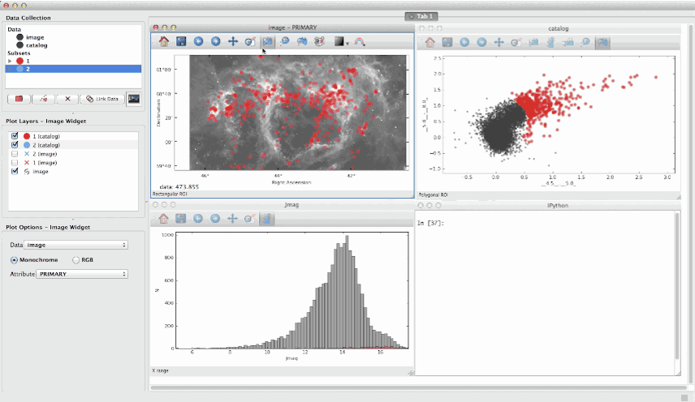

Glue
====

Glue is a python project to link visualizations of scientific datasets
across many files. Click on the image for a quick demo:

Features
--------
- Interactive, linked statistical graphics of multiple files.
- Support for many [file formats](http://www.glueviz.org/en/latest/faq.html#what-data-formats-does-glue-understand) including common image formats (jpg, tiff, png), ascii tables, astronomical image and table formats (fits, vot, ipac), and HDF5. Custom data loaders can also be [easily added](http://www.glueviz.org/en/latest/customization.html#custom-data-loaders).
- Highly [scriptable and extendable](http://www.glueviz.org/en/latest/coding_with_glue.html).

Installation
------------

For installation documentation, visit [glueviz.org](http://glueviz.org)

Mac users can also download the latest version of Glue as a [standalone
program](http://mac.glueviz.org)

Support
-------
Please report problems to glueviz@gmail.com, or [open an issue](https://github.com/glue-viz/glue/issues?state=open).

License
-------
Glue is licensed under the [BSD License](https://github.com/glue-viz/glue/blob/master/LICENSE)
