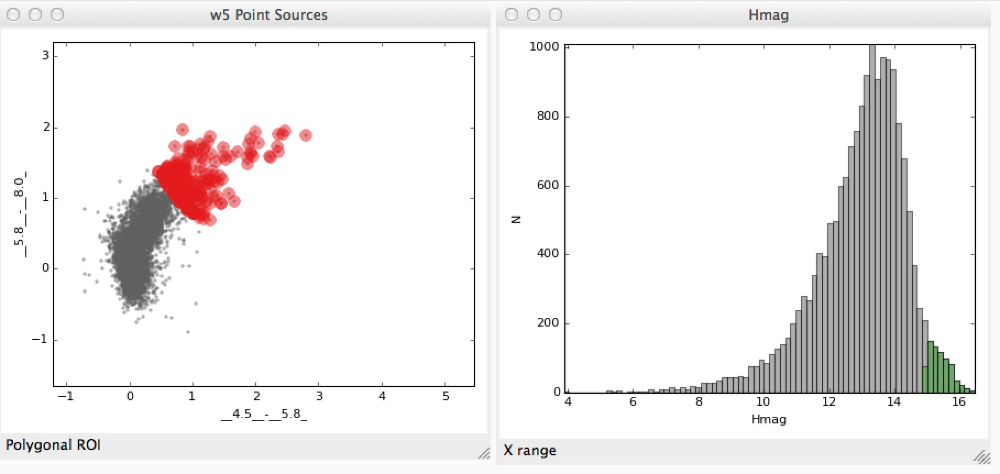
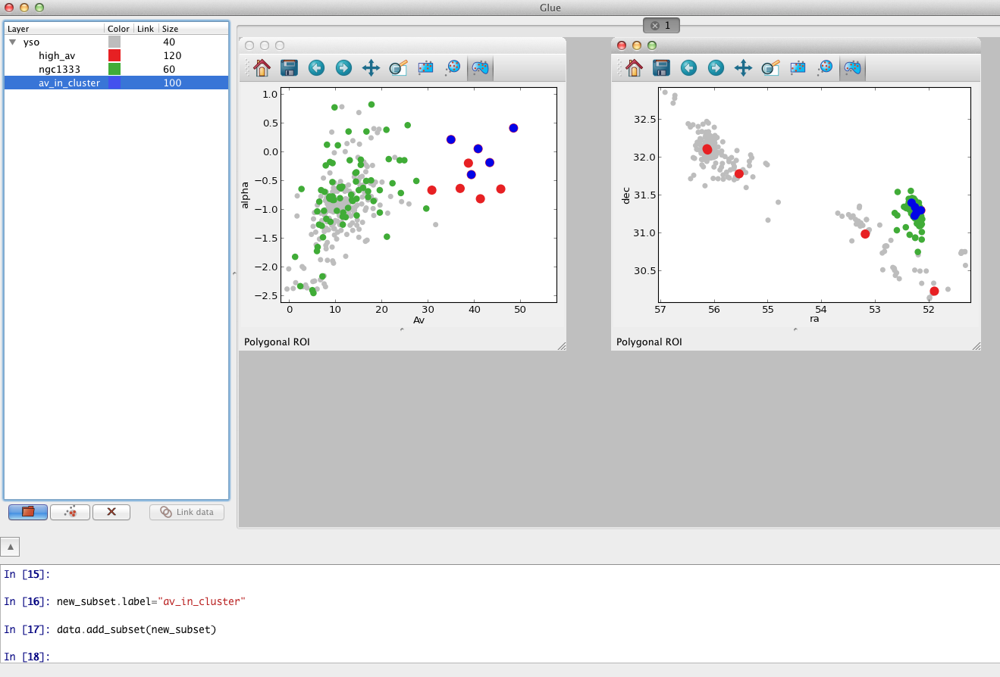
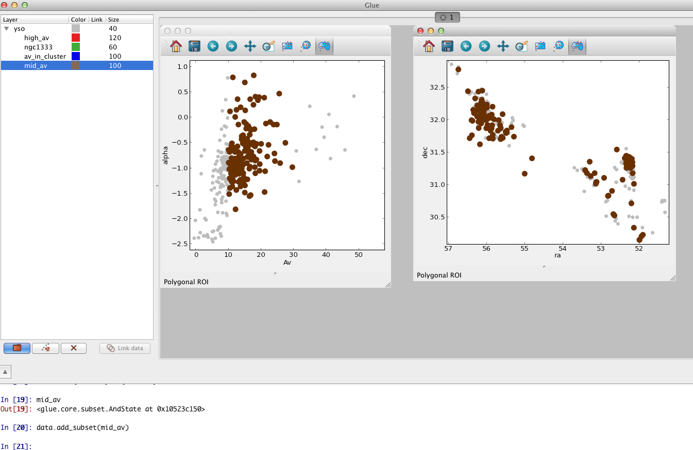

Building Custom Subsets with the Terminal Window
================================================

The built-in terminal window gives you the ability to inspect and edit
data objects in Glue. This tutorial demonstrates how to use it to build
custom subsets that would be cumbersome to define manually. We will be using
the W5 Point Source catalog from the :ref:`tutorial <getting_started>`.

.. note:: The terminal window requires that you have IPython > v0.12 on your system

We are using the example data for this tutorial. We also define a few
subsets to play with. Our setup looks like this.

Click the terminal button next to the link data button to open the terminal window.

Assign variables to the two subsets defined for this data collection::

    >>> red, faint_h = data_collection.subset_groups

Let's also grab a components in the data::

    >>> catalog = data_collection[0]
    >>> hmag = catalog.id['Hmag']

To find the intersection of the two subsets we have already defined
(i.e., red sources with faint H band magnitudes)::

   >>> new_state = red & faint_h
   >>> label = "Red and faint"
   >>> data_collection.new_subset_group(label=label, subset_state=new_state)

The resulting intersection is shown in blue here:

The boolean operators ``&``, ``^``, ``|``, and ``~`` act on subsets to
define new subsets represented by the intersection, exclusive
union, union, and inverse, respectively.

You can also build subsets out of inequality constraints on component IDs::

   >>> mid_mag = (hmag > 10) & (hmag < 15)
   >>> data_collection.new_subset_group(subset_state=mid_mag)

This selects objects with H band magnitudes between 10 and 15:

