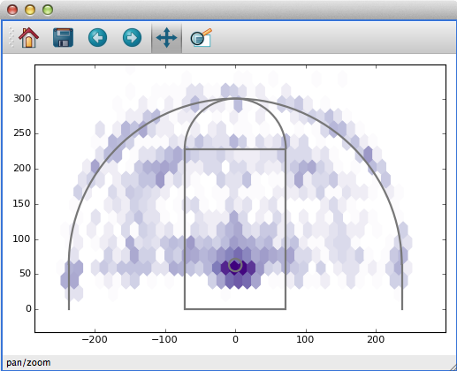
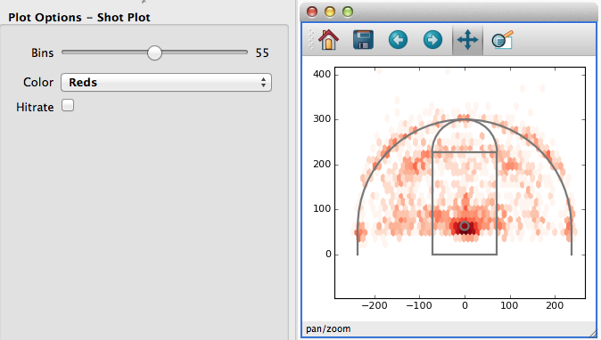

Building Custom Data Viewers
============================

Glue's standard data viewers (scatter plots, images, histograms) are
useful in a wide variety of data exploration settings. However, they
represent a *tiny* fraction of the ways to view a particular
dataset. For this reason, Glue provides a simple mechanism
for creating custom visualizations using matplotlib.

Creating a :func:`custom data viewer <glue.custom_viewer>` requires writing a little bit of Matplotlib
code but involves little to no GUI programming. The next several
sections illustrate how to build a custom data viewer by example.

The Goal: Basketball Shot Charts
--------------------------------
In Basketball, Shot Charts show the spatial distribution of shots
for a particiular player, team, or game. The `New York Times <http://www.nytimes.com/interactive/2012/06/11/sports/basketball/nba-shot-analysis.html?_r=0>`_ has a nice example.

There are three basic features that we might want to incorporate into
a shot chart:

 * The distribution of shots (or some statistic like the success rate), shown as a heatmap in the background.
 * The locations of a particular subset of shots, perhaps plotted as
   points in the foreground
 * The relevant court markings, like the 3-point line and hoop location.

We'll build a Shot Chart in Glue incrementally, starting with the simplest
code that runs.

Shot Chart Version 1: Heatmap and plot
--------------------------------------

Our first attempt at a shot chart will draw the heatmap of all shots,
and overplot shot subsets as points. Here's the code:

.. literalinclude:: _static/bball_viewer_1.py
   :linenos:

Before looking at the code itself, let's look at how it's used. If you
include or import this code in your :ref:`config.py <configuration>` file, Glue will recognize the new viewer.
Open `this shot catalog <https://raw.githubusercontent.com/ChrisBeaumont/basketball/master/shots.csv>`_, and create a new
shot chart with it. You'll get something that looks like this:

.. figure:: bball_1.png
   :align: center

Furthermore, subsets that we define (e.g., by selecting regions of a
histogram) are shown as points (notice that Tim Duncan's shots are concentrated closer to the hoop).

.. figure:: bball_2.png
   :align: center

Let's look at what the code does. Line 5 creates a new custom viewer,
and gives it the name ``Shot Plot``. It also specifies x and y kewords which we'll come back to shortly (spoiler: they tell Glue to
pass data attributes named X and Y to ``show_hexbin``).

Line 11 defines a ``show_hexbin`` function, that visualizes a dataset
as a heatmap. Furthermore, the decorator on line 10 registers this
function as the ``plot_data`` function, responsible for visualizing a dataset as a whole. The inputs to ``plot_data`` are described more
precisely in the :func:`~glue.custom_viewer` documentation, but briefly:

 - The first argument is always a Matplotlib axes object.
 - A style keyword argument is always supplied. We don't make use of it
   here, but will below.
 - The X and Y keywords are passed to ``show_hexbin`` because the
   `x` and `y` keywords were passed to :func:`~glue.custom_viewer` in Lines 6-7. They will contain the data (as arrays) corresponding
   to the dataset attributes labeled 'x' and 'y'.

 The function body itself is pretty simple -- we extract numpy
 arrays from `x.values` and `y.values`, use them to
 build a hexbin plot in Matplotlib, and return the result.

 .. warning:: Make sure you return all plot layers you create
              in a plotting function!

Lines 19-25 follow a similar structure to handle the visualization of subsets, by defining a ``plot_subset`` function. We make use of the
style keyword, to make sure we choose colors, sizes, and
opacities that are consistent with the rest of Glue. The value passed
to the style keyword is a :class:`~glue.core.visual.VisualAttributes`
object.

Custom data viewers give youn the control to visualize data how you
want, while Glue handles all the tedious bookeeping associated with updating plots when selections, styles, or datasets change. Try it out!

Still, this viewer is pretty limited. In particular, it's missing
court markings, the ability to select data in the plot, and the ability
to interactively change plot settings with widgets. Let's fix that.

Shot Chart Version 2: Court markings
------------------------------------

We'd like to draw court markings to give some context to the heatmap.
This is independent of the data, and we only need to render it once.
Just as you can register data and subset plot functions, you can also
register a setup function that gets called a single time, when the viewer
is created. That's a good place to draw court markings:

.. literalinclude:: _static/bball_viewer_2.py
   :linenos:

This version adds a new ``draw_court `` function at Line 30. Here's the result:

Shot Chart Version 3: Widgets
-----------------------------
There are several parameters we might want to tweak about our
visualization as we explore the data. For example, maybe we want
to toggle between a heatmap of the shots, and the percentage of
successful shots at each location. Or maybe we want to choose
the bin size interactively.

The keywords that you pass to :func:`~glue.custom_viewer` allow you to
set up this functionality. Keywords serve two purposes: they define
new widgets to interact with the viewer, and they define keywords to pass
onto drawing functions like ``plot_data``.

For example, consider `this version <_static/bball_viewer_3.py>`_ of the Shot Plot code:

.. literalinclude:: _static/bball_viewer_3.py
   :linenos:

This code passes 4 new keywords to :func:`~glue.custom_viewer`:

  * ``bins=(10, 100)`` adds a slider widget, to choose an integer
    between 10 and 100. We'll use this setting to set the
    bin size of the heatmap.
  * ``hitrate=False`` adds a checkbox. We'll use this setting to
    toggle between a heatmap of total shots, and a map of
    shot success rate.
  * ``color=['Reds', 'Purples']`` creates a dropdown list
    of possible colormaps to use for the heatmap.
  * ``hit='att(shot_made)'`` behaves like the x and y keywords from
    earlier -- it doesn't add a new widget, but it will
    pass the shot_made data along to our plotting functions.

This results in the following interface:

Whenever the user changes the settings of these widgets, the
drawing functions are re-called. Furthermore, the current
setting of each widget is passed as a keyword to the plotting functions:

 * ``bins`` is set to an integer
 * ``hitrate`` is set to a boolean
 * ``color`` is set to ``'Reds'`` or ``'Purples'``
 * ``x``, ``y``, and ``hit`` are passed as :class:`~glue.qt.custom_viewer.AttributeInfo` objects.

The plotting functions can use these keywords to draw the appropriate
plots -- in particular, the ``show_hexbin`` function chooses
the binsize, color, and aggregation based on the widget settings.

Shot Chart Version 4: Selection
-------------------------------
One key feature still missing from this Shot Chart is the ability to
select data by drawing on the plot. To do so, we need to write a
``make_selector`` function that converts a user-drawn ROI into a subset
object. This requires a little familiarity with Glue's own API for
dealing with ROIs and subsets, but in many cases you can follow this
basic pattern:

.. literalinclude:: _static/bball_viewer_4.py
   :lines: 18-26
   :linenos:

With `this version <_static/bball_viewer_4.py>`_ of the code you can how draw shapes on the plot to select data:

.. figure:: bball_5.png
   :align: center
