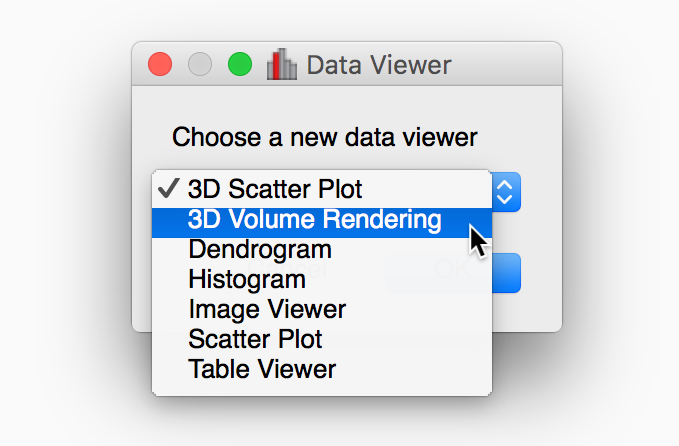
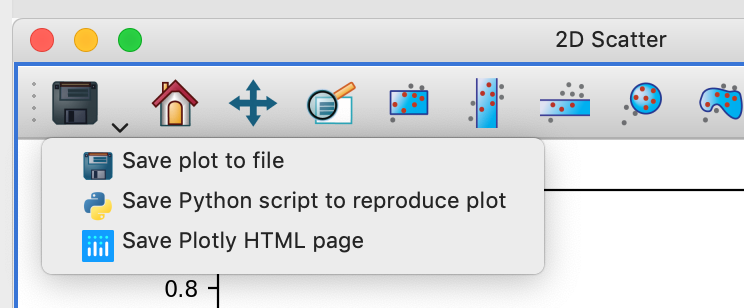
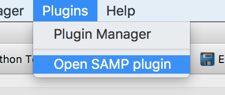
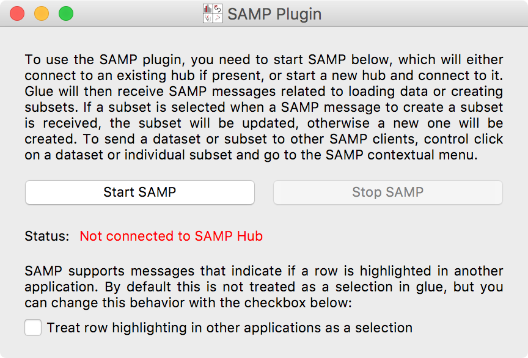
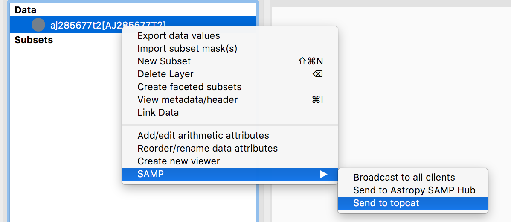

.. _available_plugins:

List of available plugins
=========================

This page lists available plugin packages, as well as information on installing
these. If you are interested in writing your own plugin package, see
:ref:`writing_plugin`. We rely on domain experts to help us develop plugins, so
if your domain is not represented below, or if you want to help us extend the
existing plugins, we'd love to hear from you!

General plugins
---------------

glue-vispy-viewers: 3d viewers
^^^^^^^^^^^^^^^^^^^^^^^^^^^^^^

The **glue-vispy-viewers** plugin package adds a 3D scatter plot viewer and a 3D
volume rendering viewer to glue. This plugin package is installed by default
with glue (provided that you installed the **glueviz** package with pip or
conda). You can read up more about the functionality available in this plugin
in :ref:`viewers-3d`. You can check that you have this plugin installed by going
to the **Canvas** menu in glue and selecting **New Data Viewer**, or
alternatively by dragging a dataset onto the canvas area. If the 3D viewers
plugin is installed, you should see the 3D viewers in the list:

If you don't see these in the list, then, you can install the 3D viewers plugin
using::

    conda install -c glueviz glue-vispy-viewers

or if you don't use conda::

    pip install glue-vispy-viewers

If you run into issues or have requests related to this plugin, or if you would
like to contribute to the development, the GitHub repository for this plugin is
at https://github.com/glue-viz/glue-vispy-viewers.

glue-jupyter: Jupyter notebook/lab viewers
^^^^^^^^^^^^^^^^^^^^^^^^^^^^^^^^^^^^^^^^^^

We are currently developing data viewers for the Jupyter notebook and Jupyter
lab - this is not quite ready yet for general use, but if you are interested
in following on or helping with the development, the GitHub repository for this
plugin is at https://github.com/glue-viz/glue-jupyter.

glue-plotly: plotly exporter for glue
^^^^^^^^^^^^^^^^^^^^^^^^^^^^^^^^^^^^^^

We are currently developing a plugin to make it easy to export plots made in
glue to standalone interactive figures using `plotly <https://plot.ly/>`_. If
you are interested in trying this out, you can install it with::

    conda install -c glueviz glue-plotly

or if you don't use conda::

    pip install glue-plotly

Once installed, you will have the ability to export some of the viewers to
HTML pages powered by plotly by selecting **Save Plotly HTML page** from the
dropdown menu for the save icon:

Note that at this time, not all viewers have a plotly exporter available.

If you run into issues or have requests related to this plugin, or if you would
like to contribute to the development, the GitHub repository for this plugin is
at https://github.com/glue-viz/glue-plotly.

Plugin for Medical imaging
--------------------------

The **glue-medical** is a plugin under development to provide functionality
related to medical imaging in glue. At the moment, the plugin only includes a
`DICOM <https://en.wikipedia.org/wiki/DICOM>`_ reader, but we want to expand
this to other formats and as well as other functionality (e.g. colormaps) that
would be useful in medical imaging. You can install the current version of this
plugin with::

    conda install -c glueviz glue-medical

or if you don't use conda::

    pip install glue-medical

Once the plugin is installed, you should be able to read in DICOM files as you
would normally read other files. You can also read in DICOM directories
containing individual slices into a single dataset by going to the **File**
menu, then **Import data**, and **Import DICOM directory as a single array**.

If you run into issues or have requests related to this plugin, or if you would
like to contribute to the development, the GitHub repository for this plugin is
at https://github.com/glue-viz/glue-medical.

Plugin for Geosciences
----------------------

The **glue-geospatial** is a plugin under development to provide functionality
related to geospatial data in glue. At the moment, the plugin includes a
reader based on the `rasterio <https://github.com/mapbox/rasterio>`_ package,
which allows e.g. GeoTIFF files to be loaded into glue. In addition, the glue
plugin tries to automatically set up the coordinate system for the datasets so
that you can link datasets based on longitude/latitude. You can install the
current version of this plugin with::

    conda install -c glueviz glue-geospatial

or if you don't use conda::

    pip install glue-geospatial

Once the plugin is installed, you should be able to read in e.g. GeoTIFF files
as you would normally read other files.

If you run into issues or have requests related to this plugin, or if you would
like to contribute to the development, the GitHub repository for this plugin is
at https://github.com/glue-viz/glue-geospatial.

Plugins for Astronomy
---------------------

For historical reasons, the core glue application already includes some
Astronomy-specific functionality, such as data readers for e.g. FITS and other
common astronomy formats, as well as linking functions that are aware of
Astronomy coordinate systems. In addition to this built-in functionality, there
are a number of plugins available and/or in development for Astronomy.

glue-wwt: WorldWide Telescope viewer
^^^^^^^^^^^^^^^^^^^^^^^^^^^^^^^^^^^^

The **glue-wwt** adds a data viewer to glue that allows users to overplot data
onto maps of the sky, powered by `WorldWide Telescope
<http://worldwidetelescope.org/webclient/>`_. You can install this plugin with::

    conda install -c glueviz glue-wwt

or if you don't use conda::

    pip install glue-wwt

Once the plugin is installed, you should see a new viewer named
**WorldWideTelescope (WWT)** in the list of available viewers when dragging a
dataset onto the main canvas in the glue application. Once you have added a
dataset to the viewer, you can select in the viewer options the columns that
give the Right Ascension and Declination of the data points (we will add support
for other coordinate systems in future). At the moment, only tables can be
shown using markers in WWT (and not images) and we don't recommend adding large
sets of points at this time (due to limitations in the way WWT deals with
annotations).

If you run into issues or have requests related to this plugin, or if you would
like to contribute to the development, the GitHub repository for this plugin is
at https://github.com/glue-viz/glue-wwt.

glue-aladin: Aladin Lite viewer
^^^^^^^^^^^^^^^^^^^^^^^^^^^^^^^

A data viewer similar to glue-wwt but for `Aladin Lite
<https://aladin.u-strasbg.fr/AladinLite/>`_, is being developed and is not quite
ready yet for general use, but if you are interested in following on or helping
with the development, the GitHub repository is at
https://github.com/glue-viz/glue-aladin.

glue-samp: Communicating with SAMP
^^^^^^^^^^^^^^^^^^^^^^^^^^^^^^^^^^

A few common applications in astronomy support communicating via the Simple
Application Messaging Protocol (SAMP) - these include for example `DS9
<http://ds9.si.edu/site/Home.html>`_, `TOPCAT
<http://www.star.bris.ac.uk/~mbt/topcat/>`_, and `Aladin
<https://aladin.u-strasbg.fr/>`_. The **glue-samp** plugin adds the ability to
use SAMP from glue.  You can install this plugin with::

    conda install -c glueviz glue-samp

or if you don't use conda::

    pip install glue-samp

Once the plugin is installed, you can go to the **Plugins** menu and select
**Open SAMP plugin**:

A window will then appear:

Click on **Start SAMP**, and the status should change to something like
**Connected to SAMP Hub**. If you open another SAMP-enabled application such as
TOPCAT, you should now be able to send data from/to glue. To send data from glue
to another application, you can right-click (control-click on Mac) on a dataset
or subset in the glue data collection, then go to **SAMP**, then e.g. **Send to
topcat**:

This can be done for tables or images, and both for the main datasets and
subsets. However, note that not all SAMP-enabled application are able to
understand all types of SAMP messages. For example, while you can send images to
DS9, you will not be able to send them to TOPCAT. Conversely, DS9 may not
understand the concept of a subset.

You can also send data from other applications to glue - for more information on
doing this, see the guide for the relevant application you want to use - glue
understands messages adding images and tables, as well as messages related to
subsets.
