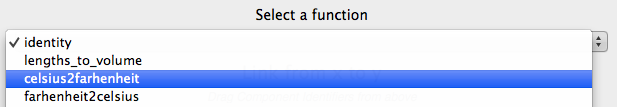

.. _configuration:

Configuring Glue via a startup file
===================================

Glue uses a configuration system to customize aspects such as which data viewers
it loads, what link functions to use, and so on. The glue configuration file is
called ``config.py``. Glue looks for this file in the following locations, in
order:

 * The current working directory
 * The path specified in the ``GLUERC`` environment variable, if present
 * The path ``.glue/config.py`` within the user's home directory

The easiest place to start is to just create a ``config.py`` file in the current
directory where you are launching glue from. If you want to use your
customizations to be available for all projects, you can then consider using the
``GLUERC`` or ``.glue`` approach.

Example Usage: Custom Link Functions
------------------------------------

As an example, let's create some translation functions which will allow us to
convert temperatures in Celsius to Farenheit::

    from glue.config import link_function

    @link_function(info="Celsius to Fahrenheit", output_labels=['F'])
    def celsius2farhenheit(c):
        return c  * 9. / 5. + 32

    @link_function(info="Fahrenheit to Celsius", output_labels=['C'])
    def farhenheit2celsius(f):
        return (f - 32) * 5. / 9.

More details about this are provided in :ref:`customization`, but for now, let's
just assume this is how we make custom linking functions. We can copy this code
into an empty ``config.py`` file in the current directory. Next time we start up
Glue, the link functions now appear in the Link Dialog:

Let's now take a look at all the available customizations in
:ref:`customization`.
