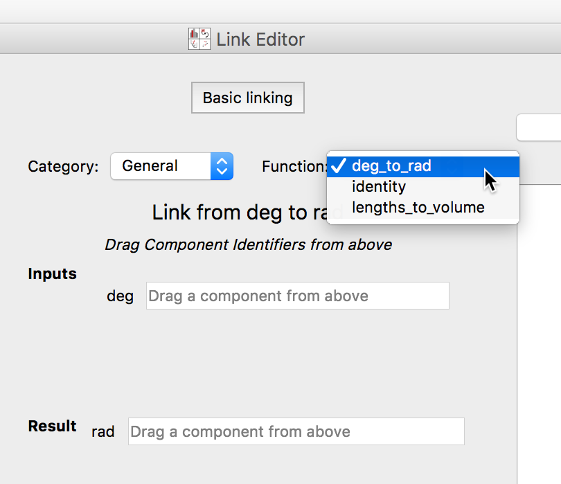
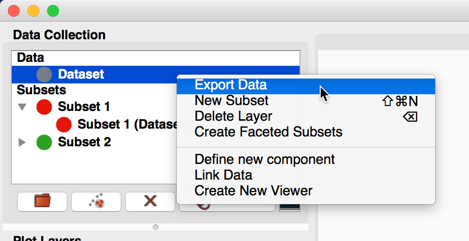
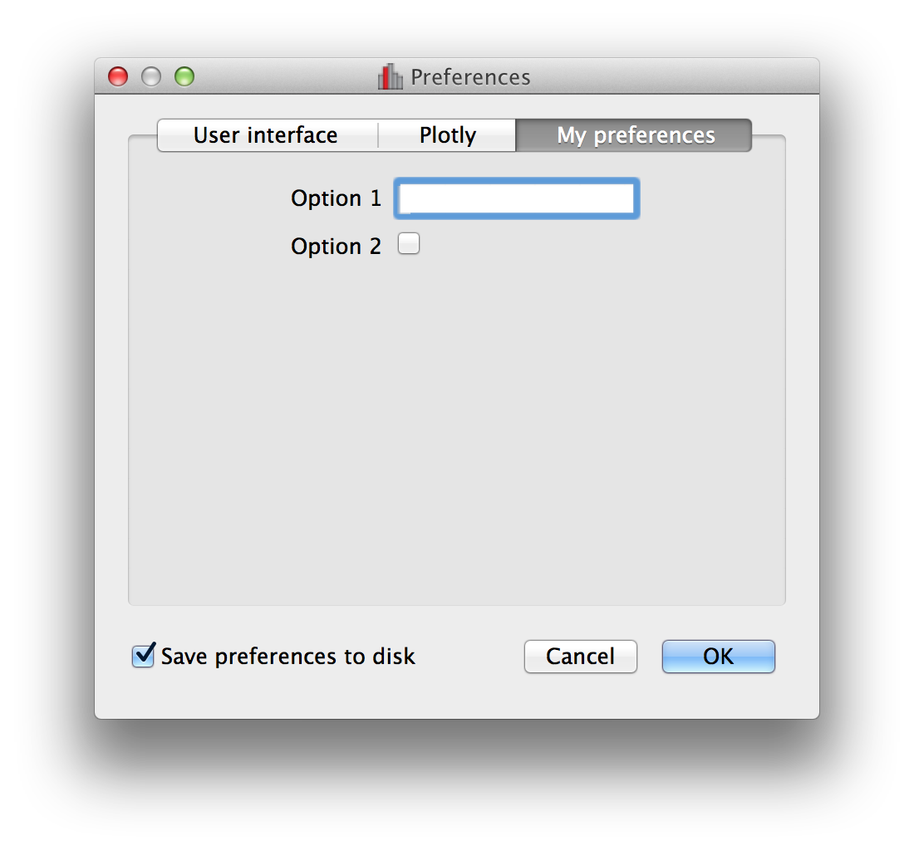

.. _customization:

Customizing your Glue environment
=================================

Using a ``config.py`` file as described in :ref:`configuration`, you can
customize many aspects of your Glue environment, which are described in the
following sections.

Registries
----------

Before we talk about the different components of the Glue environment that you
can customize, we first need to look at registries. Glue is written so as to
allow users to easily register new data viewers, tools, exporters, and more.
Registering such components can be done via *registries* located in the
``glue.config`` sub-package. Registries include for example ``link_function``,
``data_factory``, ``colormaps``, and so on. As demonstrated below, some
registries can be used as decorators (see e.g. `Custom Link Functions`_)
and for others you can add items using the ``add`` method (see e.g. `Custom
Colormaps`_).

In the following sections, we show a few examples of registering new
functionality, and a full list of available registries is given in `Complete
list of registries`_.

.. _custom_links:

Custom Link Functions
---------------------

From the :ref:`Link Data Dialog <getting_started_link>`, you inform Glue how
to convert between quantities among different data sets. You do this by
selecting a translation function, and specifying which data attributes should
be treated as inputs and outputs. You can use the configuration file to
specify custom translation functions. Here's how:

.. literalinclude:: scripts/config_link_example.py

Some remarks about this code:
 #. ``link_function`` is used as a `decorator <https://stackoverflow.com/questions/739654/how-to-make-a-chain-of-function-decorators/1594484>`_. The decorator adds the function to Glue's list of link functions
 #. We provide a short summary of the function in the ``info`` keyword, and a list of ``output_labels``. Usually, only one quantity is returned, so ``output_labels`` has one element.
 #. Glue will always pass numpy arrays as inputs to a link function, and expects a numpy array (or a tuple of numpy arrays) as output

With this code in your configuration file, the ``deg_to_rad`` function is
available in the ``Link Data`` dialog:

This would allow you to link between two datasets with different conventions
for specifying angles.

.. _custom_data_factory:

Custom Data Loaders
-------------------

Glue lets you create custom data loader functions,
to use from within the GUI.

Here's a quick example: the default image loader in Glue reads each color in
an RGB image into 3 two-dimensional attributes. Perhaps you want to be able
to load these images into a single 3-dimensional attribute called ``cube``.
Here's how you could do this::

 from glue.config import data_factory
 from glue.core import Data
 from skimage.io import imread

 def is_jpeg(filename, **kwargs):
     return filename.endswith('.jpeg')

 @data_factory('3D image loader', is_jpeg)
 def read_jpeg(file_name):
     im = imread(file_name)
     return Data(cube=im)

Let's look at this line-by-line:

* The `is_jpeg` function takes a filename and keywords as input,
  and returns True if a data factory can handle this file

* The ``@data_factory`` decorator is how Glue "finds" this function. Its two
  arguments are a label, and the `is_jpeg` identifier function

* The first line in ``read_jpeg`` uses scikit-image to load an image file
  into a NumPy array.

* The second line :ref:`constructs a Data object <data_creation>` from this
  array, and returns the result.

If you put this in your ``config.py`` file, you will see a new
file type when loading data:

  .. figure:: images/custom_data.png
     :align: center
     :width: 50%

If you open a file using this file type selection, Glue will pass the path of
this file to your function, and use the resulting Data object.

If you are defining a data factory that may clash with an existing one, for
example if you are defining a loader for a specific type of FITS file, then
make sure that the identifier function (e.g. ``is_jpeg`` above) returns `True`
only for that specific subset of FITS files. Then you can set the ``priority=``
keyword in the ``@data_factory`` decorator. The value should be an integer or
floating-point number, with larger numbers indicating a higher priority.

For more examples of custom data loaders, see the `example repository
<https://github.com/glue-viz/glue-data-loaders>`_.

.. _custom_importers:

Custom importers
----------------

The `Custom Data Loaders`_ described above allow Glue to recognize more file
formats than originally implemented, but it is also possible to write entire
new ways of importing data, including new GUI dialogs. An example would be a
dialog that allows the user to query and download online data.

Currently, an importer should be defined as a function that returns a list of
:class:`~glue.core.data.Data` objects. In future we may relax this latter
requirement and allow existing tools in Glue to interpret the data.

An importer can be defined using the ``@importer`` decorator::

    from glue.config import importer
    from glue.core import Data

    @importer("Import from custom source")
    def my_importer():
        # Main code here
        return [Data(...), Data(...)]

The label in the ``@importer`` decorator is the text that will appear in the
``Import`` menu in Glue.

.. _custom_data_exporter:

Custom Data/Subset Exporters
----------------------------

.. note:: This section is about exporting the numerical values for datasets and
          subsets. To export the *masks* for subsets, see
          :ref:`custom_subset_mask_importer` and
          :ref:`custom_subset_mask_exporter`.

In addition to allowing you to create custom loaders and importers, glue lets
you create custom exporters for datasets and subsets. These exporters can be
accessed by control-clicking on specific datasets or subsets:

and selecting **Export Data** or **Export Subsets**.

A custom exporter looks like the following::

     from glue.config import data_exporter

     @data_exporter('My exporter')
     def export_custom(filename, data):
        # write out the data here

The ``data`` argument to the function can be either a
:class:`~glue.core.data.Data` or a :class:`~glue.core.subset.Subset` object, and
``filename`` is a string which gives the file path. You can then write out the
file in any way you like. Note that if you get a
:class:`~glue.core.subset.Subset` object, you should make sure you export the
data subset, not just the mask itself. For e.g. 2-dimensional datasets, we find
that it is more intuitive to export arrays the same size as the original data
but with the values not in the subset masked or set to NaN.

.. _custom_subset_mask_importer:

Custom subset mask importers
----------------------------

When right-clicking on datasets or subsets, it is possible to select to import
subset *masks* from files (as well as export them). To define a new importer
format, use the ``@subset_mask_importer`` decorator::

    from glue.config import subset_mask_importer

    @subset_mask_importer(label='My Format')
    def my_subset_mask_importer(filename):
        # write code that reads in subset masks here

The function should return a dictionary where the labels are the names of the
subsets, and the values are Numpy boolean arrays. The ``@subset_mask_importer``
decorator can also take an optional ``extension`` argument that takes a list of
extensions (e.g. ``['fits', 'fit']``).

.. _custom_subset_mask_exporter:

Custom subset mask exporters
----------------------------

When right-clicking on datasets or subsets, it is also possible to select to
export subset *masks* to files. To define a new exporter format, use the
``@subset_mask_exporter`` decorator::

    from glue.config import subset_mask_exporter

    @subset_mask_exporter(label='My Format')
    def my_subset_mask_exporter(filename, masks):
        # write code that writes out subset masks here

The ``masks`` argument will be given a dictionary where each key is the name of
a subset, and each value is a Numpy boolean array. The ``@subset_mask_exporter``
decorator can also take an optional ``extension`` argument that takes a list of
extensions (e.g. ``['fits', 'fit']``).

.. _custom_menubar_tools:

Custom menubar tools
--------------------

In some cases, it might be desirable to add tools to Glue that can operate on
any aspects of the data or subsets, and can be accessed from the menubar. To
do this, you can define a function that takes two arguments (the session
object, and the data collection object), and decorate it with the
``@menubar_plugin`` decorator, giving it the label that will appear in the
**Tools** menubar::

    from glue.config import menubar_plugin

    @menubar_plugin("Do something")
    def my_plugin(session, data_collection):
        # do anything here
        return

The function can do anything, such as launch a QWidget, or anything else
(such as a web browser, etc.), and does not need to return anything (instead
it can operate by directly modifying the data collection or subsets).

Custom Colormaps
----------------

You can add additional matplotlib colormaps to Glue's image viewer by adding
the following code into ``config.py``::

    from glue.config import colormaps
    from matplotlib.cm import Paired
    colormaps.add('Paired', Paired)

.. _custom-actions:

Custom Actions
--------------

You can add menu items to run custom functions when selecting datasets, subset
groups or subsets in the data collection. To do this, you should define a
function to be called when the menu item is selected, and use the
``@layer_action`` decorator::

    from glue.config import layer_action

    @layer_action('Do something')
    def callback(selected_layers, data_collection):
        print("Called with %s, %s" % (selected_layers, data_collection))

The ``layer_action`` decorator takes an optional ``single`` keyword argument
that can be set to `True` or `False` to indicate whether the action should only
appear when a single dataset, subset group, or subset is selected. If ``single``
is `True`, the following keyword arguments can be used to further control when
to show the action:

* ``data``: only show the action when selecting a dataset
* ``subset_group``: only show the action when selecting a subset group
* ``subset``: only show the action when selecting a subset

These default to `False`, so setting e.g.::

    @layer_action('Do something', single=True, data=True, subset=True)
    ...

means that the action will appear when a single dataset or subset is selected
but not when a subset group is selected.

The callback function is called with two arguments. If ``single`` is `True`, the
first argument is the selected layer, otherwise it is the list of selected
layers. The second argument is the
:class:`~glue.core.data_collection.DataCollection` object.

Custom Preference Panes
-----------------------

You can also add custom panes in the Qt preferences dialog. To do this, you
should create a Qt widget that encapsulates the preferences you want to
include, and you should make sure that this widget has a ``finalize`` method
that will get called when the preferences dialog is closed. This method should
then set any settings appropriately in the application state. The following is
an example of a custom preference pane::

    from glue.config import settings, preference_panes
    from qtpy import QtWidgets

    class MyPreferences(QtWidgets.QWidget):

        def __init__(self, parent=None):

            super(MyPreferences, self).__init__(parent=parent)

            self.layout = QtWidgets.QFormLayout()

            self.option1 = QtWidgets.QLineEdit()
            self.option2 = QtWidgets.QCheckBox()

            self.layout.addRow("Option 1", self.option1)
            self.layout.addRow("Option 2", self.option2)

            self.setLayout(self.layout)

            self.option1.setText(settings.OPTION1)
            self.option2.setChecked(settings.OPTION2)

        def finalize(self):
            settings.OPTION1 = self.option1.text()
            settings.OPTION2 = self.option2.isChecked()

    settings.add('OPTION1', '')
    settings.add('OPTION2', False, bool)
    preference_panes.add('My preferences', MyPreferences)

This example then looks this the following once glue is loaded:

.. _custom_fixed_layout:

Custom fixed layout tab
-----------------------

.. note:: this feature is still experimental and may change in future

By default, the main canvas of glue is a free-form canvas where windows can be
moved around and resized. However, it is also possible to construct fixed
layouts to create 'dashboards'. To do this, you should import the ``qt_fixed_layout_tab``
object::

    from glue.config import qt_fixed_layout_tab

then use it to decorate a Qt widget that should be used instead of the free-form
canvas area, e.g.::

    @qt_fixed_layout_tab
    def MyCustomLayout(QWidget):
        pass

The widget can be any valid Qt widget - for instance it could be a widget with
a grid layout with data viewer widgets in each cell.

.. _custom_startup:

Custom startup actions
----------------------

It is possible to define actions to be carried out in glue once glue is open
and the data has been loaded. These should be written using the
``startup_action`` decorator::

    from glue.config import startup_action

    @startup_action("action_name")
    def my_startup_action(session, data_collection):
        # do anything here
        return

The function has access to ``session``, which includes for example
``session.application``, and thus gives access to the full state of glue.

Startup actions have to then be explicitly specified using::

    glue --startup=action_name

and multiple actions can be given as a comma-separated string.

Custom layer artist makers
--------------------------

In some cases, one may want to override the default layer artist classes used
by specific viewers. For example, for a particular data object, one may want to
show a tree or network on top of an image.

This can be done by defining a function and decorating it with the
``layer_artist_maker`` decorator::

    @layer_artist_maker('custom_maker')
    def custom_maker(viewer, data_or_subset):
        ...

The function should take two arguments - the first argument is the viewer to
which the data is being added, and the second is the
:class:`~glue.core.data.Data` or :class:`~glue.core.subset.Subset` object to be
added. The function should then either return a custom
:class:`~glue.viewers.common.layer_artist.LayerArtist` instance, or `None` if
the function does not need to override the default layer artists.

Note that ``layer_artist_maker`` can take an optional ``priority=`` argument
(which should be an integer), where higher values indicate that the layer artist
maker should be considered first.

.. _custom-auto-link:

Custom auto-linking helper
--------------------------

It is possible to create functions that will automatically suggest links based
on the available data. To do so, use the ``autolinker`` decorator as follows::

    from glue.config import autolinker

    @autolinker('Auto-linker name')
    def my_autolinker(data_collection):

        ...

        return links

The function should take a reference to a
:class:`~glue.core.data_collection.DataCollection` and should return a list of new
links that could be added. These will then automatically be suggested to the
user when new data are added. Note that it is your responsibility to ensure
that links that currently exist (and are in ``data_collection.external_links``)
are not suggested.

.. _custom-data-translation:

Custom translation to native data objects
-----------------------------------------

Glue includes infrastructure to make it easy to convert between glue
:class:`~glue.core.data.Data` objects and non-glue-specific data containers,
such as pandas DataFrame. You can define your own converter
by writing a class that has ``to_data`` and ``to_object`` methods, and
register this class with ``@data_translator``, e.g.::

    from glue.config import data_translator

    @data_translator(MyDataClass)
    class MyDataClassHandler:

        def to_data(self, obj):
            # This should take a MyDataClass object 'obj' and convert it to a
            # glue Data object.
            ...
            return data

        def to_object(self, data):
            # This should take a glue Data or Subset object and convert it to
            # a MyDataClass object.
            ...
            return obj

With this defined, you should then be able to add objects of type
``MyDataClass`` to the data collection and get them back using
:meth:`~glue.core.data.BaseData.get_object` and
:meth:`~glue.core.data.BaseData.get_subset_object`, e.g.::

    >>> data_collection['mydata'] = MyDataClass(...)
    >>> data = data_collection['mydata']
    >>> data
    Data(...)
    >>> data.get_object()
    MyDataClass(...)
    >>> data.get_subset_object(subset_id=0)
    MyDataClass(...)

.. _custom-subset-translation:

Custom translation of subset definitions to native data objects
---------------------------------------------------------------

In the above section, we showed how
:meth:`~glue.core.data.BaseData.get_subset_object` can be used to get non-glue data
objects for a given subset - that is, a dataset with just the relevant subset of
values. However in some cases you may also want to have ways of converting the
conceptual definition of subsets to non-glue objects or to string
serializations. To do this, you should write a class that has a ``to_object``
method and register the class using the ``@subset_definition_translator``
decorator, e.g.::

    from glue.config import subset_definition_translator

    @subset_definition_translator('my-serialized-format')
    class SimpleSerializer:

        def to_object(self, subset):

            # This should take a glue subset and translate the subset state,
            # which is accessible from subset.subset_state, to a non-glue
            # object that represents the selection - this could either be
            # a string or bytes serialization, or a different kind of
            # object that represents selections.

            ...

            return selection_definition

With this defined, you should then be able to extract subsets with this converter
using
:meth:`~glue.core.data.BaseData.get_selection_definition`, e.g.::

    >>> data.get_selection_definition(subset_id='subset 1',
                                      format='my-serialized-format')
    "a > 3"

Custom session patch
--------------------

Adding new features and keeping backward compatibility is hard. Because the
features of glue, and/or its plugins changes over time, old but precious
sessions files might not open anymore. To solve this problem, custom patch
functions can be provided to edit *in-place* the session file, just after it
is loaded. These patch functions should take a loaded session file (as a dict),
detect if it is invalid, and if so correct the problem, e.g.::

    from glue.config import subset_definition_translator

    @session_patch(priority=0)
    def correct_bad_version_plugin(session_obj):
        # if problem:
            # correct problem

        ...

        return

Complete list of registries
---------------------------

A few registries have been demonstrated above, and a complete list of main
registries are listed below. All can be imported from ``glue.config`` - each
registry is an instance of a class, given in the second column, and which
provides more information about what the registry is and how it can be used.

=========================== =========================================================
Registry name                  Registry class
=========================== =========================================================
``qt_client``                :class:`glue.config.QtClientRegistry`
``qt_fixed_layout_tab``      :class:`glue.config.QtFixedLayoutTabRegistry`
``viewer_tool``              :class:`glue.config.ViewerToolRegistry`
``data_factory``             :class:`glue.config.DataFactoryRegistry`
``data_exporter``            :class:`glue.config.DataExporterRegistry`
``subset_mask_importer``     :class:`glue.config.SubsetMaskImporterRegistry`
``subset_mask_exporter``     :class:`glue.config.SubsetMaskExporterRegistry`
``link_function``            :class:`glue.config.LinkFunctionRegistry`
``link_helper``              :class:`glue.config.LinkHelperRegistry`
``colormaps``                :class:`glue.config.ColormapRegistry`
``exporters``                :class:`glue.config.ExporterRegistry`
``settings``                 :class:`glue.config.SettingRegistry`
``preference_panes``         :class:`glue.config.PreferencePanesRegistry`
``fit_plugin``               :class:`glue.config.ProfileFitterRegistry`
``layer_action``             :class:`glue.config.LayerActionRegistry`
``startup_action``           :class:`glue.config.StartupActionRegistry`
``autolinker``               :class:`glue.config.AutoLinkerRegistry`
``data_translator``          :class:`glue.config.DataTranslatorRegistry`
``subset_state_translator``  :class:`glue.config.SubsetDefinitionTranslatorRegistry`
``session_patch``            :class:`glue.config.SessionPatchRegistry`
=========================== =========================================================

.. _lazy_load_plugin:

Deferring loading of plug-in functionality (advanced)
-----------------------------------------------------

In some cases, you may want to defer the loading of your
component/functionality until it is actually needed. To do this:

* Place the code for your plugin in a file or package that could be imported
  from the ``config.py`` (but don't import it directly - it just has to be
  importable)

* Include a function called ``setup`` alongside the plugin, and this function
  should contain code to actually add your custom tools to the appropriate
  registries.

* In ``config.py``, you can then add the plugin file or package to a registry
  by using the ``lazy_add`` method and pass a string giving the name of the
  package or sub-package containing the plugin.

Imagine that you have created a data viewer ``MyQtViewer``. You could
directly register it using::

    from glue.config import qt_client
    qt_client.add(MyQtViewer)

but if you want to defer the loading of the ``MyQtViewer`` class, you can
place the definition of ``MyQtViewer`` in a file called e.g.
``my_qt_viewer.py`` that is located in the same directory as your
``config.py`` file. This file should look something like::

    class MyQtViewer(...):
        ...

    def setup():
        from glue.config import qt_client
        qt_client.add(MyQtViewer)

then in ``config.py``, you can do::

    from glue.config import qt_client
    qt_client.lazy_add('my_qt_viewer')

With this in place, the ``setup`` in your plugin will only get called if the
Qt data viewers are needed, but you will avoid unnecessarily importing Qt if
you only want to access ``glue.core``.
