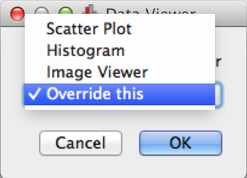

:orphan:

Writing a fully customized Qt viewer (advanced)
===============================================

Motivation
----------

This tutorial is intended for people who want to develop a fully custom Qt-based
viewer for glue that does not use Matplotlib and does not use the state class
infrastructure. If you don't already have an existing widget, but want to make
sure it will work outside glue, start off by developing the widget outside of
glue, then use the instructions below to make it usable inside glue.

Displaying the widget in glue
-----------------------------

Let's imagine that you have a Qt widget class called ``MyWidget`` the
inherits from ``QWidget`` and implements a specific type of visualization you
are interested in::

    class MyWidget(QWidget):
        ...

Now let's say we want to use this widget in glue, without having to change
anything in ``MyWidget``. The best way to do this is to create a new class,
``MyGlueWidget``, that will wrap around ``MyWidget`` and make it
glue-compatible. The glue widget should inherit from
:class:`~glue.viewers.common.qt.data_viewer.DataViewer` (this class does a few
boilerplate things such as, for example, adding the ability to drag and drop
data onto your data viewer). The simplest glue widget wrapper that you can write
that will show ``MyWidget`` is::

    from glue.qt.widgets.data_viewer import DataViewer

    class MyGlueWidget(DataViewer):

        def __init__(self, session, parent=None):
            super(MyGlueWidget, self).__init__(session, parent=parent)
            self.my_widget = MyWidget()
            self.setCentralWidget(self.my_widget)

    # Register the viewer with glue
    from glue.config import qt_client
    qt_client.add(MyGlueWidget)

If you put the contents above into a ``config.py`` file then launch glue in
the same folder as the ``config.py`` file, you will then be able to go to the
**Canvas** menu, select **New Data Viewer**, and you should then be presented
with the window to select a data view, which should contain an **Override
this** entry:

To give your viewer a more meaningful name, you should give your class an
attribute called ``LABEL``::

    class MyGlueWidget(DataViewer):

        LABEL = "My first data viewer"

        def __init__(self, session, parent=None):
            super(MyGlueWidget, self).__init__(session, parent=parent)
            self.my_widget = MyWidget()
            self.setCentralWidget(self.my_widget)

Passing data to the widget
--------------------------

Now we want to be able to pass data to this viewer. To do this, you should
define the ``add_data`` method which should take a single argument and return
`True` if adding the data succeeded, and `False` otherwise. So for now, let's
simply return `True` and do nothing::

        def add_data(self, data):
            return True

Now you can open glue again, and this time you should be able to load a
dataset the usual way. When you drag this dataset onto the main canvas area,
you will be able to then select your custom viewer, and it should appear
(though the data itself will not). You can now expand the ``add_data`` method
to actually add the data to ``MyWidget``, by accessing ``self.my_widget``,
for example::

        def add_data(self, data):
            self.my_widget.plot(data)
            return True

However, this will simply plot the initial data and plot more data if you
drag datasets onto the window, but you will not for example be able to remove
datasets, show subsets, and so on. In some cases, that may be fine, and you
can stop at this point, but in other cases, if you want to define a way to
interact with subsets, propagate selections, and so on, you will need to listen
for events, which is discussed in `Listening for events`_.

But first, let's take a look at how we can add side panels in the dashboard
which can include for example options for controlling the appearance or contents
of your visualization.

Adding side panels
------------------

In the glue interface, under the data collection is an area we refer to as the
dashboard, where different data viewers can include options for controlling the
appearance or content of visualizations (this is the area indicated as **C** in
:doc:getting-started). You can add any widget to the two available spaces.

In your wrapper class, ``MyGlueWidget`` in the example above, you will need to
define a method called ``options_widget``, which returns an instantiated widget
that should be included in the dashboard on the bottom left of the glue window,
and can contain options to control the data viewer.

For example, you could do::

    class MyGlueWidget(DataViewer):

        ...

        def __init__(self, session, parent=None):
            ...
            self._options_widget = AnotherWidget(...)

        ...

        def options_widget(self):
            return self._options_widget

Note that despite the name, you can actually use the options widget to what you
want, and the important thing is that ``options_widget`` is the bottom left
pane in the dashboard on the left.

Note that you can also similarly define (via a method) ``layer_view``, which
sets the widget for the middle widget in the dashboard. However, this will
default to a list of layers which can normally be used as-is (see `Using
Layers`_)

Listening for events
--------------------

Once the data viewer has been instantiated, the main glue application will
automatically call the ``register_to_hub`` method on the data viewer, and will
pass it the hub as an argument. This allows you to set up your data viewer as a
client that can listen to specific messages from the hub::

    from glue.core.message import DataCollectionAddMessage

    class MyGlueWidget(DataViewer):

        ...

        def register_to_hub(self, hub):

            super(MyGlueWidget, self).register_to_hub(hub)

            # Now we can subscribe to messages with the hub

            hub.subscribe(self,
                          DataUpdateMessage,
                          handler=self._update_data)

        def _update_data(self, msg):

            # Process DataUpdateMessage here

Using layers
------------

By default, any sub-class of `~glue.viewers.common.qt.data_viewer` will
also include a list of layers in the central panel in the dashboard. Layers can
be thought of as specific components of visualizations - for example, in a
scatter plot, the main dataset will be a layer, while each individual subset
will have its own layer. The order of the layers (which controls which one
appears in front of which) can then be set by dragging the layers around, and
the color/style of the layers can also be set from this list of layers.

Conceptually, layer artists can be used to carry out the actual drawing and
include any logic about how to convert data into visualizations. If you are
using Matplotlib for your visualization, there are a number of pre-existing
layer artists in ``glue.viewers.*.layer_artist``, but otherwise you will need
to create your own classes.

The minimal layer artist class looks like the following::

    from glue.core.layer_artist import LayerArtistBase

    class MyLayerArtist(LayerArtistBase):

        def clear(self):
            pass

        def redraw(self):
            pass

        def update(self):
            pass

Essentially, each layer artist has to define the three methods shown above. The
``clear`` method should remove the layer from the visualization, the ``redraw``
method should redraw the entire visualization, and ``update``, should update
the appearance of the layer as necessary before redrawing.

In the data viewer, when the user adds a dataset or a subset, the list of
layers should then be updated. The layers are kept in a list in the
``_layer_artist_container`` attribute of the data viewer, and layers can be added and
removed with ``append`` and ``remove`` (both take one argument, which is a
specific layer artist). So when the user adds a dataset, the viewer should do
something along the lines of::

    layer_artist = MyLayerArtist(data, ...)
    self._layer_artist_container.append(layer_artist)
    layer_artist.redraw()

If the user removes a layer from the list of layers by e.g. hitting the
backspace key, the ``clear`` method is called, followed by the ``redraw``
method.
