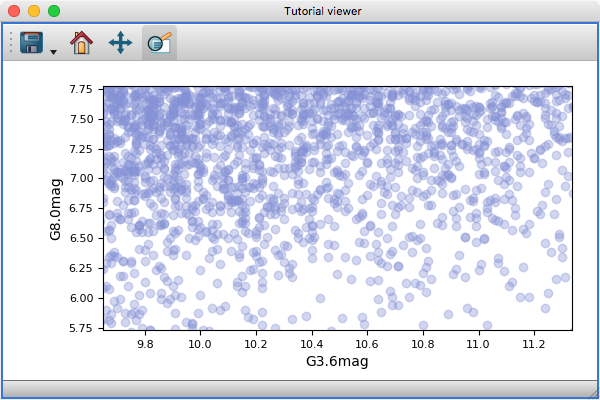

.. _matplotlib-qt-viewer:

Writing a custom viewer for glue with Qt and Matplotlib
=======================================================

If you are a user trying to build a very simple viewer using Matplotlib, you may
want to check out :doc:`custom_viewer` -- the present tutorial is intended for
people who wish to write and distribute a viewer using Matplotlib with full
control over layout and behavior. This tutorial assumes that you have already
gone over the :ref:`state-viewer` and :ref:`state-qt-viewer` tutorials.

Glue provides a set of base classes for the state classes, layer artist, and
data viewer which already take care of a number of aspects common to all
Matplotlib-based viewers. We describe each of these in turn in the following
sections, then simplify the example from :ref:`state-qt-viewer` using this
infrastructure.

State classes
-------------

The :class:`~glue.viewers.matplotlib.state.MatplotlibDataViewerState` class
provides a subclass of :class:`~glue.viewers.common.state.ViewerState` which
adds properties related to:

* the appearance of the plot (font and tick sizes)
* the limits of the current view (this currently assumes 2D plots)
* the aspect ratio of the axes
* whether the axes are log or linear

Note that it does not add e.g. ``x_att`` and ``y_att`` since not all Matplotlib-
based viewers will require the same number of attributes, and since some viewers
may define attributes that aren't specific to the x or y axis (e.g. in the case
of networks).

The :class:`~glue.viewers.matplotlib.state.MatplotlibLayerState` class
provides a subclass of :class:`~glue.viewers.common.state.LayerState` which
adds the ``color`` and ``alpha`` property (and keeps them in sync with
``layer.style.color`` and ``layer.style.alpha``).

Layer artist
------------

The :class:`~glue.viewers.matplotlib.layer_artist.MatplotlibLayerArtist` class
implements the
:meth:`~glue.viewers.matplotlib.layer_artist.MatplotlibLayerArtist.redraw`,
:meth:`~glue.viewers.matplotlib.layer_artist.MatplotlibLayerArtist.remove`, and
:meth:`~glue.viewers.matplotlib.layer_artist.MatplotlibLayerArtist.clear`
methods assuming that all the contents of the layer use Matplotlib artists. In
the ``__init__`` of your
:class:`~glue.viewers.matplotlib.layer_artist.MatplotlibLayerArtist` sub-class,
you should make sure you add all artist references to the ``mpl_artists``
property for this to work.

Data viewer
-----------

The :class:`~glue.viewers.matplotlib.qt.data_viewer.MatplotlibDataViewer` class
adds functionality on top of the base
:class:`~glue.viewers.common.qt.data_viewer.DataViewer`
class:

* It automatically sets up the Matplotlib axes
* It keeps the x/y limits of the plot, the scale (linear/log), the font/tick
  parameters, and the aspect ratio in sync with the
  :class:`~glue.viewers.matplotlib.state.MatplotlibDataViewerState`
* It adds tools for saving, zooming, panning, and resetting the view
* It recognizes the global glue preferences for foreground/background color

Functional example
------------------

Let's now take the take full example from :ref:`state-qt-viewer` and
update/improve it to use the infrastructure described above. As before if you
want to try this out, you can copy the code below into a file called
``config.py`` in the directory from where you are starting glue. In addition you
will also need the :download:`viewer_state.ui <mpl_viewer/viewer_state.ui>`
file.

.. literalinclude:: mpl_viewer/config.py

While the code is not much shorter, there is additional functionality available.
In particular, the viewer now has standard Matplotlib buttons in the toolbar:

In addition, the layer artist has been improved to take into account the color
and transparency given by the layer state (via the ``_on_visual_change``
method), and the axis labels are now set in the viewer state class.

Further reading
---------------

To find out how to add tools to your custom viewer, see the
:ref:`custom-toolbars` tutorial.
