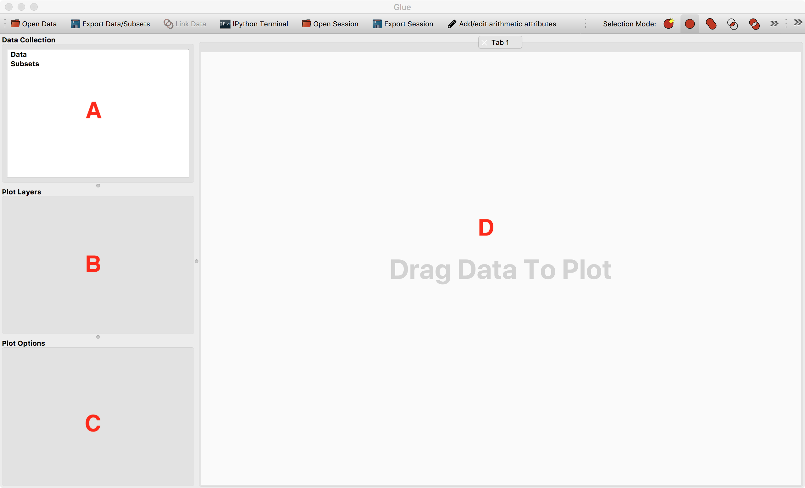
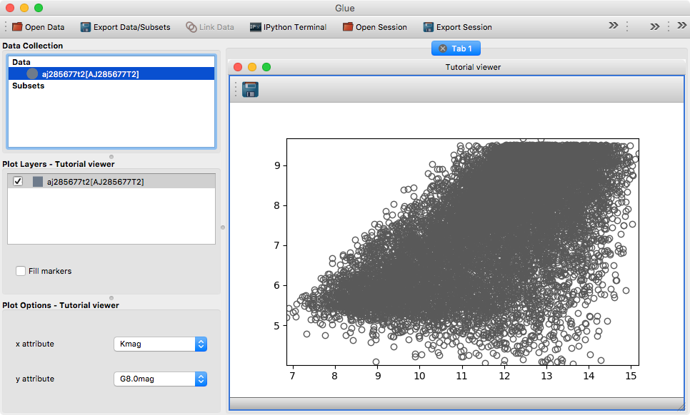

.. _state-qt-viewer:

Writing a custom viewer for glue with Qt
========================================

In :ref:`state-viewer`, we looked at the basics of building data viewers for
glue. In this follow-up tutorial, we look at specifically how to use this to
build a data viewer for the Qt front-end of glue.

Options widgets
---------------

We mentioned in :ref:`state-viewer` that there are state classes that contain a
conceptual representation of the overall viewer options and the settings
pertaining to each layer in the visualization. What is now needed are widgets
that will allow users to easily change this state, and also reflect changes to
the state that are made programmatically.

In the Qt version of glue, viewers typically define a widget to control the
viewer state, which is usually shown is the area indicated as **C** in
the following diagram:

and a widget to control the layer state, which is usually shown is the area
indicated as **B** in the above diagram (in addition to the layer list).

The only requirement for these widgets is that the widget for the viewer options
should take an argument which is the viewer state (as well as a ``session``
keyword argument which is a :class:`~glue.core.session.Session` object that
contains a reference to the data collection and hub), and the widget for the
layer settings should take an argument which is the layer artist (in future this
will likely be changed to the layer state), but beyond this, you can implement
the widgets any way you like. Let's take the simple layer state example above
with the ``fill`` option. You could implement a layer options widget by doing::

    from echo.qt import connect_checkable_button
    from qtpy.QtWidgets import QWidget, QVBoxLayout, QCheckBox

    class TutorialLayerStateWidget(QWidget):

         def __init__(self, layer_artist):

             super(LayerEditWidget, self).__init__()

             self.checkbox = QCheckBox('Fill markers')
             layout = QVBoxLayout()
             layout.addWidget(self.checkbox)
             self.setLayout(layout)

             self.layer_state = layer_artist.state
             self._connection = connect_checkable_button(self.layer_state, 'fill', self.checkbox)

In the above example, you can see that we use the
:class:`~echo.qt.connect_checkable_button` function to link the
``fill`` property from the layer state with the checkbox. For a full list of
available functions, see `here
<https://echo.readthedocs.io/en/latest/api.html>`__.

For more complex cases, you may want to use Qt Designer to create a ui file with
your layout (such as :download:`viewer_state.ui <state_viewer/viewer_state.ui>`), then load it
into the options widget - you can then also automatically connect UI elements to
state properties using the
:func:`~echo.qt.autoconnect_callbacks_to_qt` function. Let's use
this to create a widget to control the viewer state::

    from echo.qt import autoconnect_callbacks_to_qt
    from qtpy.QtWidgets import QWidget
    from glue.utils.qt import load_ui

    class TutorialViewerStateWidget(QWidget):

         def __init__(self, viewer_state, session=None):

             super(TutorialViewerStateWidget, self).__init__()

             # The dirname= is used to indicate that the .ui file is in the same
             # directory as the present file.
             self.ui = load_ui('options_widget.ui', dirname=os.path.dirname(__file__))

             self.viewer_state = viewer_state
             self._connections = autoconnect_callbacks_to_qt(self.viewer_state, self.ui)

For :func:`~echo.qt.autoconnect_callbacks_to_qt` to work, you need
to follow certain naming conventions for the UI elements in the ``.ui`` file. You
can read up more about this convention `here
<https://echo.readthedocs.io/en/latest/api/echo.qt.autoconnect_callbacks_to_qt.html#echo.qt.autoconnect_callbacks_to_qt>`__.

Data viewer
-----------

In the case of Qt, defining a data viewer is similar to the general case
described in :ref:`state-viewer` but this time we need to use the
``DataViewer`` class from ``glue.viewers.common.qt.data_viewer`` and define
two additional attributes to point to the widgets that control the viewer
and layer state::

    from glue.viewers.common.qt.data_viewer import DataViewer

    class TutorialDataViewer(DataViewer):

        LABEL = 'Tutorial viewer'
        _state_cls = TutorialViewerState
        _data_artist_cls = TutorialLayerArtist
        _subset_artist_cls = TutorialLayerArtist

        # Additional attributes for Qt viewers
        _options_cls = TutorialViewerStateWidget
        _layer_style_widget_cls = TutorialLayerStateWidget

As mentioned previously, you will need to set up the actual visualization in the
``__init__`` method for the data viewer, and this time you should use the
``setCentralWidget`` method to add your custom Qt visualization to the widget,
e.g.::

    from matplotlib import pyplot as plt

    def __init__(self, *args, **kwargs):
        super(TutorialDataViewer, self).__init__(*args, **kwargs)
        self.axes = plt.subplot(1, 1, 1)
        self.setCentralWidget(self.axes.figure.canvas)

Functional example
------------------

Let's now take all these pieces and construct a functional example. To try this
out you can simply copy the code below into a ``config.py`` file in the
directory from where you are starting glue. In addition you will also need the
:download:`viewer_state.ui <state_viewer/viewer_state.ui>` file. In `File layout
in glue`_ we discuss how this code are split into different files in glue.

Note that if you are interested in building a Matplotlib-based viewer, you can
make use of the ``glue.viewers.matplotlib`` sub-package to simplify things
as described in :ref:`matplotlib-qt-viewer`.

.. literalinclude:: state_viewer/config.py

Try opening a tabular dataset in glue, drag it onto the canvas area, and select
**Tutorial viewer** - you should now get something that looks like:

File layout in glue
-------------------

In glue, we split up the classes using the following layout:

============================ ========================================
Filename                     Description
============================ ========================================
``state.py``                 State classes for the viewer and layer
``layer_artist.py``          Layer artist class
``qt/options_widget.ui``     Qt ui file for the viewer state widget
``qt/options_widget.py``     Qt viewer state widget
``qt/layer_style_editor.ui`` Qt ui file for the layer state widget
``qt/layer_style_editor.py`` Qt layer state widget
``qt/data_viewer.py``        Qt data viewer
============================ ========================================

You are of course free to organize the files how you wish, but this should help
understand the existing viewers in glue if needed.

Further reading
---------------

To find out how to add tools to your custom viewer, see the
:ref:`custom-toolbars` tutorial, and for information on building a data viewer
with Matplotlib, take a look at the :ref:`matplotlib-qt-viewer` tutorial.
