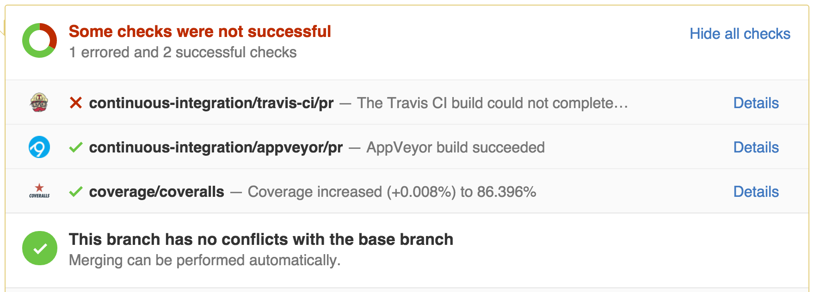

Testing framework
=================

Writing tests
-------------

In order to make sure that everything works as expected, and that we don't
introduce any regressions when making changes, Glue includes a number of tests.
All tests are contained inside the ``tests/`` directories in each sub-package
of Glue. For example, the tests for the ``glue.core`` functionality are in
``glue/core/tests``. The tests for the ``glue.utils.qt`` functionality are in
``glue/utils/qt/tests``. Tests should always live close to the code they are
testing.

In general, we try and make tests as specific as possible to the code being tested - so for example if we create a new dialog, and we want to check that various widgets in the tests are working correctly, we don't need to launch the whole Glue application. Instead, we can create a test data collection with some example data, and simply launch the dialog in question.

We run tests using `py.test <http://www.pytest.org>`_, and tests are therefore written using this framework. The syntax for a basic test is actually very simple and not py.test-specific -- it is simply a function whose name starts with ``test_``. If the function crashes, the test fails, and if the function runs without crashing, the test passes::

    def test_functionality():
        # This is an example of a test that passes
        a = 1
        b = 2 + a
        assert a == 3

Some tests are also written using test classes instead of functions (which
can include py.test-specific methods), and we can also make use of various decorators in py.test to e.g. parameterize tests.

Rather than provide a full guide on how to write tests, we encourage you to take a look at the Astropy documentation on `Writing tests <http://docs.astropy.org/en/latest/development/testguide.html#writing-tests>`_, since we follow the same guidelines as them.

Running tests
-------------

The easiest way to run the Glue tests is to do::

    python setup.py test

You can also invoke py.test directly::

    py.test glue

To run only a specific test, you can do::

    py.test glue/core/tests/test_links.py

Continuous integration
----------------------

Every time someone opens a pull request to the Glue repository, and every time
we merge changes into the code base, all the tests are run on `Travis
<http://travis-ci.org>`_ and `AppVeyor <http://www.appveyor.com/>`_. This is
referred to as *Continuous Integration*. One of the nice things about continuous integration is that it allows us to
automatically run the tests for different operating systems, Python versions,
versions of Numpy, and Qt frameworks (PyQt4, PyQt5, and PySide).

`Travis <http://travis-ci.org>`_ runs tests on Linux and MacOS X, and `AppVeyor
<http://www.appveyor.com/>`_ runs the tests on Windows. When you open a pull
request, you will be able to check the status of the tests at the bottom, which
will look something like this:

In this example, the tests failed on Travis, but passed on Windows. You can
then get more information about which set-ups failed by clicking on 'Details'.