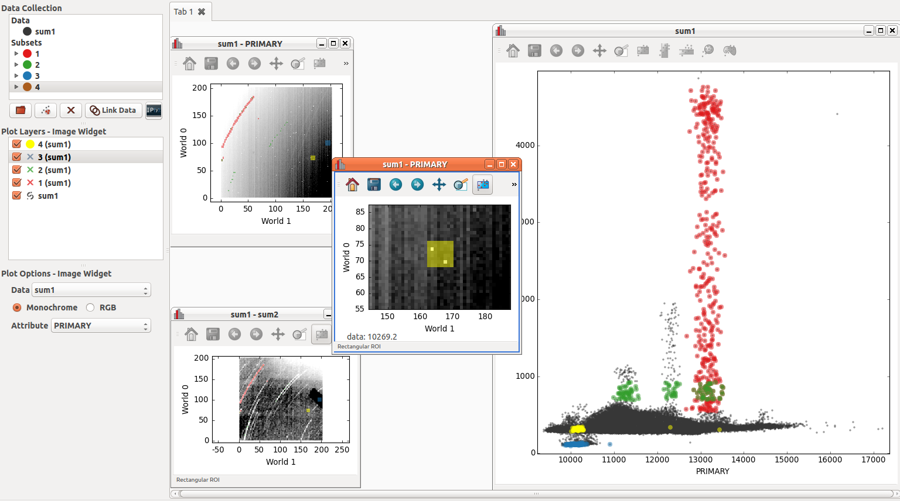

.. _faq:

Frequently Asked Questions
==========================

This page contains commonly asked questions about using Glue. For more technical
issues in installing or running Glue, see the :ref:`known-issues` page.

What data formats does Glue understand?
---------------------------------------

Glue relies on several libraries to parse different file formats:

 * `Astropy <https://www.astropy.org>`_ for FITS images and tables, a
   variety of `ascii table formats
   <http://docs.astropy.org/en/latest/io/ascii/index.html>`_, and VO
   tables.
 * `scikit-image <https://scikit-image.org/>`_ to read popular image
   formats like ``.jpeg`` and ``.tiff``
 * `h5py <https://www.h5py.org/>`_ to read HDF5 files

If Glue's predefined data loaders don't fit your needs, you can also :ref:`write
your own <custom_data_factory>` loader, and plug it into Glue.

How do I overplot catalogs on images in Glue?
---------------------------------------------

Take a look at this video. For more details, consult the :ref:`tutorial <getting_started>`.

.. raw:: html

    

    <iframe src="https://player.vimeo.com/video/54940097?badge=0" width="500" height="305" frameborder="0" webkitAllowFullScreen mozallowfullscreen allowFullScreen></iframe>
    

How do I use Glue with the IPython notebook?
--------------------------------------------

For IPython version >= 4.0, Glue can be started from a Jupyter notebook without
blocking, so that both the notebook and the Glue UI can run at once. This
requires running the following magic function::

    %gui qt

And then starting glue (probably by calling :ref:`qglue <qglue>` or creating an
instance of :class:`~glue.app.qt.application.GlueApplication`) from the
notebook.

If you encounter an error like this::

    ValueError: API 'QString' has already been set to version 1

set the ``QT_API`` environment variable to either ``pyqt``, ``pyqt5``, or
``pyside``, depending on which version of Qt you have installed::

    QT_API=pyside ipython notebook --gui qt

Does Glue Understand CASA Cubes?
--------------------------------

Many radio astronomy datacubes are 4 dimensional, and give intensity
as a function of 2 spatial dimensions, a frequency dimension, and a
Stokes polarization dimension. By default, Glue will read these FITS
images in as 4D hypercubes (use the task exportfits in CASA to write
a native CASA image into a FITS cube that glue can read).

However, you might wish to load the image as a series of 3D cubes,
one for each Stokes parameter. This would more easily allow you,
for example, to compare histograms of intensities for each Stokes
parameter.

Because of this, Glue has a special "CASA image loader", to load
these kinds of files. To open a file in this mode, select "CASA PPV Cube"
in the file type dropdown when opening a file. This will create a single
Data object with 1 attribute for each Stokes parameter.

Something is broken, or confusing. What should I do?
----------------------------------------------------

If you think you have found a bug in Glue, feel free to add an issue to the
`GitHub issues page <https://github.com/glue-viz/glue/issues?q=is%3Aopen>`_. If
you have general questions, feel free to post a message to the `Glue mailing
list <https://groups.google.com/forum/#!forum/glue-viz>`_, or send us an `email
<mailto:glue.viz@gmail.com>`_ directly.

You can also submit bug reports directly from Glue, by clicking ``Help->Send
Feedback``. This also sends us some diagnostic information about your Glue
installation.

How do I make a scatterplot of columns from two different catalogs?
-------------------------------------------------------------------

:ref:`Merge <merging>` the two datasets into a single object.

How do I make a scatterplot between two images?
-----------------------------------------------

:ref:`Merge <merging>` the two datasets into a single object, like you do for
catalogs. This will only work if the two images have exactly the same shape
(although it does not check if the WCS is the same).  You can then drag the
merged object into the visualization area to view an image of the first
attribute. Repeat a second time to view the second image, and finally create a
scatterplot comparing the image intensities at each pixel. You can then select
regions in any of the three plots, and the corresponding selections in the other
plots will be highlighted. Another interesting way to visualize your two related
images is drop a fourth object using **2D Image Viewer**, but this time select the RGB
instead of Monochrome, and put each image into one of the colors. Right mouse
down will change the *Contrast* selected color after you have selected the
*bias/contrast button* on the top row. Obviously with three images  this is a
great way to create a colorful RGB image.

A note on brushing in the image. If you want to just highlight a single pixel
(pretty easy once you zoom in), you need to make sure your rectangular selection
has its top right selection in that pixel. You cannot just highlight inside the
pixel, it needs to cross boundaries between pixels.

The intensity in image SUM1 and image SUM2 are correlated in the scatter
plot. A second image of SUM1 is zoomed in around two *warm* pixels to see
where they show up in the scatter plot (in yellow). In this particular
diagram one can see that warm pixels follow the same relationship between
SUM1 and SUM2 and the colder pixels.

I have some other question...?
------------------------------

Ask us a question on the `mailing list <https://groups.google.com/forum/#!forum/glue-viz>`_!
