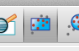
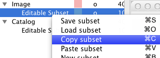

.. _getting_started:

Getting started
***************

Installation
============

.. todo::

    How will we distribute?

First steps
===========

The most common way to use Glue is through the Graphical User
Interface. This section will walk you through a simple
session with the Glue GUI.You can also follow along with this video:

.. raw:: html

    

    <iframe src="http://player.vimeo.com/video/44941396" width="500" height="281" frameborder="0" webkitAllowFullScreen mozallowfullscreen allowFullScreen></iframe>
    

Start the application
---------------------

The :command:`glueqt` command starts the glue GUI. From your command prompt::

    glueqt

.. todo::
   Create a glueqt executable

There are three main components to the Glue application, shown in the figure below:

 1) The visualization area will host individual plots
 2) The layer manager lists the data and subsets that are currently open
 3) The menu bar

.. figure:: main_window.png
   :alt: Main Glue GUI window
   :scale: 40%
   :align: center

   The main glue application window

Open a Data Set
---------------

Let's get some data into glue. The data we will be using in this tutorial are located in here. From the menu, select :menuselection:`File --> open data`. In the dialog, select and open the ``Extinction.fits`` file

.. tip:: You can also open a data set by clicking the + button at the bottom of the layer manager

.. todo:: Add a link to example data.
.. todo:: Add file->open data to application menu

Loading a data set adds two items to the layer manager -- the dataset
itself and an "editable subset." We will see in a moment what the
editable subset is all about.

.. figure:: after_load.png
   :align: center

   The layer manager after loading data.

We'd like to explore the Extinction data set. Lets open a new
visualization window to take a look. In the menu select ``Tab -> new
window`` (or ``Ctrl + N``). This launches a dialog asking what kind of
visualization we would like to use. This is an image, so we will
choose ImageWidget.

The Image Widget allows us to specify a data set and attribute. Each
data set may have several attributes -- in this case, we have the
primary pixel information, Pixel coordinate information (i.e. the x or
y location of each pixel in pixel space), and world coordinate
information (in this case, the RA and Dec of each
pixel). Select the ``Primary`` component.

.. tip:: Glue automaticaly parses FITS headers, to derive information about the pixel and world coordinate system of images.

Adjusting Contrast
------------------

You may notice at this point that the image greyscale has defaulted to
a bad setting. We can adjust this by clicking on the bias/contrast box
in the image toolbar

   The button to active the Bias/Contrast mouse mode

Clicking on this button activates the Bias/Contrast "mouse mode" --
mouse modes are different ways of responding to user input. The
bias/contrast mouse mode uses right mouse button drags to adjust the
greyscale, in a way similar to DS9. Try right-dragging to adjust the
greyscale to your liking. Click the bias/contrast button again to
deactivate the mouse mode.

Define a Subset
---------------

The main way of interacting with data in Glue is through defining
regions of interest, or Subsets. The primary goal of Glue is to let
users drill down into interesting regions of their data by identifying
interesting regions, and propagating this across several data
sets. Let's define a subset.

There are several mouse modes which create subsets. Choose the
Rectangle tool, and left-click-drag on a region in the image.

   The rectangle mouse mode defines rectangular regions of interest

This action defines a new subset, which gets attached to the
Extinction data's Editable Subset. Note that you can double-click on
the colored box next to the editable subset entry in the layer
manager, and change the color of the subset in visualization windows.

Loading More Data
-----------------

None of this is very interesting yet -- defining a single subset on a
single dataset isn't all that enlightening, and other image viewers
like DS9 provide much better functionality.

Let's load another data set. This time, load ``ysos.tbl`` --
a VO catalog of young stellar objects towards the Perseus molecular cloud.
This creates a new data entry and editable subset in the layer manager. Let's also create a second visualization environment: this time, a scatter plot.

The scatter plot has it's own layer manager -- click the "+" button on
the scatter widget to load the catalog dataset into the widget, and
select which quantities to plot along the x/y axis. Note that the
scatter widget shares many of the same mouse modes.

Linking Data
------------

These two data sets share a logical connection -- the ``ra`` and
``dec`` columns of the catalog specify the location of objects on the
sky. This information is also in the image. Let's teach Glue about
that connection.

In the layer manager, click the "Link" button. Select the ``identity`` function in the middle, and drag the RA attributes from each data set into the input/output box. Select ``two-way-link``.

.. figure:: link_dialog.png
   :align: center

   Linking the coordinate information of an image and catalog data set

Finally, click the "add" button to tell the application that these
two quantities in fact describe the same information. Repeat this for
the declination as well. Finally, click OK to accept these changes.

Nothing visible changes, but Glue now knows of a strategy for
propagating subsets from one data set to another -- let's see how that
works

.. note:: see :ref:`component_link` for more information on how this window works.

Propagating Subsets
-------------------

Define a subset in the image widget using one of the mouse modes. This
updates the image's edit_subset definition. Next, right click on that
subset in the layer manager, and click "Copy Subset". Finally, highlight
the edit subset in the catalog, right click, and select "paste
subset". You should see some points in the scatter plot change color.

   Copying a subset definition to apply to another data set.

What just happened? The selection in the image widget defined a region
in RA/Dec space. Since Glue knows that these quantities
are linked to attributes in the catalog, it knows how to filter
items in the catalog based on this region of interest. Copy/pasting
the subset copies over the region of interest to the catalog and
filters the catalog appropriately.

.. note:: The copy/paste action is a one-time translation. If either
          of the subsets are re-defined, this does not propagate.

Actually, something even niftier is going on. Behind the scenes, the
image client defines subsets in *pixel* coordinate space -- this is
not directly applicable to the catalog. However, it *is* possible to
translate RA and Dec into the pixel space of the image. Glue
is able to indirectly deduce the pixel coordinates (in the image
space) of each entry in the catalog, and use this information to copy
the subset definition.

This is a powerful feature of Glue, and greatly simplifies specifying
links between data sets. For example, if we loaded a third data set
(call it other_image) and connected it's RA/Dec attributes
with the catalog, Glue would automatically know how to make all the
following translations (and more):

 * RA/Dec in other_image to pixel x/y in the original image
 * pixel x/y in other_image to pixel x/y in the original image
 * pixel x/y in other_image to latitude/longitude in all 3 data sets

.. note::

    We can't always copy/paste subsets across data. For example, plot
    two attributes besides ra and dec in the scatter widget, and
    define a subset. The underlying region of interest is now defined
    according to the plotted attributes, which do not translate to
    image coordinates. If you try to copy/paste this subset onto the
    image, it will fail and simply clear the image's subset
    definition.

Saving Subsets
--------------

Glue's main focus is exploratory data analysis -- for more
quantitative analysis, you will probably want a different tool. Subset
definitions can easily be saved as masks, to be used for further
analysis in other programs. Simply right click on a subset in the
layer manager, and click "Save subset." Likewise, you can re-load
subset masks from file.

Currently, all subsets are saved as simple 1/0 masks as FITS files.

Going Further
-------------

There are many other things Glue is useful for, besides what has been
covered here. Other features include:

 * Specifying custom logic to link attributes across data sets
 * Plugging in different data visualizations
 * Defining new attributes via transformations of others (for example,
   deriving column density estimates from color information)
 * Creating custom mouse modes to translate mouse interaction into subset definitions
 * Using the Glue framework as an analysis tool outside of the GUI framework

Documentation for these features is forthcoming.
