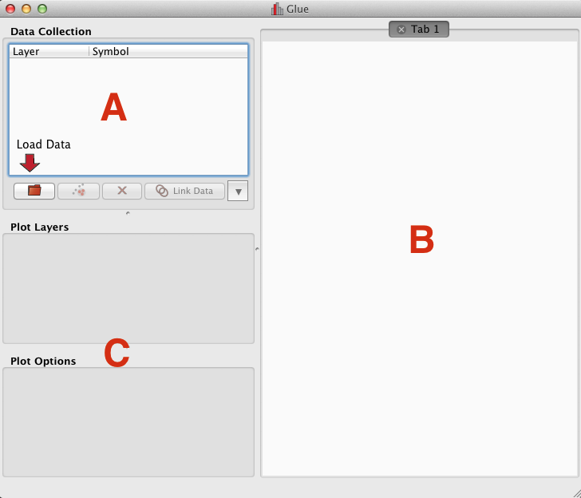
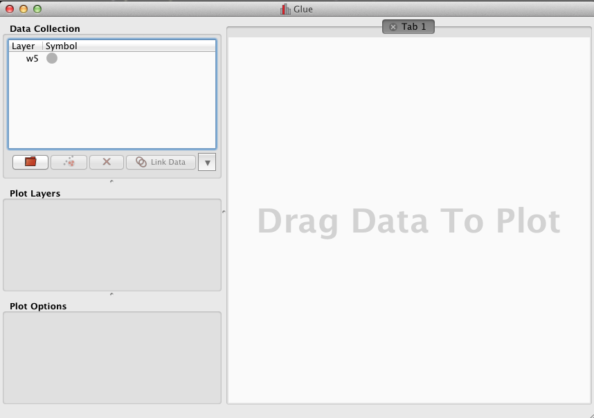
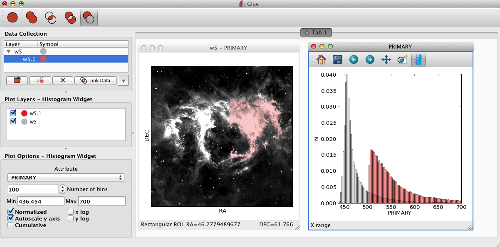
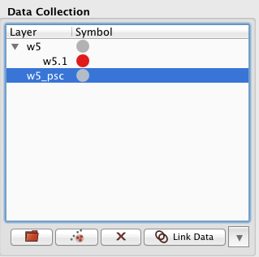
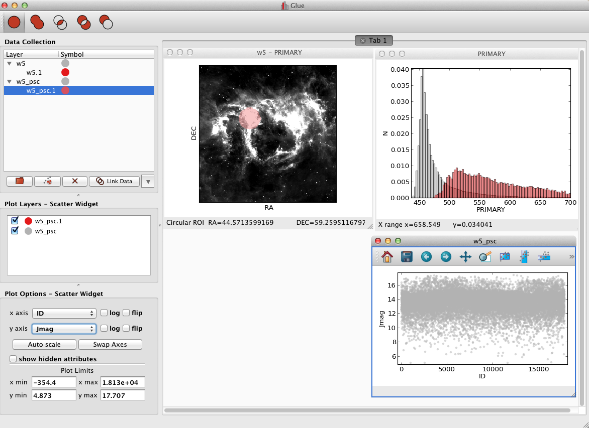
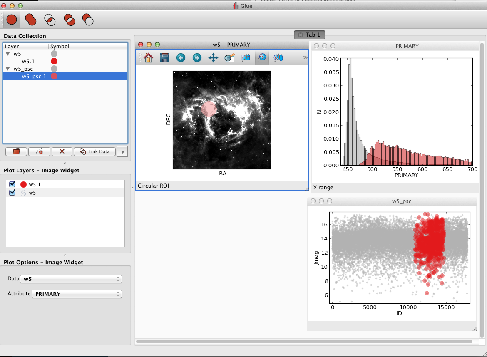

.. _getting_started:

Getting started
***************
This page walks through Glue's basic GUI features, using data from the W5 star forming region as an example. You can download the data files for this tutorial `here <_static/w5.tgz>`_

After :ref:`installing <installation>` Glue, open the program by either double clicking on the icon (if using a pre-built application) or from the command line::

    glue

   Glue's main interface

The main window consists of 3 areas:

 A. The **data manager**. This lists all open data sets and subsets (highlighted regions).
 B. The **visualization area**. This is where each visualization window resides.
 C. The **visualization dashboard**. This shows the options for the active visualization window.

Opening Data
============
There are three ways to open data: By clicking on the red folder icon, the ``File->Open Data Set`` menu, or ``Ctrl+O`` (``Cmd+O`` on the Mac). Find and open the file ``w5.fits``. This is a `WISE image <http://wise.ssl.berkeley.edu/>`_ of the `W5 Star Forming Region <http://en.wikipedia.org/wiki/Soul_Nebula>`_.

Plotting Data
=============
After opening ``w5.fits``, a new entry will appear in the data manger:

To visualize a dataset, click and drag the entry from the data manager to the visualization dashboard. A popup window asks about what kind of plot to make. Since this is an image, select ``Image``.

Defining Subsets
================
Work in glue revolves around "drilling down" into interesting subsets within data. Each visualization type (image, scatterplot, …) provides different ways for defining these subsets. In particular, the image window provides 4 options:

 .. figure:: image_selectors.png

* Rectangular selection: When active, a click+drag defines rectangular regions of interest.
* Circular selection: Defines circles.
* Freeform selection: Defines arbitrary polygons.
* Contour selection: Uses the contour line that passes through the mouse.

We can highlight the west arm of W5 using the rectangle selector:

 .. figure:: w5_west.png
    :align: center
    :width: 500px

Notice that this highlights the relevant pixels in the image, adds a new subset (``W5.1``) to the data manager, and adds a new visualization layer (also labeled ``W5.1``) in the visualization dashboard.

We can redefine this subset by dragging a new rectangle in the image. Alternately, we could define a second subset by clicking the ``New Subset`` button (next to the folder button).

.. _multi_selection_note:
.. note:: When multiple subsets are defined, only the highlighted entries in the data manager are affected when drawing new subsets. If no subsets are highlighted, then a new subset is created.

You can edit the properties of a visualization layer (color, name, etc.) By right-clicking on the entry in the visualization dashboard.

  .. figure:: layer_options.png
     :align: center

Likewise, you can re-arrange the rows in this widget to change the order in which each layer is drawn -- the top entry will appear above all other entries.

Refining Subsets and Linked Views
=================================
Visualizations are linked in Glue -- that is, we can plot this data in many different ways, to better understand the properties of each subset. To see this, click and drag the ``W5`` entry into the visualization area a second time, and make a histogram. Edit the settings in the histogram visualization dashboard to produce something similar to this:

 .. figure:: histogram.png
    :align: center
    :width: 500px

This shows the distribution of intensities for the image as a whole (gray), and for the subset in red (the label `PRIMARY` comes from the FITS header)

Perhaps we wish to remove faint pixels from our selection. To do this, we first enable the selection mode toolbar via ``Toolbars->Selection Mode Toolbar``, and then pick the last mode (``Remove From Selection`` mode).:

 .. figure:: modes.png
    :align: center

When this mode is active, new regions defined by the mouse are subtracted from the selected subsets. Thus, I can highlight the region between x=450-500 in the histogram to remove this region from the data.

.. note:: Make sure you switch back to the first, default combination mode (``Replace Selection`` mode)

Linking Data
============
Glue is designed so that visualization and drilldown can span multiple datasets. To do this, we need to inform Glue about the logical connections that exist between each dataset.

Open ``w5_psc.vot`` -- a catalog of *Spitzer*-identified point sources towards this region. You will see a new entry in the data manager.

At this point, you can visualize and drilldown into this catalog. However, Glue doesn't know enough to intercompare the catalog and image. To do that, we must ``Link`` these two data entries. Click on the ``Link Data`` button in the data manager. This brings up a new window, showing all the pieces of information within each dataset:

.. figure:: link_editor.png
   :align: center
   :width: 400px

The image has an attribute ``World x:RA---TAN``. This is the same quantity as the ``RAJ2000`` attribute in the ``w5_psc`` catalog -- they are both describing Right Ascension (the horizontal spatial coordinate on the sky). Select these entries, and click ``Glue`` to instruct the program that these quantities are equivalent. Likewise, link ``World y: DEC--TAN`` and ``DEJ2000`` (Declination, the other coordinate). Click ``OK``.

.. note::
   What does this do? This tells Glue how to derive the catalog-defined quantities ``DEJ2000`` and ``RAJ2000`` using data from the image, and vice versa. In this case, the derivation is simple (it aliases the quantity ``World y:DEC--TAN`` or ``World x:RA---TAN``). In general, the derivation can be more complex (i.e. an arbitrary function that maps quantities in the image to a quantity in the catalog). Glue uses this information to apply subset definitions to different data sets, overplot multiple datasets, etc.

After these connections are defined, subsets that are defined via spatial constraints in the image can be used to filter rows in the catalog. Let's see how that works.

First, define a subset in the image as before. I chose a circle towards the east arm:

.. figure:: link_subset_1.png
   :align: center
   :width: 500px

Next, create a new (empty) subset in the catalog by highlighting ``w5_psc`` and clicking the ``New Subset`` button (next to the red folder button).

Next, create a scatter plot of the catalog by dragging ``w5_psc`` into the visuaslization area. At this point, your window should look like this:

Finally, we can select ``w5.1``, copy it's definition (``Ctrl+C`` or ``Cmd+C``), selecting ``w5_psc.1``, and paste this definition (``Ctrl+V`` or ``Cmd+V``). This will show which entries in the catalog overlap the circular region defined in the image.

This cross-data operation was possible because Glue had enough information to apply the spatial constraint in the image (fundamentally, a constraint on ``World x:RA---TAN`` and ``World y:DEC--TAN``) to a constraint in the catalog (since it could derive thsoe quantities from the ``RAJ2000`` and ``DEJ2000`` attributes). Several other cross-data operations are possible at this point. For example, you can drag the ``w5_psc.1`` entry from the data manager to the image window to overplot this subset as a collection of points in the image.

.. tip::

    Glue stores subsets as sets of constraints -- tracing a rectangle
    subset on a plot defines a set of constraints on the
    quantities plotted on the x and y axes (left < x < right, bottom <
    y < top). Copying a subset copies this definition, and pasting it
    applies the definition to a different subset.

As was mentioned :ref:`above <multi_selection_note>`, the highlighted subsets in the data manager are the ones which are affected by selecting regions in the plots. Thus, instead of manually copy-pasting subsets from the image to the catalog, you can also highlight both subsets before selecting a plot region. This will update both subsets to match the selection.

.. note:: Careful readers will notice that we didn't use the image subset from earlier sections when working with the catalog. This is because that selection combined spatial constraints (the original rectangle in the image) with a constraint on intensity (the histogram selection). There is no mapping from image intensity to quantities in the catalog, so it isn't possible to filter the catalog on that subset. If you try to paste a subset onto a dataset and Glue doesn't know what to do, it clears the target subset as an indication that the operation cannot be completed.

Saving your work
================
Glue provides a number of ways to save your work, and to export your work for further analysis in other programs.

**Saving The Session**
You can save a Glue session for later work via the ``File->Save Session`` menu. This creates a glue session file (the preferred file extension is ``.glu``). Currently, this saves the data and subsets, but not the visualization windows. You can restore this session later via ``File->Open Session``

.. warning:: Due to the way python objects are saved, it is unlikely that a saved session will restore properly if you change Glue versions.

**Saving Plots**
Static images of individual visualizations can be saved by clicking the floppy disk icon on a given visualization window.

**Saving Subsets**
Glue is primarily an exploration environment -- eventually, you may want to export subsets for further analysis. Glue currently supports saving subsets as FITS masks. Right click on the subset in the data manager, and select ``Save Subset`` to write the subset to disk. This file will have the same shape as the original data, and will contain a 1/0 indicating whether that element is part of the subset.
