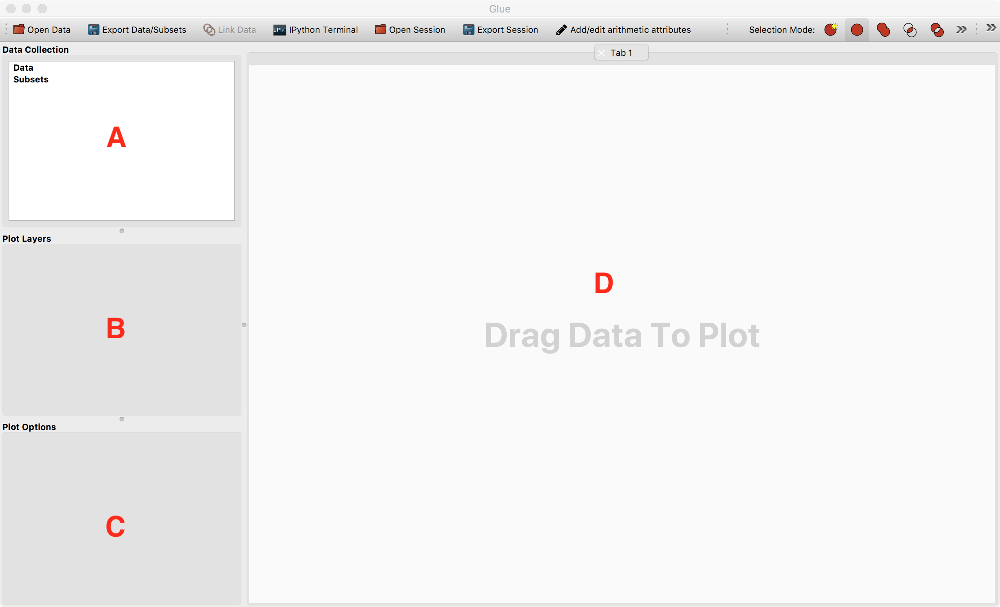
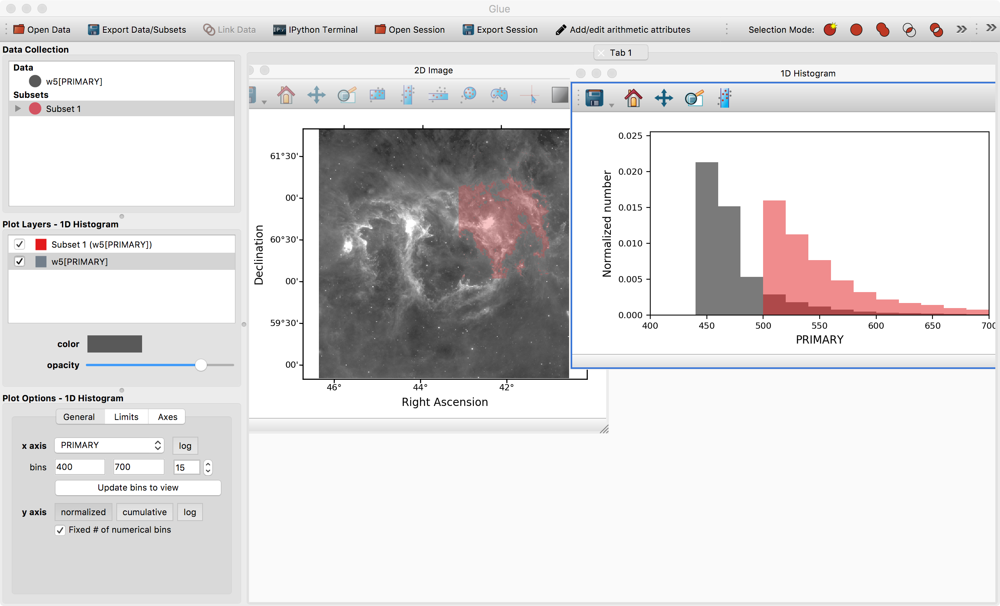
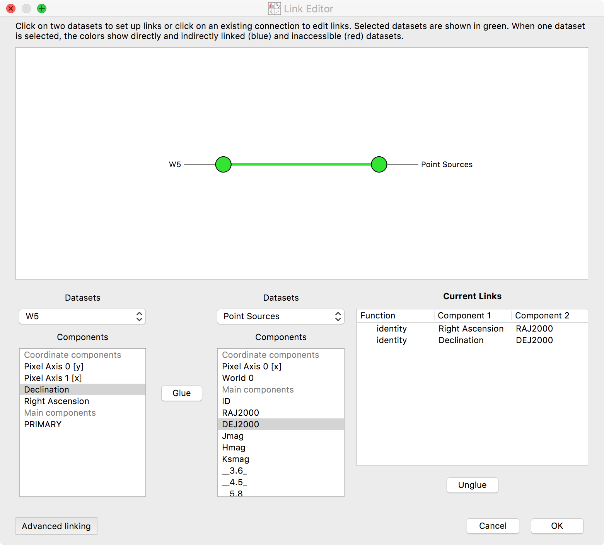
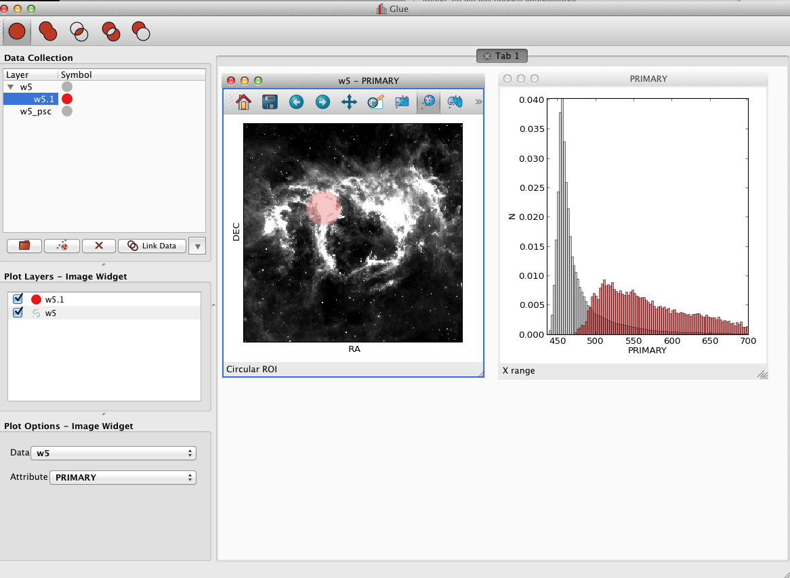
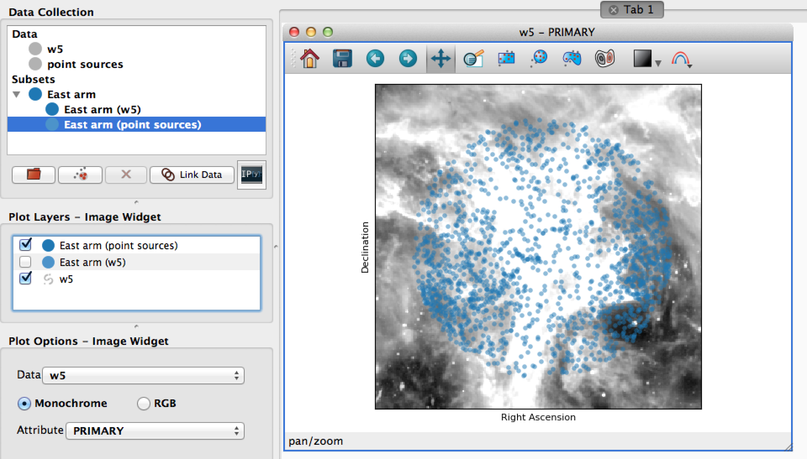

.. _getting_started:

Getting started
***************

This page walks through Glue's basic GUI features, using data from the W5 star
forming region as an example. You can download the data files for this tutorial here:

* :download:`w5.tgz` (Linux and MacOS X)
* :download:`w5.zip` (Windows)

After :ref:`installing <installation>` Glue, you can launch it by typing::

    glue

or by clicking on the Glue icon in the Anaconda Navigator if using it. After a
few seconds you should see the main window of glue which looks like this:

The main window consists of 4 areas:

 A. The **data collection**. This lists all open data sets and subsets (highlighted regions).
 B. The **viewer layers**. This is where you will see a list of layers in the current viewer, and be able to control the appearance of individual layers
 C. The **viewer options**. This is where you will see global options for the active viewer
 D. The **visualization canvas**. This is where visualization windows resides.

Opening Data
============

There are multiple ways to open data:

* By clicking on the red folder icon in the top left
* By selecting the **Open Data Set** item under the **File** menu or using the
  equivalent shortcut (e.g. **Ctrl+O** on Linux, **Cmd+O** on Mac).
* By dragging and dropping data files onto the main window

  Find and open the file ``w5.fits`` which should be in the ``w5.tgz`` or
  ``w5.zip`` archive you downloaded above. This is a `WISE image
  <https://www.nasa.gov/mission_pages/WISE/main/index.html>`_ of the `W5 Star Forming Region
  <https://en.wikipedia.org/wiki/Soul_Nebula>`_. While this is an astronomical
  dataset, glue can be used for data in any discipline, and many of the concepts
  shown below are applicable to many types of dataset.

Plotting Data
=============

After opening ``w5.fits``, a new entry will appear in the data manager:

To visualize a dataset, click and drag the entry from the data manager to the
visualization dashboard. A popup window asks about what kind of plot to make.
Since this is an image, select **2D Image Viewer**.

Defining Subsets
================

Work in glue revolves around "drilling down" into interesting subsets within
data. Each visualization type (image, scatterplot, ...) provides different ways
for defining these subsets. In particular, the image window provides 5 options:

* Rectangular selection
* Horizontal range
* Vertical range
* Circular selection
* Freeform selection

To use these, click on one of the selection icons then click and drag on the
image to define a selection. If using the polygon selection, you should press
'enter' when the selection is complete (or 'escape' to cancel).

We can highlight the west arm of W5 using the rectangle selector:

 .. figure:: images/w5_west.png
    :align: center
    :width: 100%

Notice that this highlights the relevant pixels in the image, adds a new subset
(named **Subset 1**) to the data manager, and adds a new visualization layer in
the visualization dashboard.

We can redefine this subset by dragging a new rectangle in the image, or we can
also move around the current subset by pressing the 'control' key and clicking
on the subset then dragging it. As long as **Subset 1** is selected in the data
collection view in the top left, drawing selections will redefine **Subset 1**.
If you deselect this subset and draw a new region, a new subset will be
created.

You can edit the properties of a visualization layer (color, transparency, etc.)
by clicking on the layer in the **Plot layers** list on the left. Likewise, you
can re-arrange the rows in this widget to change the order in which each layer
is drawn -- the top entry will appear above all other entries.

Refining Subsets and Linked Views
=================================

Visualizations are linked in Glue -- that is, we can plot this data in many
different ways, to better understand the properties of each subset. To see this,
click and drag the **W5[PRIMARY]** entry into the visualization area a second
time, and make a histogram. Edit the settings in the histogram visualization
dashboard to produce something similar to this:

 .. figure:: images/histogram.png
    :align: center
    :width: 100%

This shows the distribution of intensities for the image as a whole (gray), and
for the subset in red (the label **PRIMARY** comes from the FITS header)

Perhaps we wish to remove faint pixels from our selection. To do this, we pick
the last mode (**Remove From Selection**) from the selection mode toolbar:

 .. figure:: images/modes.png
    :align: center
    :width: 300

When this mode is active, new regions defined by the mouse are subtracted from
the selected subsets. We can therefore highlight the region between x=450-500 in
the histogram to remove this region from the data.

.. note:: Make sure you switch back to the first, default selection mode
          (**Replace Selection**) once you have finished defining the
          selection.

Linking Data
============

.. _getting_started_link:

Glue is designed so that visualization and drilldown can span multiple datasets.
To do this, we need to inform Glue about the logical connections that exist
between each dataset.

Open the second file, ``w5_psc.vot`` -- a catalog of *Spitzer*-identified point
sources towards this region. You will see a new entry in the data manager. We
can double click on that entry to rename it to **Point Sources**, and the result
will look like this:

At this point, you can visualize and drilldown into this catalog. However, Glue
doesn't know enough to compare the catalog and image. To do that, we must
*Link* these two data entries. Click on the ``Link Data`` button in the toolbar.
This brings up a new window, showing all the pieces of information within each
dataset:

Select the two datasets in the network diagram in the top panel, or from the
drop-down menus underneath. The image has an attribute **Right Ascension**. This
is the same quantity as the **RAJ2000** attribute in the **Point Sources**
dataset -- they are both describing Right Ascension (the horizontal spatial
coordinate on the sky). Select these entries, and click **Glue** to instruct the
program that these quantities are equivalent. Likewise, link **Declination** and
**DEJ2000** (Declination, the other coordinate). Click **OK**.

.. note:: What does this do? This tells Glue how to derive the catalog-defined
          quantities **DEJ2000** and **RAJ2000** using data from the image, and
          vice versa. In this case, the derivation is simple (it aliases the
          quantity **Declination** or **Right Ascension**). In general, the
          derivation can be more complex (i.e. an arbitrary function that maps
          quantities in the image to a quantity in the catalog). Glue uses this
          information to apply subset definitions to different data sets,
          overplot multiple datasets, etc.

After these connections are defined, subsets that are defined via spatial
constraints in the image can be used to filter rows in the catalog. Let's see
how that works.

First, make a scatter plot of the point source catalog. Then, select **Subset
1** and draw a new region on the image. You should see this selection applied to
all plots:

You can also overplot the catalog rows on top of the image. To do this, click
the arrow next to the new subset -- this shows the individual selections applied
to each dataset. Click and drag the subset for the point source catalog on top
of the image. To see these points more easily, you may want to disable the
layer showing all the points (named **Point Sources**) in the list of plot
layers.

Glue is able to apply this filter to both datasets because it has enough
information to apply the spatial constraint in the image (fundamentally, a
constraint on **Right Ascension** and **Declination**) to a constraint in the
catalog (since it could derive those quantities from the **RAJ2000** and
**DEJ2000** attributes).

.. tip::

    Glue stores subsets as sets of constraints -- tracing a rectangle
    subset on a plot defines a set of constraints on the
    quantities plotted on the x and y axes (left < x < right, bottom <
    y < top). Copying a subset copies this definition, and pasting it
    applies the definition to a different subset.

As was mentioned above, the highlighted subsets in the data manager are the ones
which are affected by selecting regions in the plots. Thus, instead of manually
copy-pasting subsets from the image to the catalog, you can also highlight both
subsets before selecting a plot region. This will update both subsets to match
the selection.

.. note:: Careful readers will notice that we didn't use the image subset
          from earlier sections when working with the catalog. This is because
          that selection combined spatial constraints (the original rectangle in
          the image) with a constraint on intensity (the histogram selection).
          There is no mapping from image intensity to quantities in the catalog,
          so it isn't possible to filter the catalog on that subset. In
          situations where Glue is unable to apply a filter to a dataset, it
          doesn't render the subset in the visualization.

.. _saving_session:

Saving your work
================

Glue provides a number of ways to save your work, and to export your work for
further analysis in other programs.

**Saving The Session**

You can save a Glue session for later work via the **Save Session** button in
the toolbar or in the **File** menu. This creates a glue session file (the
preferred file extension is ``.glu``). You can restore this session later via
the **Open Session** button in the toolbar or in the **File** menu.

By default, these files store references to the files you opened, and not
copies of the files themselves. Thus, you won't be able to re-load this
session if you move any of the original data. To include the data in the
session file, you can select 'Glue Session including data' when saving:

.. figure:: images/save_with_data.png
   :align: center
   :width: 400px

**Saving Plots**

Static images of individual visualizations can be saved by clicking the floppy
disk icon on a given visualization window. There are also exporters available
under the **File** menu - built-in exporters include one to export plots to the
`plotly <https://plot.ly>`_ service, and one to export plots using
`D3PO <https://github.com/adrn/d3po>`_.

**Saving Subsets**

Glue is primarily an exploration environment -- eventually, you may want to
export subsets for further analysis. Glue currently supports saving subsets as
FITS masks. Right click on the subset in the data manager (note that you need to
select the subset applied to a specific dataset, not the overall subset, so be
sure to expand the subset by clicking on the triangle on the left of the subset
name), and select **Export subset values** or **Export subset mask(s)** to write
the subset to disk.
