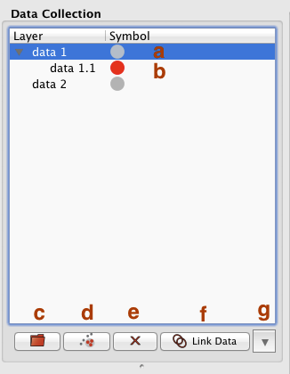
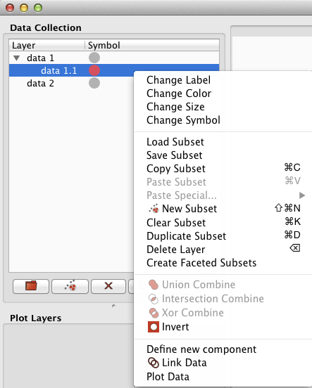

.. _gui_guide:

Guide to the GUI
================

Main Application Window
-----------------------
.. figure:: main_window.png
   :align: center
   :width: 500px

   Glue's main interface

The main window consists of 3 areas:

 A. The **data manager**. This lists all open data sets and subsets (highlighted regions)
 B. The **visualization area**. This is where each visualization window resides
 C. The **visualization dashboard**. This shows the options for the active visualization window.

Data Magager
^^^^^^^^^^^^

A. An open data set. This dataset is also :ref:`highlighted <multi_selection_note>`.
B. A subset associated with ``data 1``
C. The **Open Data** button
D. Add a **New Subset** to the highlighted dataset
E. **Delete** the highlighted items
F. Open the **Link Data** dialog to define connections between data
G. Toggle the Python **Terminal**

Right Clicking on an entry in the data manager brings up a menu of options (also available within the ``Data Manager`` menu):

This menu has the following entries:

 * **Change Label**: Change the name of the selection (here, ``data1.1``)
 * **Change Color**: Change the color (and opacity) associated with the selection (here, red)
 * **Change Size**: Change point size for relevant visualizations
 * **Change Symbol**: Change point symbol for relevant visualizations
 * **Load Subset**: Load a subset previously saved with ``Save Subset``
 * **Save Subset**: Write the selected subset to a FITS mask of 1s and 0s
 * **Copy Cubset**: Copy the definition of the subset to the clipboard
 * **Paste Subset**: Overwrite this subset with the subset previously copied to the clipboard
 * **Paste Special**: Instead of overwriting on paste, use boolean combination (add to selection, remove from selection, etc.)
 * **New Subset**: Create a new subset associated with the highlighted data
 * **Clear Subset**: Reset the subset definition to the null set
 * **Duplicate Subset**: Create a new subset whose region definition matches the current selection
 * **Delete Layer**: Remove the selected items from the data manager and visualizations
 * **Create Faceted Subsets**: Create several subsets by partitioning a dataset by one of its quantities (similar to a histogram)
 * **Union Combine**: Create a new subset that is the combination of the selected subsets
 * **Intersection Combine**: Create a new subest that is the intersection of the selected subsets
 * **Xor combine**: Create a new subset that is the exclusive intersection of the selected subsets (i.e. union - intersection)
 * **Invert**: Invert the current selection
 * **Define New Component**: Launch a new window to add a new component to the data
 * **Link Data**: open the Link Data dialog
 * **Plot Data**: An alternative to dragging the entry into the visualization area. Creates a new visualization of the selection

Scatter Widget
--------------

Image Widget
------------

Histogram Widget
----------------
