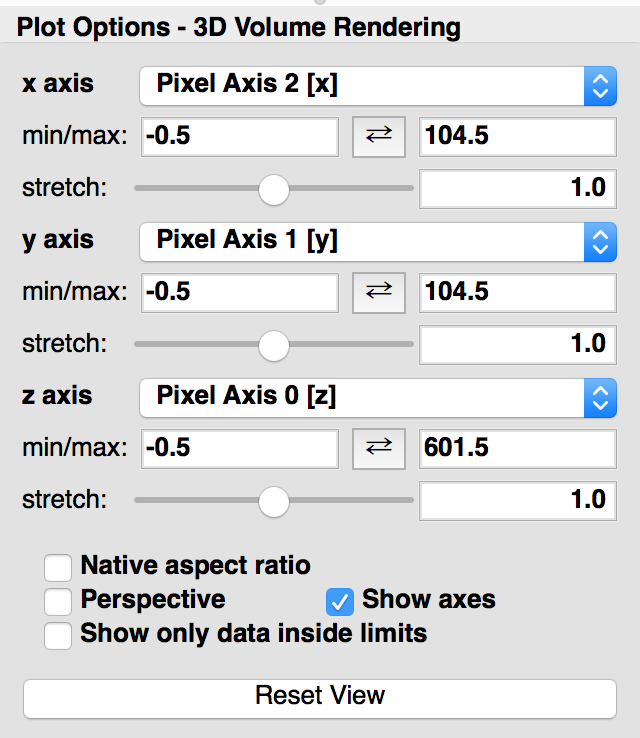
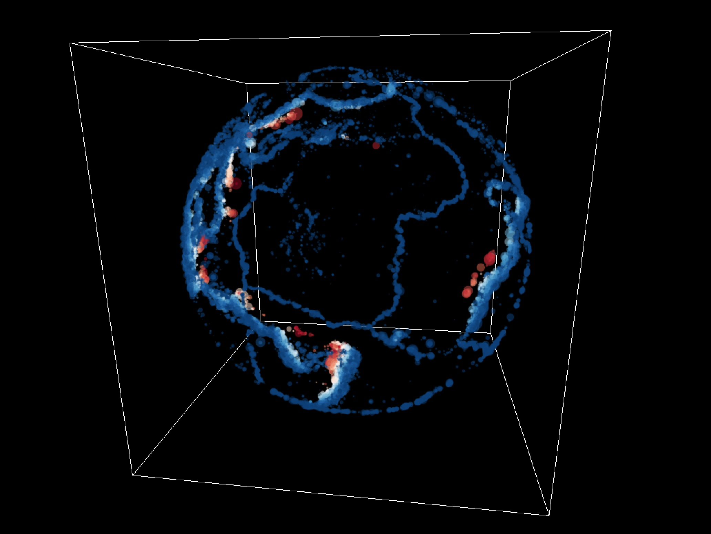

:orphan:

.. _experimental_3d:

3D viewers in Glue
==================

.. important:: The functionality described on this page is experimental
               and is not feature-complete. If you do try it out, let us know if
               you have any feedback, or are interested in helping develop it
               further!

A plugin with experimental 3D viewers for glue, powered by `VisPy
<http://www.vispy.org>`_, is now available. To install this plugin, you will
first need to make sure that the VisPy package is installed.

Provided that you installed glue with ``conda`` or with ``pip`` (with the
optional dependencies enabled), you should already have the 3D viewers
available. You can check this by going to the **Canvas** menu in glue and
selecting **New Data Viewer**, or alternatively by dragging a dataset onto
the canvas area. If the 3D viewers plugin is installed, you should see the
3D viewers in the list:

.. image:: images/3d_viewers_select.png
   :align: center
   :width: 339

If you don't see these in the list, then if you are using
`Anaconda <https://www.continuum.io/downloads>`_ to manage your Python
distribution, you can install the 3D viewers plugin using::

    conda install -c conda-forge glue-vispy-viewers

If you don't use Anaconda, you can install the plugin using::

    pip install glue-vispy-viewers

With the plugin installed, you will now have access to two new data
viewers in Glue:

* 3D scatter viewer
* 3D volume rendering viewer

Please read on to understand the current functionality and limitations of each
viewer. If you are interested in getting involved in implementing some of the
missing functionality or fixing known issues, please join the `glue-viz-dev
<https://groups.google.com/forum/#!forum/glue-viz-dev>`_ mailing list and let
us know!

Common options for all viewers
------------------------------

All 3D viewers share a similar panel in the bottom left:

In addition, all viewers will show a rectangular 3D box, which by default
is a cube. The edges of the cube correspond to the min/max values in the
options panel above. If these values are changed, the data is renormalized
inside the cube, but the white cube stays the same. It is also possible to
instead stretch the cube into a rectangular box with a different size in each
dimension, using the sliders. This can be useful in the case of a volume
rendering, if the number of pixels is very different along different axes.

3D Scatter Plot Viewer
----------------------

The 3D scatter plot viewer is the most feature-complete of the viewers at the
moment. It is currently able to:

* Display markers based on any 3 data components
* Highlight subsets made in other viewers
* Control the visual appearance of both data and subsets
* Color code markers using any component
* Set the size of markers to depend on any component
* Scale the absolute size and the transparency of markers in each layer using
  sliders

The following visualization shows a 3D scatter plot with the location of
earthquakes around the globe, color coded by depth and with the size set by the
magnitude of the earthquake:

At the moment this viewer is not able to show multiple datasets (just one
dataset with subsets), but this will be added shortly.

3D Volume Rendering Viewer
--------------------------

The 3D volume rendering is currently able to show only 3D datasets (not e.g. 4D
cubes sliced along one dimension). The viewer is able to also highlight subsets
made in other viewers:

.. image:: images/3d_volume.jpg
   :align: center
   :width: 600px

At the moment, the 3D viewer is only able to show multiple datasets if they are
on the same grid. Note that for this viewer, the limits in the options panel in
the bottom left are in pixel coordinates, not world coordinates.

3D Isosurface Viewer
--------------------

A 3D isosurface viewer is in development. This viewer is still highly
experimental and currently very slow for displaying isosurfaces. In addition, it
is only able to show a single isosurface level. We do not recommend using it at
this time, and have disabled it by default. If you are interested in trying it
out, see the `README.md
<https://github.com/glue-viz/glue-vispy-viewers/blob/master/README.md>`_ file in
the glue-vispy-viewers repository.

General limitations/known issues
--------------------------------

* The performance of the viewers may not yet be optimal with large datasets -
  if in doubt, start with a smaller dataset first to see if you will run into
  performance issues.

Reporting issues
----------------

Please report any issues in the following `issue tracker
<https://github.com/glue-viz/glue-3d-viewer/issues>`_. Please first check that
there is not already a similar issue open -- if there is, please feel free to
comment on that issue to let us know you ran into that problem too!

Credits
-------

* Penny Qian
* Tom Robitaille
* Maxwell Tsai
