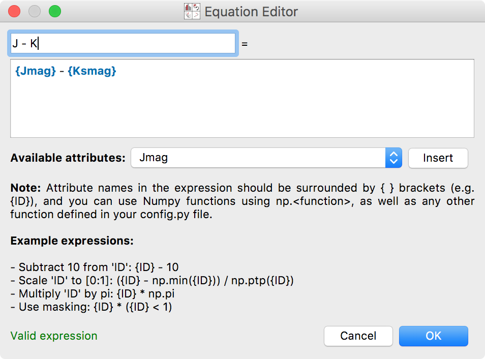
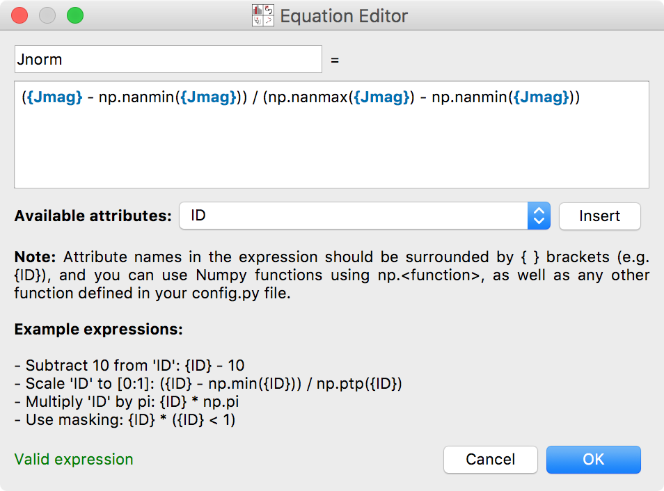

.. _new_components:

Defining New Attributes
=======================

New attributes of data items can be easily created from mathematical
operations on existing attributes. In this section, we define new
attributes for the W5 Point Source catalog from the
:ref:`tutorial <getting_started>`.

To start off, click on the **Arithmetic Attributes** tool in the toolbar:

A new window will appear for defining attributes. To start off, use the
drop-down menu to select the dataset for which you want to create an arithmetic
attribute. Then, click on **New arithmetic attribute**, which will open up the
equation editor. From here, set the new attribute name, then type the expression
in the box provided. Attribute names should be included in curly brackets, e.g.
``{ID}``. You can either type attribute names directly, using tab-completion
if necessary, or you can also select an attribute from the list of available
attributes and click on **Insert** to insert it into the expression.

Here we define a new attribute ``J - K`` to be the difference between the J and
the Ks magnitudes:

After clicking **OK**, the new attribute is listed in the list of arithmetic
attributes:

.. figure:: images/arithmetic_defined.png
    :align: center
    :width: 500

At this point, you could if you wished define additional attributes, or go back
and edit existing ones. Clicking **OK** again will return to the main glue
interface, from which you can now use the new arithmetic attribute(s).

Note that the expression line can include Numpy functions (prefaced with
``np.``), and anything else you import in your config.py file for Glue. For
example, you could define a normalized version of ``Jmag`` using:

