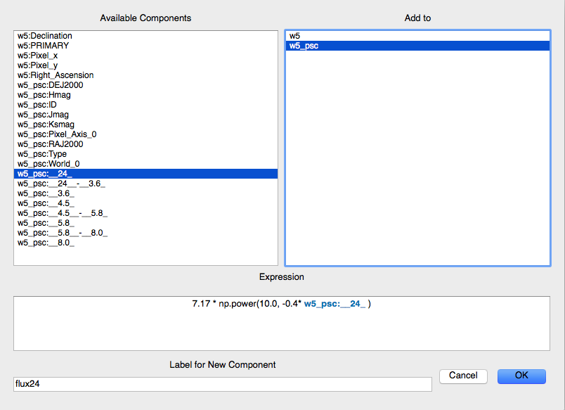

.. _new_components:

Defining New Components
=======================

New components of data items can be easily created from mathematical
operations on existing components. In this section, we define new
components for the W5 Point Source catalog from the
:ref:`tutorial <getting_started>`.

Right-click on the ``w5_psc`` item in the Data Collection window and
select ``Define new component``:

A new window will appear for defining components. Double-clicking on any
of the Available Components will add it to the expression line. You can
also type the name of the component -- it will appear in blue if it is
valid and in red if not, when separated by spaces from other parts
of the expression. Here we
define a new component ``__24__-__3.6_`` to be the difference between
24 micron and 3.6 micron magnitudes:

.. figure:: images/define_component_02.png
    :align: center

Remember to select the data item on the ``Add to`` window (here, ``w5_psc``).

After clicking ``OK``, the new component is available for plotting and
other uses.

Furthermore, the
expression line can include Numpy functions (prefaced with ``np.``), and anything
else you import in your config.py file for Glue. For example, if you wished to
define a component expressing the 24 micron flux density in Janskys, you could
use the ``np.power`` function:

