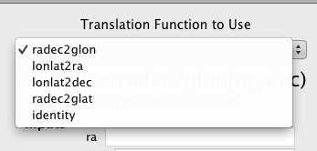

.. _configuration:

Configuring Glue
================

Glue uses a configuration system to customize aspects such as which
visualization modules it loads, what link functions to use, etc. This
allows users who create their own glue modules to easily incorporate
them into the main GUI environment.

The configuration file is a normal python file that Glue automatically
imports. Glue looks for a file called ``config.py`` in the following locations:

 * The directory specified by the environment variable ``gluerc``
 * ``~/.glue``
 * The current working directory
 * A default config file shipped with glue.

To obtain a fresh ``config.py`` file to edit, run the command line program::

   glue-config

Which will create a new file at ``~/.glue/config.py``

Example Usage: Custom Link Functions
------------------------------------

As an example, let's create some translation functions which will
allow us to link RA / Dec data to other data in Galactic
latitude/longitude::

.. literalinclude:: scripts/coord_convert.py

Next, I copy this code into my `~/.glue/config.py` file (or install it
on my system as a module and import the module form
``config.py``). Finally, I edit the link_functions list::

    link_functions = [identity, radec2glat, radec2glon, lonlat2ra, lonlat2dec]

When linking attributes with the Link Editor, any function in ``link_functions`` can be used
to link attributes.

