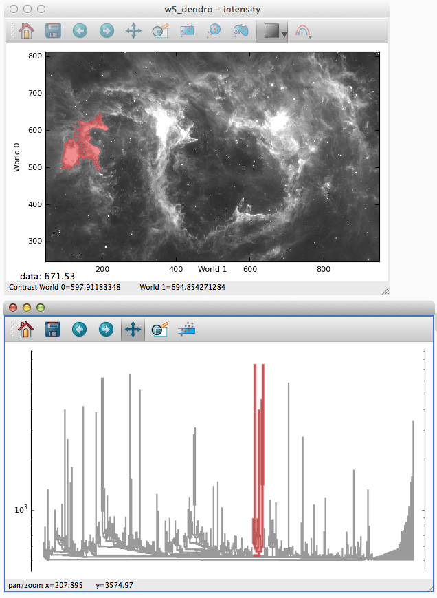

Visualizing Astronomical Dendrograms
====================================

You can use Glue to visualize dendrograms created by the
`astrodendro <http://dendrograms.org/>`_ package.

Enabling the viewer
-------------------

The dendrogram viewer will be automatically available if the `astrodendro`_
package is installed. To install it, simply use::

    pip install astrodendro

Building a dendrogram
---------------------

The details of constructing dendrograms for astronomical images
is beyond the scope of this document -- see `<http://dendrograms.org/>`_
for more information. The following snippet builds a dendrogram
from the W5 image used in the :ref:`tutorial <getting_started>`::

    from astropy.io import fits
    from astrodendro import Dendrogram

    data = fits.getdata('W5.fits')
    dg = Dendrogram.compute(data, min_value=500, min_npix=50)
    dg.save_to('w5_dendro.fits')

Next, load this file into Glue, choosing "Denrdogram" as a file type.
You can now visualize the W5 dendrogram alongside its image:

Linking to Catalog Properties
-----------------------------

If you have used astrodendro to compute a catalog of structure properties,
you can visualize that in Glue as well. The best way to do this is to
save the catalog as a table, load it into Glue, and
:ref:`merge it <merging>` with the dendrogram dataset. This will
supplement the dendrogram with the additional catalog-derived properties.
