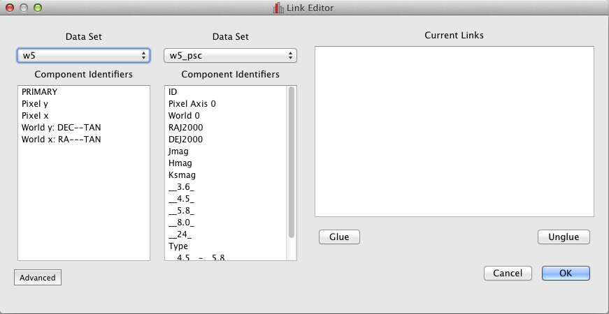
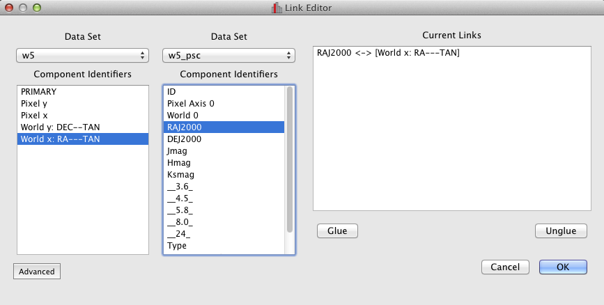
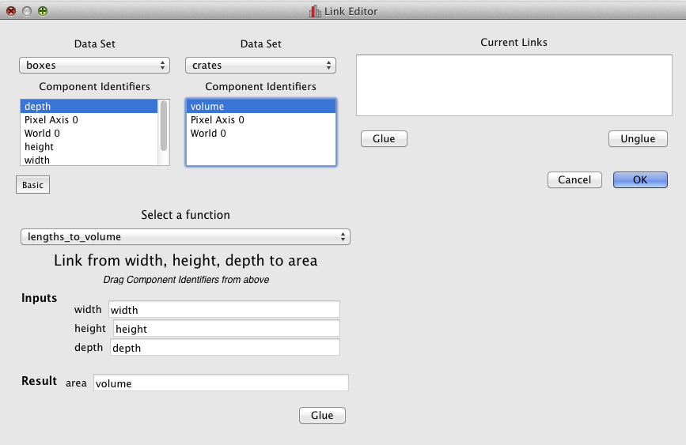

.. _linking:

How Data Linking Works
======================

.. currentmodule: glue.core

Glue makes it possible to compare different, interrelated datasets. For example, Glue allows you to:

* Overlay scatterplots of the positions of objects in two different catalogs
* Select a region of interest in an image, and use this spatial constraint to filter a catalog with position information
* Overlay histograms that compare mass distributions of two different datasets.

To do this, Glue needs to understand how quantities in different datasets relate to each other:

* Sometimes, two datasets define the same quantity (e.g., two catalogs that both report time)
* Sometimes, datasets define the same quantities in different units (elapsed time in hours vs elapsed time in days)
* Sometimes, a quantity (like area) can be derived from other quantites (like length and width).

**Data Links** tell Glue how to translate between different quantities,
to intercompare different datasets.

.. note::

  **Are data links like table joins?** If you are familiar with
  concepts from SQL, R, or Pandas, you might think data links are like
  data mergers or joins. They are different -- mergers assume
  information about the **same entity** is present in many tables,
  such that the diffent tables can in principle be merged together.
  Data Links in glue, on the other hand, assume that the entrys in
  different datasets correspond to different entities, but may
  describe the **same quantity**. For example, an image and a position
  catalog both have spatial information, but no row in the catalog
  represents a pixel in the image. Data mergers are not yet supported
  in Glue.

Data Linking from the GUI
-------------------------
The :ref:`Data Linking Editor <getting_started_link>` let's users
define data links from the GUI.

The simplest link occurs when two datasets define the same quantity in
the same units. In this case, Glue can trivially overplot
visualizations in both datasets. For example, in the image above, both
datasets (a catalog and an image) both have the same RA and Dec
spatial information (RA and Dec are essentially latitude and longitude
coordinates on the sky). To link these quantities, we highlight the
equivalent quantities, and click "Glue".

In the more general case, one quantity can be computed from one or more others,
but is not identical to another quantity. The ``advanced`` tab let's us
specify how to use a translation function to derive one quantity from others:

Here, a ``boxes`` dataset reports the linear dimensions of some boxes, and a crates dataset reports the volume of crates. The box volumes can be intercompared with the crate volumes by multiplying the box width, height, and depth.
To specify this link, we select a translation function (``lengths_to_volume``),
and drag the components to the relevant inputs and output of the translation
function.

Note that this link is one-way: we can compute area from width height
and depth, but not vice versa. Thus, we will be able to overlay
information about box volume on a plot of crate volume, but not any
information about crate height.

Links Propagate
---------------

Glue knows how to string links together. For example, consider
4 datasets which report masses in kilograms. There are
6 pairs of equivalent mass quantities (``m1<->m2, m1<->m3, m1<->m4, m2<->m3, m2<->m4, m3<->m4``). However, you need only define 3 links (say, ``m1<->m2, m1<->m3, m1<->m4``). Even though there is no explicit link between ``m2<->m3``, Glue knows they are equivalent (since ``m3<->m1<->m2``). Glue will always be able
to figure out these "chains" of connections.
