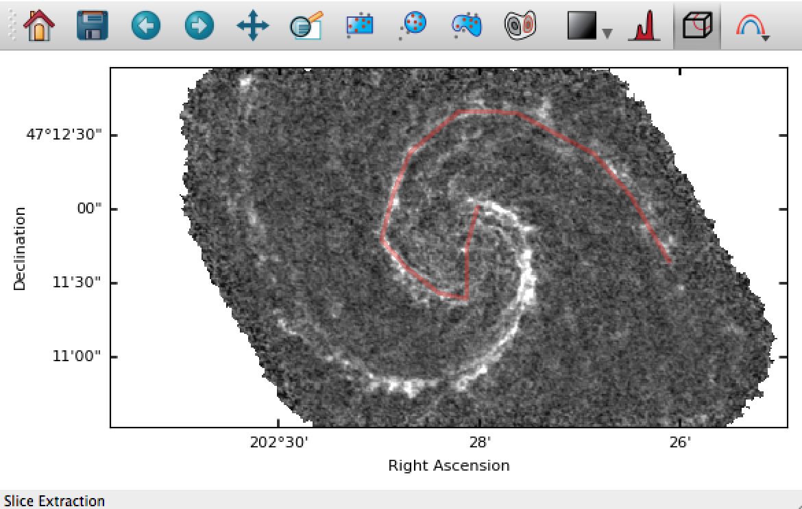
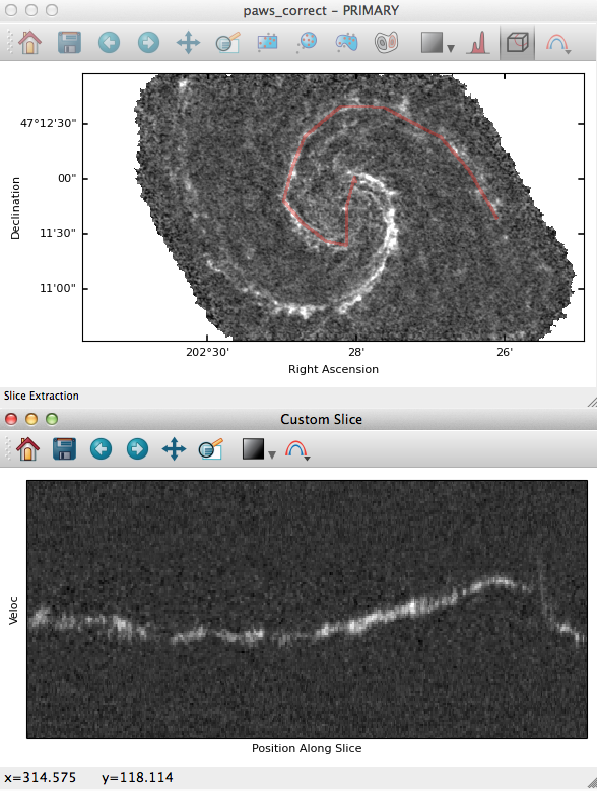

.. _slice:

================
Slice Extraction
================

When visualizing image cubes, Glue's image viewer extracts axis-parallel slices
through the data. You can also extract slices from *arbitrary* paths through
the data, using the slice tool in the image viewer:

Activate this mode and click (or click+drag) a path on an image:

Hitting escape will reset the path. Hitting enter will extract this
slice from the original cube, and display it in a new window:

The slice plot is linked to the original image viewer (of course!), so that
click+dragging on the slice window will update the orientation of the
image window.

This video demonstrates the process, and also shows the power of combining
slice extraction and spectrum extraction.

.. raw:: html

    

    <iframe src="https://player.vimeo.com/video/96815794?badge=0"  width="500" height="333" frameborder="0" webkitAllowFullScreen mozallowfullscreen allowFullScreen></iframe>
    

     

This kind of slice extraction is especially useful for spectral cube analysis,
since the extracted images are position-velocity diagrams. However, they can
be useful in other contexts as well. For example, here's a screenshot showing
an on-the-fly cross section of a brain tumor MRI:

.. raw:: html

    

    
    

     

The script used to load this data into Glue can be found `here <https://gist.github.com/ChrisBeaumont/e97d4efdc9c472836214>`__.

