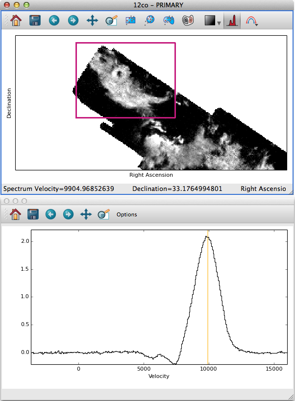
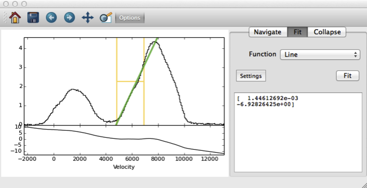
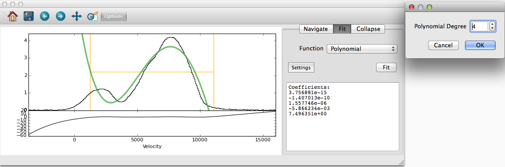
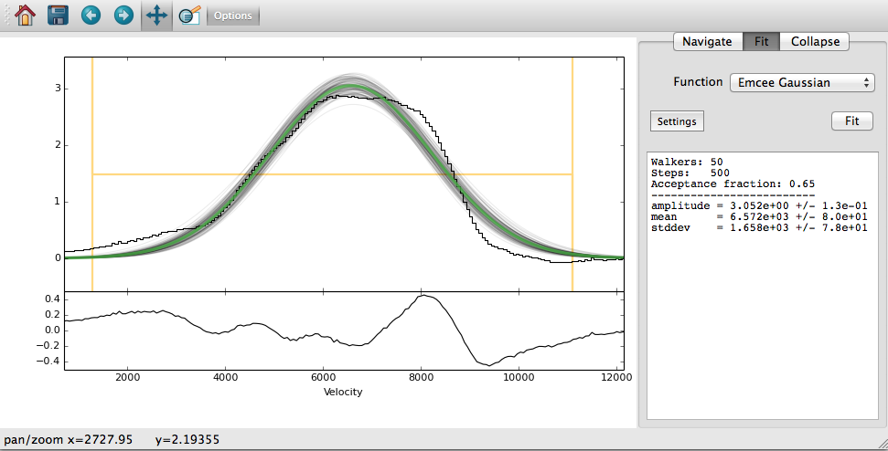

.. _spectrum:

=================
Spectrum Analysis
=================

When using the image viewer on data with 3 or more dimensions,
you have the option of extracting and analyzing spectra (or, more generally,
integrated 1D profiles). To extract a spectrum, click the profile button
on an image viewer:

Then, click-drag a box on the image. Glue will extract a spectrum by
integrating over the dimensions of the box, for each slice of the cube.
Likewise, you can also drag a subset onto the spectrum window, to extract
a spectrum for the pixels in that subset.

The spectrum is displayed in a new window, which you can interact with
in a few ways.

Interaction Modes
=================

Navigation
^^^^^^^^^^

The default navigation mode inside the spectrum window is **navigation**:
by double clicking on a part of the spectrum (or by dragging the vertical
handle), you will set which slice of the data is shown in the image view.

Cube Collapse
^^^^^^^^^^^^^
Click on the options button of the spectrum window, and then select the
**collapse** tab. This allows you to partially collapse the cube, and
send the result back to the image viewer. The two-sided handle on the plot
defines the slices to collapse over, which you can edit by dragging the edges.

Profile Fitting
^^^^^^^^^^^^^^^^
By clicking on the **fit** tab, you can fit a model to the extracted spectrum.
Again, the two sided handle on the plot defines the range of data to fit.
Clicking the fit button will add a best-fit model to the plot. The dropdown
lets you choose which model to fit to the data.

Different models have different settings, which you can adjust by clicking
on the settings button. For example, the (astropy-powered) Gaussian fitter
allows you to fix certain parameters, or limit them to specific ranges.

.. _fit_plugins:

Custom fitting plugins
======================

The profile fitting tool is designed to be easily extended, so that
you can plug in your own model fitting code worrying about GUI code.
We will walk through several examples of custom fitting plugins,
to demonstrate the various features of the plugin system.

Simple line fitter
^^^^^^^^^^^^^^^^^^^
Our first example is a simple linear model. Here's the code:

.. literalinclude:: line_fit_plugin.py
   :linenos:
   :emphasize-lines: 6,8,10,13

Let's look at this line by line:

Line 6 wraps a subclass of BaseFitter1D in the ``fit_plugin`` decorator.
All plugins follow this basic structure.

Line 8 gives this class a label, which is used in the GUI to label
this model in the model selection dropdown.

Line 10 overrides the :meth:`~glue.core.fitters.BaseFitter1D.fit` method. All plugins must implement fit, which
takes at least 4 parameters:

 * x: A numpy array of X values
 * y: A numpy array of Y values
 * dy: A numpy array of the errors on each Y value, or none
 * constraints: A dictionary of constraints (more on this later)

The fit method can do whatever it wants. Here, we are using :func:`numpy.polyfit` to fit a 1st-order polynomial to the data. We ignore dy and constraints.
We return the result from polyfit -- Glue doesn't care what fit returns,
it just passes that to other methods (as we will now see)

Line 13 overrides the :meth:`~glue.core.fitters.BaseFitter1D.predict` method. Again, all models must define this method.
It takes 2 inputs -- whatever was returned from :meth:`~glue.core.fitters.BaseFitter1D.fit`, and an array of X values
to evaluate the model at. This method must return a array of model-predicted Y
values at each X location. We use :func:`numpy.polyval` to do this

This code is enough to let us fit lines to data:

.. note:: In order for Glue to find this code, we need to copy this file to the same directory as :ref:`config.py <configuration>` (``~/.glue`` by default), and add ``import line_fit_plugin`` to ``config.py``.

Polynomial fitter, with Options
^^^^^^^^^^^^^^^^^^^^^^^^^^^^^^^
Generalizing the line fitter above to higher degree polynomials is trivial, since ``polyfit/polyval`` both handle this case. We might want to make the degree of the fit a user-settable
parameter. We can do this by adding a UI :mod:`option <glue.core.simpleforms>`, and a few keywords to our class:

.. literalinclude:: poly_fit_plugin.py
   :linenos:

This code adds a few new features:

Line 10 adds an :class:`~glue.core.simpleforms.IntOption` named degree to the class. Likewise,
the fit method takes a keyword named degree, and uses this to fit a
polynomial of order ``degree`` (e.g., degree=2 corresponds to a parabola).
This extra information allows Glue to add a widget to the settings window:

This plugin also overrides the :meth:`~glue.core.fitters.BaseFitter1D.summarize` method. Summarize returns a string, which is used as the display in the fit summary window.

Model with constraints
^^^^^^^^^^^^^^^^^^^^^^

Models like those found in ``astropy.modeling`` support fixing or
constraining certain parameters. If you would like to add user-setttable
constraints to your model, add a ``param_names`` list to the class::

    class ConstrainedGaussian(BaseFitter1D):
        param_names = ['amplitude']
        ...

Glue uses this information to let the user fix or limit parameters
in the settings tab. This information is passed to the ``constraints``
argument of :meth:`~glue.core.fitters.BaseFitter1D.fit`. ``constraints`` is a dictionary whose keys are
parameter names. Each value is itself a dictionary with 4 entries:

 * The default ``value`` of the parameter, or None if not set by the user
 * ``fixed``, which is True if the parameter should be held fixed
 * ``limits``, which is None if the value is unconstrained, or a list of minimum/maximum allowed values

Astropy-based models
^^^^^^^^^^^^^^^^^^^^

The :class:`~glue.core.fitters.AstropyFitter1D` base class can be subclassed to plug custom `astropy models and fitters <http://astropy.readthedocs.org/en/latest/modeling/>`_ into Glue. This is very easy::

    from astropy.modeling import models, fitting

    @fit_plugin
    class Gaussian(AstropyFitter1D):
        model_cls = models.Gaussian1D
        fitting_cls = fitting.NonLinearLSQFitter
        label = "Gaussian"

        def parameter_guesses(self, x, y, dy):
            return dict(amplitude=1, stddev=1, mean=1)

The :meth:`~glue.core.fitters.AstropyFitter1D.parameter_guesses` method is optional, and provides initial guesses
for the model parameters if they weren't set by the user.

Custom Plotting
^^^^^^^^^^^^^^^^

Fit plugins can also override the :meth:`~glue.core.fitters.BaseFitter1D.plot` method, to customize how the model fit is drawn on the profile.

Example: Gaussian fitting with Emcee
^^^^^^^^^^^^^^^^^^^^^^^^^^^^^^^^^^^^

The :download:`emcee plugin example <emcee_plugin.py>` combines many
of these ideas.

