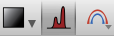

.. _spectrum:

==============
Profile Viewer
==============

When using the image viewer on data with 3 or more dimensions, you have the
option of extracting and analyzing 1D profiles (for Astronomers dealing with
spectral cubes, this would be a spectrum). To compute a profile, click the
profile button on an image viewer:

This will create a 1D profile viewer with the data collapsed along all but one
axis (which you can select in the bottom left):

.. figure:: images/profile_data.png
   :align: center
   :width: 600px

You can also create 1D profiles directly by dragging datasets onto the canvas
rather than going via the image viewer. If the dataset has subsets, these will
also result in profiles being computed in the profile viewer. If you don't have
any subsets yet, try and select a region in the image viewer, and you will then
see the collapsed profile for that region in the profile viewer:

.. figure:: images/profile_subset.png
   :align: center
   :width: 600px

Interaction Modes
=================

The profile viewer has various advanced features that we now describe. To access
these, click on the 'Options' button in the toolbar of the profile viewer.

Navigation
^^^^^^^^^^

The default navigation mode inside the spectrum window is **Navigation**: by
clicking on a part of the spectrum (or by dragging the vertical handle), you
will set which slice of the data is shown in any open image viewer showing the
same data.

Profile Fitting
^^^^^^^^^^^^^^^^

By clicking on the **Fit** tab, you can fit a model to the extracted spectrum.
In this mode, you can click and drag on the spectrum to define a range over
which to fit a mode. You can edit the range by dragging either of the edges.
Clicking the fit button will add a best-fit model(s) to the plot (one model for
each dataset and one for each subset). The dropdown lets you choose which model
to fit to the data.

Different models have different settings, which you can adjust by clicking on
the settings button. For example, the Gaussian fitter allows you to fix certain
parameters, or limit them to specific ranges. For more information about
customizing the models and/or fitting process, see :ref:`custom-fitting`.

Cube Collapse
^^^^^^^^^^^^^

The **Collapse** tab allows you to partially collapse the cube, and send the
result back to the image viewer. As for fitting, you can draw and edit a range
over which to collapse the data. Clicking 'collapse' will temporarily show a
collapsed view of the data over the range in any image viewer currently showing
the same data.
