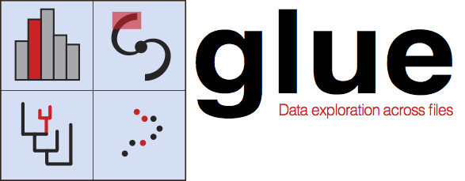

Glue Documentation
==================

Glue is a Python library to explore relationships within and among related datasets. Its main features include:

* **Linked Statistical Graphics.** With Glue, users can create scatter plots, histograms and images (2D and 3D) of their data. Glue is focused on the brushing and linking paradigm, where selections in any graph propagate to all others.
* **Flexible linking across data.** Glue uses the logical links that exist between different data sets to overlay visualizations of different data, and to propagate selections across data sets. These links are specified by the user, and are arbitrarily flexible.
* **Full scripting capability.** Glue is written in Python, and built on top of its standard scientific libraries (i.e., Numpy, Matplotlib, Scipy). Users can easily integrate their own python code for data input, cleaning, and analysis.

.. raw:: html

 

 <iframe width="640" height="390" src="https://www.youtube.com/embed/qO3RQiRjWA4?rel=0" frameborder="0" allowfullscreen></iframe>
 

For more demos, check out the :ref:`videos <demo_videos>` page.

**The latest version of glue is v0.9** - see our :ref:`overview of changes in v0.9 <whatsnew_09>`

Getting started
---------------

Glue is designed with "data-hacking" workflows in mind, and can be used in
different ways. For instance, you can simply make use of the graphical Glue
application as is, and never type a line of code. However, you can also
interact with Glue via Python in different ways:

* Using the IPython terminal built-in to the Glue application
* Sending data in the form of NumPy arrays or Pandas DataFrames
  to Glue for exploration from a Python or IPython session.
* Customizing/hacking your Glue setup using ``config.py`` files, including
  automatically loading and clean data before starting Glue, writing custom
  functions to parse files in your favorite file format, writing custom
  functions to link datasets, or creating your own data viewers.

Glue thus blurs the boundary between GUI-centric and code-centric data
exploration. In addition, it is also possible to develop your own plugin
packages for Glue that you can distribute to users separately, and you can also
make use of the Glue framework in your own application to provide data linking
capabilities.

In the following sections, we cover the different ways of using Glue from the
Glue application to the more advanced ways of interacting with Glue from Python.

.. note:: For any questions or help with using glue, you can always join the
          `user support mailing list <https://groups.google.com/forum/#!forum/glue-viz>`_
          or ask questions on our `Gitter channel <https://gitter.im/glue-viz/glue>`_!

Using the Glue application
--------------------------

.. toctree::
   :maxdepth: 2

   installation.rst
   getting_started/index.rst
   gui_guide/index.rst
   gui_guide/3d_viewers.rst

Interacting with data from Python
---------------------------------

.. toctree::
   :maxdepth: 1

   python_guide/ipython_terminal.rst
   python_guide/data_tutorial.rst
   python_guide/glue_from_python.rst

Customizing/Hacking Glue
------------------------

.. toctree::
   :maxdepth: 1

   customizing_guide/configuration.rst
   customizing_guide/customization.rst
   python_guide/data_viewer_options.rst
   customizing_guide/custom_viewer.rst
   python_guide/liveupdate.rst
   customizing_guide/full_custom_qt_viewer.rst
   customizing_guide/toolbar.rst

Getting help
------------

.. toctree::
   :maxdepth: 1

   videos.rst
   faq.rst
   help.rst

.. _architecture:

The Glue architecture
---------------------

The pages below take you through the main infrastructure in Glue, and in
particular how selections, linking, and communications are handled internally.
You don't need to understand all of this in order to get started with
contributing, but in order to tackle some of the more in-depth issues, this
will become important. This is not meant to be a completely exhaustive guide,
but if there are areas that you feel could be explained better, or are missing
and would be useful, please let us know!

.. toctree::
   :maxdepth: 1

   developer_guide/selection.rst
   developer_guide/communication.rst
   developer_guide/linking.rst

Information on the Data framework is available in :ref:`data_tutorial` and is not repeated here.

.. _devdocs:

Developing Glue
---------------

.. toctree::
   :maxdepth: 2

   developer_guide/developer_guide.rst

API
---

.. toctree::
   :maxdepth: 1

   developer_guide/api.rst

Indices and tables
==================

* :ref:`genindex`
* :ref:`modindex`
* :ref:`search`
