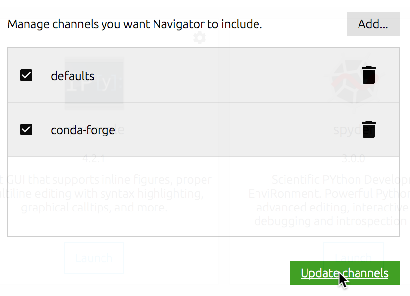
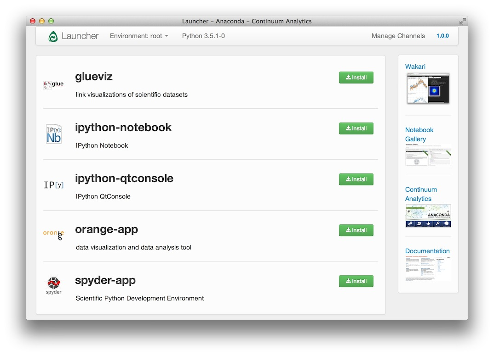

.. _installation:

Installing Glue
===============

.. _anaconda:

Anaconda Python Distribution (Recommended)
------------------------------------------

**Platforms:** MacOS X, Linux, and Windows

We recommend using the `Anaconda <http://continuum.io/downloads.html>`__ Python
distribution from Continuum Analytics (or the related Miniconda distribution).
Anaconda includes all of Glue's main dependencies. There are two ways of
installing Glue with the Anaconda Python Distribution: :ref:`graphically using the
Anaconda Navigator <anaconda_gui>`, or :ref:`using the conda command
<anaconda_cli>` on the command-line, both of which are described
below.

.. _anaconda_gui:

Graphical installation
^^^^^^^^^^^^^^^^^^^^^^

Once Anaconda is installed, go to the **Applications** folder and launch the
**Anaconda Navigator**:

If you do not have the Anaconda Navigator icon, but have an Anaconda Launcher,
you are using an old version of Anaconda. See :ref:`here <anaconda_old_gui>` for
alternate instructions.

Assuming you have the navigator open, before installing glue first click on the
**Channels** button:

.. image:: images/navigator_channels_button.png
   :align: center
   :width: 373

If not already present, add **conda-forge** to the list of channels by clicking
on **Add**, typing **conda-forge**, and pressing enter, then click on **Update
channels**:

You can now install the latest version of glue by clicking on **Install**:

.. image:: images/navigator_install.png
   :align: center
   :width: 264

Once the installation is complete, you can click on the **Launch** button (which
will replace the **Install** button).

.. _anaconda_cli:

Command-line installation
^^^^^^^^^^^^^^^^^^^^^^^^^

To install or update glue on the command-line, simply do::

    conda install -c conda-forge glueviz

.. note:: There is currently a known issue when running Anaconda's Qt on
          certain Linux distributions (including Kubuntu). See
          `Issue with PyQt4 from conda`_ for more details.

Installing with pip
-------------------

**Platforms:** MacOS X, Linux, and Windows

Installing glue with `pip <https://pip.pypa.io>`__ is also possible, although you
will need to first make sure that you install Qt and either
`PyQt <https://riverbankcomputing.com/software/pyqt/intro>`_ or
`PySide <http://pyside.org>`_, since these cannot be automatically
installed. See the section on `Installing PyQt or PySide`_

Assuming that you have either PyQt or PySide installed, you can install glue
along with **all** :ref:`required and optional dependencies <glue-deps>` using::

    pip install glueviz[all]

The above will include domain-specific plugins. If you only want to install glue
with all required and only non-domain-specific optional dependencies (for
example excluding the optional dependencies for astronomy), you can do::

    pip install glueviz[recommended]

And finally, if you don't want to install optional dependencies at all::

    pip install glueviz

Note that this will still installed required dependencies.

Standalone Application
----------------------

**Platforms:** MacOS X

Mac users with OS X >= 10.7 can download Glue as a `standalone program
<http://mac.glueviz.org>`_. This is a fast way to get started with using
Glue, but this application includes its own version of Python, and will not
recognize any packages in other Python installations. If you want to use glue in
your existing Python installation, follow instructions in the other sections.
Note that there may be a delay between when a release is announced, and when the
dmg installer is available.

.. _glue-deps:

Dependencies
------------

Glue has the following required dependencies:

* Python 2.7, or 3.3 and higher
* `Numpy <http://www.numpy.org>`_
* `Matplotlib <http://www.matplotlib.org>`_
* `Pandas <http://pandas.pydata.org/>`_
* `Astropy <http://www.astropy.org>`_ 1.0 or higher
* `setuptools <http://setuptools.readthedocs.io/en/latest/>`_
* Either `PySide`_ or `PyQt`_ (both PyQt4 and PyQt5 are supported)
* `QtPy <https://pypi.python.org/pypi/QtPy/>`__ 1.1 or higher - this is an
  abstraction layer for the Python Qt packages

The following optional dependencies are also highly recommended and
domain-independent:

* `IPython <http://ipython.org>`_ 1.0 or higher
* `qtconsole <http://jupyter.org/qtconsole/>`_
* `dill <http://pythonhosted.org/dill/>`_, for better session saving
* `SciPy <http://www.scipy.org>`_
* `scikit-image <http://scikit-image.org>`_
* `h5py <http://www.h5py.org>`_ for reading HDF5 files
* `xlrd <https://pypi.python.org/pypi/xlrd>`_ for reading Excel files
* `plotly <https://plot.ly>`_ for exporting to plot.ly
* `glue-vispy-viewers <https://pypi.python.org/pypi/glue-vispy-viewers>`_, which provide 3D viewers

Finally, there are domain-specific optional dependencies. For astronomy, these
are:

* `astrodendro <http://dendrograms.org>`_ for dendrograms
* `pyavm <https://astrofrog.github.io/pyavm/>`_ for reading AVM metadata
* `spectral-cube <http://spectral-cube.readthedocs.io>`_ for reading spectral cubes
* `ginga <https://ejeschke.github.io/ginga/>`_ - if you want to use a ginga viewer in glue

You can check which dependencies are installed and which versions are available
by running (once glue is installed)::

    glue-deps list

It is also possible to install missing dependencies with::

    glue-deps install

Installing PyQt or PySide
-------------------------

If you are using Linux, PyQt and PySide will typically be available in the
built-in package manager. For example, if you are using Ubuntu, then you can do::

    sudo apt-get install python-qt4

for Python 2, and::

    sudo apt-get install python3-pyqt4

for Python 3. If you are using MacOS X, then if you are using MacPorts to
manage your Python installation, you can do::

    sudo port install py35-pyqt4

assuming you are using Python 3.5 (modify the ``py35`` version as needed).

.. _anaconda_old_gui:

Graphical installation with old versions of Anaconda
----------------------------------------------------

If you have the Anaconda Python Distribution, but have the Anaconda Launcher
instead of the Anaconda Navigator, you will be presented with a window that
looks like the following when opening the Launcher:

As you can see, glue is already in the list (under the name **glueviz**).
However, we need to tell Anaconda to get the latest version of glue from the
**conda-forge** channel (the default version available is otherwise not the
most recent). To do this, click on **Manage Channels** in the top right of the
window, which will bring up a small window - type **conda-forge** into the
field and click on **Add Channel**, then **Submit**:

Once you have done this, you can install glue by clicking on the **Install** button corresponding to the **glueviz** entry. If you have already installed glue, and want to update, you can click on the **Update** button.

Running Glue
------------

Installing glue from source will create a executable ``glue`` script
that should be in your path. Running ``glue`` from the command line will
start the program. Glue accepts a variety of command-line
arguments. See ``glue --help`` for examples.

.. note:: On Windows, installation creates an executable ``glue.exe`` file
          within the python script directory (e.g., ``C:\Python27\Scripts``).
          Windows users can create a desktop shortcut for this file, and run
          Glue by double clicking on the icon.

Known issues
------------

Issue with PyQt4 from conda
^^^^^^^^^^^^^^^^^^^^^^^^^^^

On certain Linux installations, when using Anaconda/conda to manage the Python
installation you are using for glue, you may run into the following error when
launching glue::

    ImportError: /usr/lib/libkdecore.so.5: undefined symbol: _ZNK7QSslKey9algorithmEv

This is due to a known issue with Anaconda where the system installation of Qt
is used instead of the version shipped with Anaconda (see `this issue
<https://github.com/glue-viz/glue/issues/562>`_ if you are interested in a
discussion of the issue). A simple workaround is to force glue to use PySide
insead of PyQt4::

    conda install pyside
    export QT_API=pyside

after which glue will use PySide when started.
