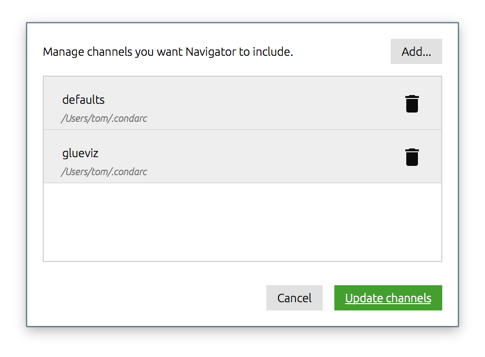

Anaconda Python Distribution
============================

**Platforms:** MacOS X, Linux, and Windows

We recommend using the `Anaconda <http://continuum.io/downloads.html>`__ Python
distribution from Continuum Analytics (or the related Miniconda distribution).
Anaconda includes all of Glue's main dependencies. There are two ways of
installing Glue with the Anaconda Python Distribution: :ref:`graphically using the
Anaconda Navigator <anaconda_gui>`, or :ref:`using the conda command
<anaconda_cli>` on the command-line, both of which are described
below.

.. _anaconda_cli:

Command-line installation
-------------------------

Installing glue using the ``conda`` command from the command-line is the recommended
way to install glue, because errors are more easily visible in case you run into
any issues with the installation process. Once Anaconda (or simply ``conda``) is
installed, open a terminal, and type:

    conda install -c glueviz glueviz

This will install the latest version of glue from the ``glueviz`` conda channel.
If you run into any issues, see the `Troubleshooting`_ section below. To update
glue in future, use the same command.

.. _anaconda_gui:

Graphical User Interface
------------------------

If you prefer to not use the command-line to install glue, you can also use the
Anaconda navigator, but be aware that it is harder to diagnose issues when
things go wrong (the navigator can sometimes silently fail). Once Anaconda is
installed, go to the **Applications** folder and launch the **Anaconda
Navigator**:

.. image:: images/navigator_icon.png
   :align: center
   :width: 80

If you do not have the Anaconda Navigator icon, but have an Anaconda Launcher,
you are using an old version of Anaconda, and we recommend that you update to
the latest version.

Assuming you have the navigator open, before installing glue first click on the
**Channels** button:

If not already present, add **glueviz** to the list of channels by clicking
on **Add**, typing **glueviz**, and pressing enter, then click on **Update
channels**:

You can now install the latest version of glue by clicking on **Install**:

Once the installation is complete, you can click on the **Launch** button (which
will replace the **Install** button). If updates become available in future,
these should be shown in the Navigator.

Troubleshooting
---------------

A common source of issues with conda is that there may be conflicts between the
version of dependencies required by glue and that required by other packages.
The easiest way to avoid this is to install glue in a separate environment. To
do this, first create an environment in which you will install glue::

    conda create -n glueviz python

This will create an environment called ``glueviz`` in which Python will be
installed. You only need to create the environment once. Once created, you can
switch to the environment with::

    source activate glueviz

Then, install glue as indicated in :ref:`anaconda_cli` using::

    conda install -c glueviz glueviz

Whenever you open a new terminal, if you want to run glue you should then
remember to switch to the ``glueviz`` environment using::

    source activate glueviz

If you want to update glue, run the installation command again inside the
environment.
