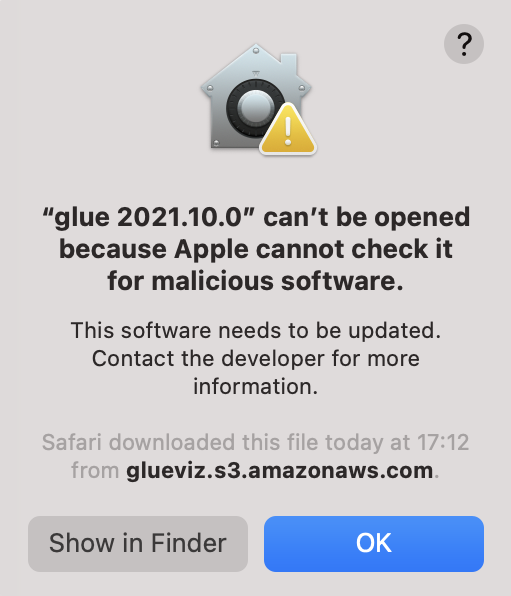
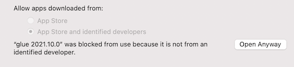
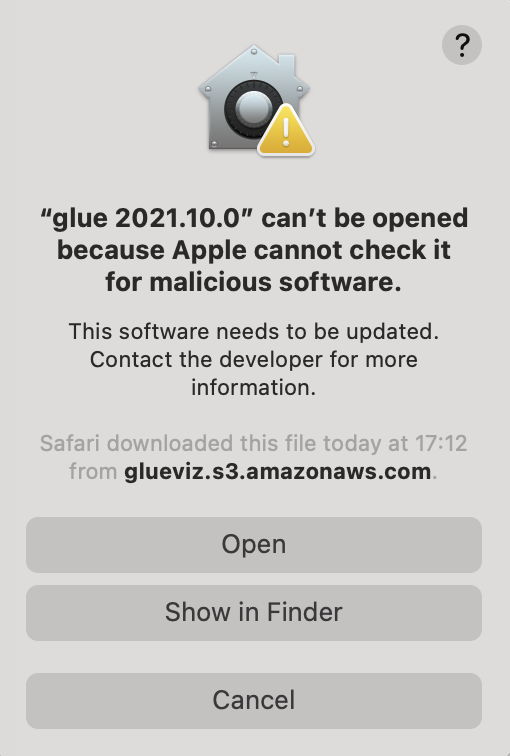
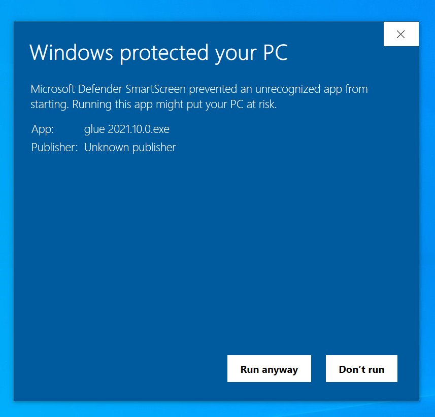

Standalone MacOS X and Windows applications
===========================================

**Platforms:** MacOS X and Windows

On MacOS X and Windows, the easiest way to install glue along with a few of
the common glue plugins is to download pre-built single-file applications.

.. note:: This installation method is very recent, so if you run into any issues
          it would be really helpful if you could let us know by `opening an issue
          <https://github.com/glue-viz/glue-standalone-apps/issues/new>`_. In the
          mean time, you can always try one of the other installation methods.

The plugins included by default in the standalone applications are:

* `glue-vispy-viewers <https://github.com/glue-viz/glue-vispy-viewers/>`_
* `glue-wwt <https://github.com/glue-viz/glue-wwt/>`_
* `glue-plotly <https://github.com/glue-viz/glue-plotly/>`_

With this installation method, it is not possible to install additional plugins
beyond those included by default, so if you want the ability to do this, you
should check one of the other installation methods mentioned in
:ref:`installation`.

MacOS X
-------

Donwload the :download:`glue 2023.02.0.dmg
<https://glueviz.s3.amazonaws.com/installers/2023.02.0/glue%202023.02.0.dmg>`
file, open it and copy the **glue 2023.02.0.app** application to your
**Applications** folder (or any other location you want to use).

Open the copied application - after a short wait, you will likely see a dialog that looks like:

Click **OK** then go to the MacOS X **Settings**, then **Security and Privacy**, then go to the
**General** tab. You will likely see the following message:

Click on **Open anyway**, then in the following dialog:

Click **Open**. The glue application should now open! You should only need to do all this when
installing a new version, if you relaunch the same application it should now work straight away.

Windows
-------

Donwload the :download:`glue 2023.02.0.exe
<https://glueviz.s3.amazonaws.com/installers/2023.02.0/glue%202023.02.0.exe>` file.
Once the file has downloaded, open the **glue 2023.02.0.exe** application. You
will likely then see a dialog such as:

Click on **More info** and you will then see:

Click on **Run anyway** and glue should now open.

Nightly builds
--------------

The applications above are built every few months to provide stability
and are checked to make sure they all work correctly. We also provide
'nightly' builds which use the latest (released) versions of all the relevant
glue packages and plugins. These are generated automatically and are
not hand-checked, so may be unstable. The download links are:

* Linux: :download:`glue-nightly <https://glueviz.s3.amazonaws.com/installers/nightly/glue-nightly>`
* MacOS X: :download:`glue nightly.dmg <https://glueviz.s3.amazonaws.com/installers/nightly/glue%20nightly.dmg>`
* Windows: :download:`glue nightly.exe <https://glueviz.s3.amazonaws.com/installers/nightly/glue%20nightly.exe>`
