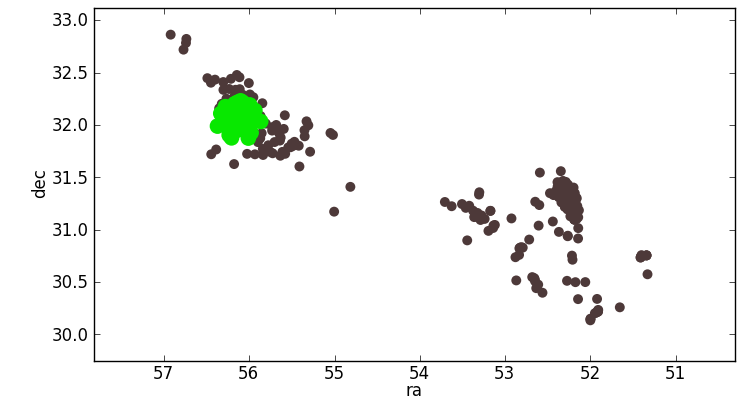
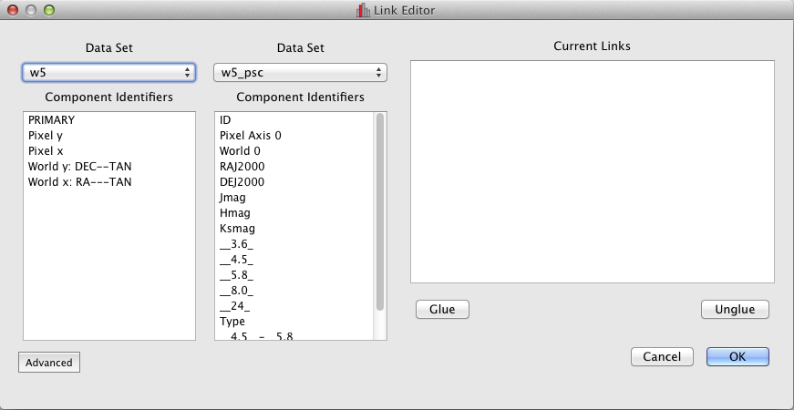

.. _component_link:

Understanding Component Links
=============================

.. currentmodule: glue.core

Many interactions which manipulate subests in Glue define regions of interest. For example, consider defining a circular ROI in a scatter plot of objects' RA and Dec coordinates:

Glue uses this ROI to filter objects in the catalog, which the Scatter Client displays by highlighting points inside the ROI.

The ROI is basically a constraint on the numerical values of the RA
and DEC quantities. We often wish to apply this same filter to another
dataset. However, Glue isn't (yet!) smart enough to understand what the RA and DEC components describe, and thus doesn't realize when the same quantities appear in another dataset.

We use :class:`~component_link.ComponentLink` objects to give Glue this
information, so that it knows how to apply the constraints in an ROI
to another data set. When we use the Link Editor in the GUI, Glue is creating ComponentLinks for us

Understanding how a :class:`~component_link.ComponentLink` works will help you to write custom functions to express connections between data, and to propagate subsets across data sets.

The ComponentLink
-----------------

A typical :class:`~data.Component` stores data as numpy array, and is associated with a :class:`~data.ComponentID`. Regions of Interest are typically expressed as constraints on the values of these IDs. For example::

   ra > 50 and ra < 51 and dec > 31 and dec < 32

A data set can process this ROI only if it has values associated with the ra and dec ComponentIDs.

By default, every Component stored in a dataset is given a unique
ComponentID. Thus, even if two data sets components which we (the
humans) recognize describe the same quantity, Glue initially sees them
as unrelated due to their different ComponentIDs.

.. note::
    It would be cool if Glue recognized some of these links
    automatically , given the label names. If you want to solve that
    problem, that would be great.

A :class:`~component_link.ComponentLink` is a way of expressing a relationship between ComponentIDs so that, if a data set has the necessary prerequisite IDs, it can derive a different ComponentID.

ComponentLinks have 3 pieces of information:

  * A list of prerequisite ComponentIDs
  * The ComponentID that can be derived from the prerequisites
  * A function which carries out this transformation

The simplest link function would be::

  def identity(x):
      return x

With this function, we can create a link between the right ascention Components of two datasets::

  link = ComponentLink([id_of_ra_from_data_1], id_of_ra_from_data_2, identity)
  data_1.add_component_link(link)

After this, ``data_1`` now knows how to compute the data for ``id_of_ra_from_data_2``. It simply passes the data from ``id_of_ra_from_data_1`` through the ``identity`` function, and returns the result.

With this extra information, Glue can apply ROI constraints defined
relative to ``id_of_ra_form_data_2``. Likewise, any piece of code can access the component data as if it were a normal component::

   numpy_array = data1[id_of_ra_from_data_2]

.. note:: If you are creating visualization clients, this means that
   you never need to worry about whether a ComponentLink exists. You
   simply try to extract the desired :class:`~data.Component` from the
   data as above, which raises in InvalidAttribute exception if it
   cannot be found or calculated.

Other Link Functions
--------------------
Of course, you can use more exciting functions than the identity function. For example, suppose you are working with two astronomical catalogs, but one defines right ascension as hour, minute, and second columns, while the other uses decimal degrees. This translation function would do the trick::

    def hms_to_degrees(hours, minutes, seconds):
        return 15 * (hours + minutes / 60. + seconds / 3600.)

    link = ComponentLink([hour_id, minute_id, second_id], degree_id, hms_to_degrees)
    catalog_with_hours.add_link(link)

Note that the inputs and outputs to the translation functions are the numerical data -- the numpy arrays themselves, and not glue objects. Glue takes care of packing/unpacking the relevant objects when it calls your translation function

.. note:: Links are one-way. In the above example, we can propagate
   information from the hms coordinate system to the degree coordinate
   system, but not vice versa. A second link will allow for two-way
   propagation

Using custom functions in the GUI
---------------------------------
It is easy to plug your own translation functions into the GUI. Simply add a reference to your function to the ``link_functions`` list in your config.py file. See :ref:`configuration` for more details about the Configuration system.

.. todo:: Add configuration tutorial

Any functions that you add will be available from the Link Editor.

Links Propagate
---------------

As mentioned in :ref:`getting_started`, Glue knows how to string
:class:`~component_link.ComponentLink` objects together. For example,
consider 3 datasets with ra/dec information. Logically, there 6 unique
mappings between the RA attributes in each dataset (3 pairs of data
sets to link, and 2 directions for each). However, Glue can get by
with as few as 3 links: ``ra1 -> ra2 -> ra3 -> ra1``. Even though
there is no direct link, for example, from ``ra1 -> ra3``, Glue can
get there by first deriving ``ra2`` (using the first link) and then
``ra3`` (using the second).

Glue builds these networks automatically, and will always know about all
the Components it can derive from a set of links.

.. note:: technically, that last statement depends on all the data sets being managed by a DataCollection. This is always the case when using the GUI.

