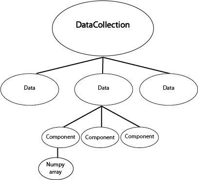

.. _data_tutorial:

Working with Data objects
=========================

If you are using the IPython terminal in the Glue application, or if you are
writing Python code that uses Glue, you will probably want to interact with
data.

Data classes
------------

The core data container in Glue is the :class:`~glue.core.data.Data` class.
Each :class:`~glue.core.data.Data` instance can include any number of
n-dimensional *components*, each represented by the
:class:`~glue.core.component.Component` class. The actual data resides in the :class:`~glue.core.component.Component` objects. Because of this structure, a
:class:`~glue.core.data.Data` object can represent either a table, which is a
collection of 1-d :class:`~glue.core.component.Component` objects, or an
n-dimensional dataset, which might include one (but could include more)
n-dimensional :class:`~glue.core.component.Component` objects.

Inside :class:`~glue.core.data.Data` objects, each
:class:`~glue.core.component.Component` is assigned a
:class:`~glue.core.component_id.ComponentID`. However, this is not necesarily a
unique ID for each and every component -- instead, different components
representing the same conceptual quantity can be given the same component ID.
Component IDs are central to the linking framework

When using the Glue application, the :class:`~glue.core.data.Data` objects are
collected inside a :class:`~glue.core.data_collection.DataCollection`.

We can represent this graphically like this:

The :class:`~glue.core.data_collection.DataCollection` can be accessed by the
``dc`` variable in the IPython terminal. If the Glue application is not open, you can also create your own :class:`~glue.core.data_collection.DataCollection` by doing::

    >>> from glue.core import DataCollection
    >>> dc = DataCollection()

In the remainder of this page, we are going to assume that you have just
followed the :ref:`Getting Started <getting_started>` tutorial, and have the
Astronomy data on the W5 region loaded.

Alternatively, for the purposes of this tutorial, you can also load the same
data manually into a Python/IPython session using::

    >>> from glue.core import DataCollection
    >>> from glue.core.data_factories import load_data
    >>> dc = DataCollection()
    >>> dc.append(load_data('getting_started/w5.fits'))
    >>> dc.append(load_data('getting_started/w5_psc.vot'))

This sets up the ``dc`` object to be the same as what it would be in the
:ref:`Getting Started <getting_started>` tutorial.

.. _data_access_api:

Using Data and DataCollection
-----------------------------

Let's take a look at the :class:`~glue.core.data_collection.DataCollection`:

    >>> dc
    DataCollection (2 data sets)
          0: w5[PRIMARY]
          1: w5_psc

:class:`~glue.core.data_collection.DataCollection` behaves like a list -- you can access :class:`~glue.core.data.Data` objects by indexing them. Let's grab the first data object::

    >>> data = dc[0]
    >>> data
    Data (label: w5[PRIMARY])
    >>> data.components
    [Declination, PRIMARY, Pixel x, Pixel y, Right Ascension]

:class:`~glue.core.data.Data` objects behave like dictionaries: you can retrieve the numerical data associated with each one with bracket-syntax::

    >>> data['PRIMARY']
    array([[ 454.47747803,  454.18780518,  454.56842041, ...,  450.08349609,
             451.14971924,  450.25921631],
           ...,
           [ 442.0128479 ,  442.54266357,  443.43310547, ...,  441.5506897 ,
             442.89486694,  442.76904297]], dtype=float32)

Numpy-style fancy-indexing is also supported::

    >>> data['PRIMARY', 0:3, 0:2]
    array([[ 454.47747803,  454.18780518],
           [ 452.36376953,  452.8883667 ],
           [ 451.77172852,  453.42767334]], dtype=float32)

This is equivalent to::

    >>> data['PRIMARY'][0:3, 0:2]
    array([[ 454.47747803,  454.18780518],
           [ 452.36376953,  452.8883667 ],
           [ 451.77172852,  453.42767334]], dtype=float32)

Note that the indexing syntax (e.g. ``['PRIMARY']``) gives you the Numpy array, and not the :class:`~glue.core.component.Component` object itself. The Numpy array is usually what you are interested in. However, you can retrieve the Component object if you like. To do this, you will first need to get the  :class:`~glue.core.component_id.ComponentID` for the component you are interested in:::

    >>> primary_id = data.components[0]
    >>> primary_id
    Declination
    >>> type(primary_id)
    glue.core.component_id.ComponentID

You can then fetch the component with
:meth:`~glue.core.data.Data.get_component`::

    >>> component = data.get_component(primary_id)
    >>> component.data
    array([[ 58.84943461,  58.84956411,  58.84969336, ...,  58.84969336,
             58.84956411,  58.84943461],
           ...,
           [ 61.84155834,  61.84170457,  61.84185052, ...,  61.84185052,
             61.84170457,  61.84155834]])

.. note:: The item access syntax (square brackets) will not work if component
          labels are not unique. In this case, you must first retrieve the
          wanted ComponentID and use it to get the component object.

Adding new attributes to datasets
---------------------------------

A common task is to combine two or more attributes in a dataset, and store the
result as a new attribute to visualize. To demonstrate this, let's use the W5
catalog data::

    >>> dc
    DataCollection (2 data sets)
          0: w5[PRIMARY]
          1: w5_psc
    >>> catalog = dc[1]

We can examine the attributes in this dataset

    >>> print(catalog)
    Data Set: w5_psc
    Number of dimensions: 1
    Shape: 17771
    Components:
     0) ID
     1) Pixel Axis 0
     2) World 0
     3) RAJ2000
     4) DEJ2000
     5) Jmag
     6) Hmag
     7) Ksmag
     ...

As mentioned in `Using Data and DataCollection`_, :class:`~glue.core.data.Data`
objects behave like dictionaries mapping component names to numpy arrays. So
one way to define a new component is like this::

    >>> j_minus_h = catalog['Jmag'] - catalog['Hmag']
    >>> catalog['jmh'] = j_minus_h

If you are using the Glue application, this new attribute is immediately
available for visualizing.

Using lazy attributes
---------------------

In the procedure above, the `j_minus_h` array was precomputed. An alternative
approach is to define a new attribute that gets evaluated on-the-fly. While
``data[attribute_name]`` returns a numpy array, ``data.id[attribute_name]``
returns a :class:`~glue.core.component_id.ComponentID`, which you can use as a
lightweight proxy object that you can use to build simple arithmetic
expressions::

    >>> jmh_lazy = catalog.id['Jmag'] - catalog.id['Hmag']
    >>> jmh_lazy
    <BinaryComponentLink: (Jmag - Hmag)>
    >>> catalog['jmh2'] = jmh_lazy

This new component is computed as needed on the fly, and can be more memory
efficient for particular applications.

Defining new subsets
--------------------

You can define new subsets from Python. An example might look like::

    >>> state = catalog.id['Jmag'] > catalog.id['Hmag']
    >>> label = 'J > H'
    >>> subset_group = dc.new_subset_group(label, state)

If you using the Glue application, you can then change the visual properties of this subset using::

    >>> sg.style.color = '#00ff00'

..note:: ``subset_group`` is not technically a subset, but a group of subsets.
         This is beyond the scope of this tutorial, and explained in more
         detail in :ref:`dev_selection`

This method of creating subsets can be a powerful technique. For a demo of
using sending Scikit-learn-identified clusters back into Glue as subsets, see
`this notebook <http://nbviewer.ipython.org/github/ChrisBeaumont/crime/blob/master/glue_startup.ipynb>`_.

The following example demonstrates how to access subsets defined graphically in data viewers. Let's say that you have two subsets that you defined in the scatter plot and histogram data viewers:

.. image:: images/subset_01.png
   :width: 60%

We'll assume that you made a similar selection to these for demonstration purposes. You can now access the subsets from the built-in IPython console. To do this, assuming you have two subsets defined, you can do::

    >>> red, faint_h = dc.subset_groups

Let's also grab a component in the data::

    >>> hmag = catalog.id['Hmag']

To find the intersection of the two subsets we have already defined (i.e., red
sources with faint H band magnitudes)::

   >>> new_state = red & faint_h
   >>> label = "Red and faint"
   >>> data_collection.new_subset_group(label=label, subset_state=new_state)

The resulting intersection is shown in blue here:

.. image:: images/subset_02.png
   :width: 60%

The boolean operators ``&``, ``^``, ``|``, and ``~`` act on subsets to define
new subsets represented by the intersection, exclusive union, union, and
inverse, respectively.

You can also build subsets out of inequality constraints on component IDs::

   >>> mid_mag = (hmag > 10) & (hmag < 15)
   >>> dc.new_subset_group('between_10_15', mid_mag)

This selects objects with H band magnitudes between 10 and 15:

.. image:: images/subset_03.png
   :width: 60%

.. _data_creation:

Accessing subset data
---------------------

Once you have defined subsets, you can acceess the subsets on specific datasets using the ``.subsets`` attribute on :class:`~glue.core.data.Data` objects. For instance, after the above selections, you might have something that looks like this::

    >>> catalog.subsets
    (Subset: between_10_15 (data: w5_psc), Subset: J > H (data: w5_psc))

Let's access the first subset::

    >>> subset = catalog.subsets[0]
    >>> subset
    Subset: between_10_15 (data: w5_psc)

You can access components of the subset as if it was a dataset::

    >>> subset['Jmag']
    array([ 15.34000015,  10.89999962,  13.30000019, ...,  13.06000042,
            13.38000011,  14.18000031], dtype=float32)

In this case, only the values in the selection are returned. If you prefer, you can also retrieve the subset as a boolean mask that can be applied to the original dataset::

    >>> subset.to_mask()
    Out[65]: array([ True,  True,  True, ...,  True,  True,  True], dtype=bool)

Creating a data object
----------------------

In the above examples, we have assumed that the data objects were loaded via
the Glue application. The readers/writers in Glue can also be accessed using
the functions in :mod:`glue.core.data_factories`::

    >>> from glue.core.data_factores import (load_data, gridded_data,
    ...                                      tabular_data)
    >>> load_data('image.fits', factory=gridded_data)  # reads a FITS image
    >>> load_data('catalog.csv', factory=tabular_data) # reads a catalog
    >>> load_data('catalog.csv')  # guesses format

If these functions do not fit your needs, you can also :ref:`write your own
data loader <custom_data_factory>`, and use it from the Glue GUI.

It is also possible to create :class:`~glue.core.data.Data` objects completely manually::

      >>> from glue.core import Data
      >>> data = Data(x=[1, 2, 3], y=[2, 3, 4], label="first dataset")

The arguments to the class are the components you want to create, as well as
a label/name for the dataset. Each component can be given using the
``name=values`` syntax. The above example creates a
:class:`~glue.core.data.Data` with two components ``x`` and ``y``.

You can then add the data object to the data collection using::

    >>> dc.append(data)
