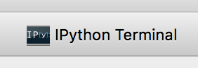

Using the IPython terminal in Glue
==================================

Glue includes a button to open an IPython terminal window:

This gives you programmatic access to Glue data. A number of variables are
available by default (these are also listed when you open the terminal):

  * ``dc`` / ``data_collection`` refer to the central
    :class:`~glue.core.data_collection.DataCollection`, which is an object that
    holds all of the datasets, subsets, and data links

  * ``hub`` is the main communication hub.

  * ``application`` is the top level
    :class:`~glue.app.qt.application.GlueApplication`, which has access to plot
    windows (among other things)

Additionally, you can drag datasets and subsets into the terminal window, to
easily assign them new variable names.

Most of your interactions will likely be with data objects and the data
collection, so let's take a look at these in the next section!
