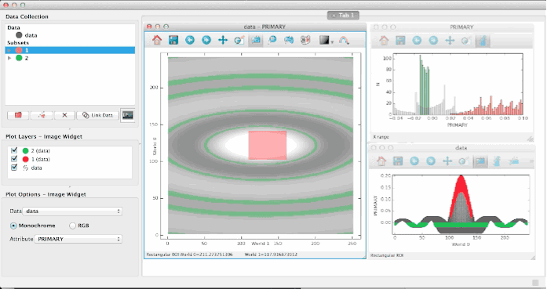

Watching data for changes
=========================

A new, experimental feature enables Glue to monitor the
data files you've loaded for changes, and to auto-refresh
plots when needed. This can be useful if your data update periodically,
or if your data are produced by an analysis pipeline whose parameters you
are iteratively refining.

To enable this feature, add the following line to your :ref:`config.py <configuration>` script::

    from glue.config import auto_refresh
    auto_refresh(True)

.. note:: This currently only works if file updates do not change the shape of
          the underlying data.
