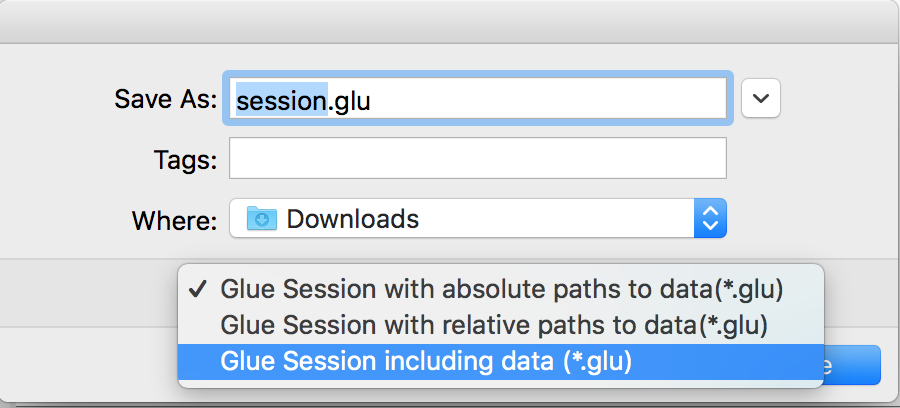
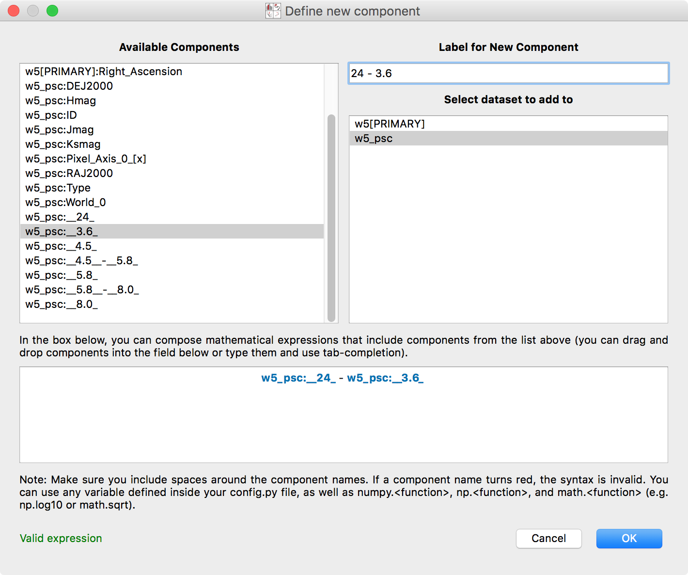

:orphan:

.. _whatsnew_05:

What's new in Glue v0.5?
========================

Python 3 compatibility
----------------------

Glue v0.5 is now fully compatible with Python 2.6, 2.7, and 3.3 and later.

Installation with conda
-----------------------

If you make use of Anaconda or Miniconda, Glue can now be installed very easily
by doing::

    conda install glueviz

This will install glue itself as well as all of the required and many optional
dependencies.

New features
------------

Glue v0.5 includes a number of new features, in particular:

* The ability to :ref:`include a copy of all datasets <saving_session>` in
  ``.glu`` session files, to make it easier to exchange session files with
  other users. When saving a session file, choose the option to include all
  data from the drop-down menu:

* The ability to write and register
  :ref:`custom data importers <custom_importers>`, as well as
  :ref:`custom menubar tools <custom_menubar_tools>`.

* An improved interface for :ref:`creating new components <new_components>`,
  including tab-completion and color highlighting of component names.

* The ability to pass ``HDUList`` objects when using ``qglue``.

* The ability to define floating-point and text parameter boxes when defining
  custom viewers.

* Support for more coordinate frames for the Astronomy coordinate system
  transformations.

* The ability to drag existing selection regions by pressing 'control',
  selecting a selection, and moving it around.

Improvements
------------

In addition to the new features described above, we have made a number of
internal improvements to the code structure, and have fixed a number of
usability bugs reported by users.

Full list of Changes
--------------------

A full list of changes can be found in the
`CHANGES.md <https://github.com/glue-viz/glue/blob/master/CHANGES.md>`_ file
