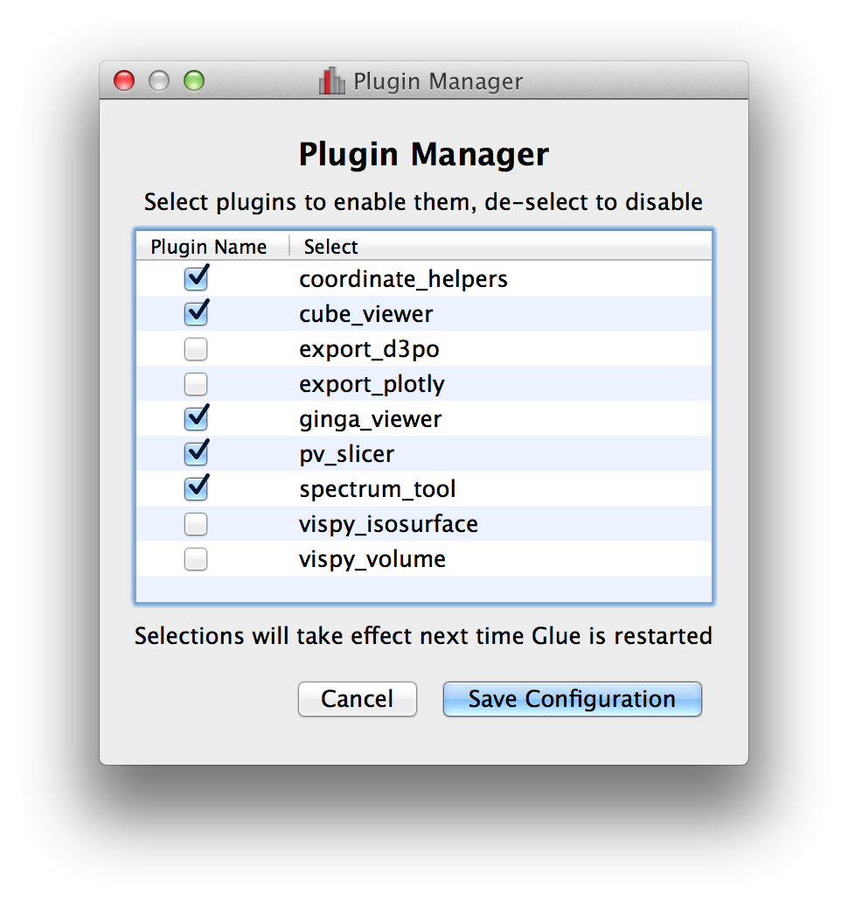
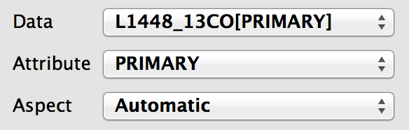
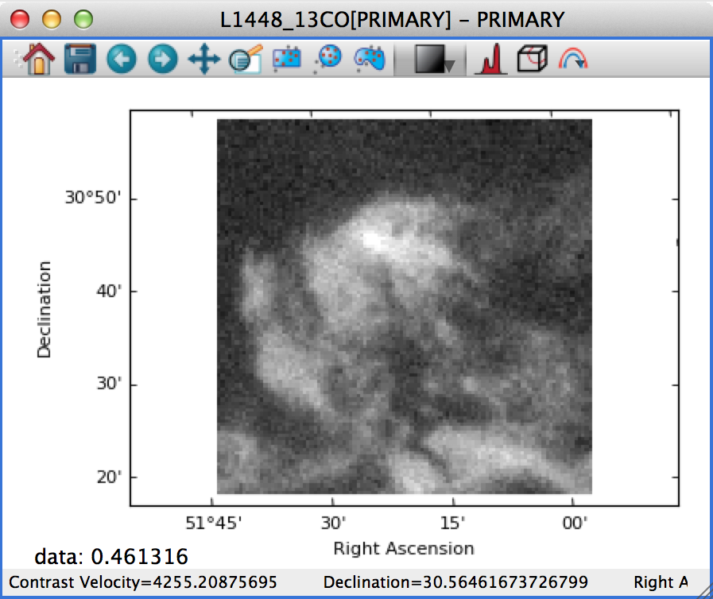
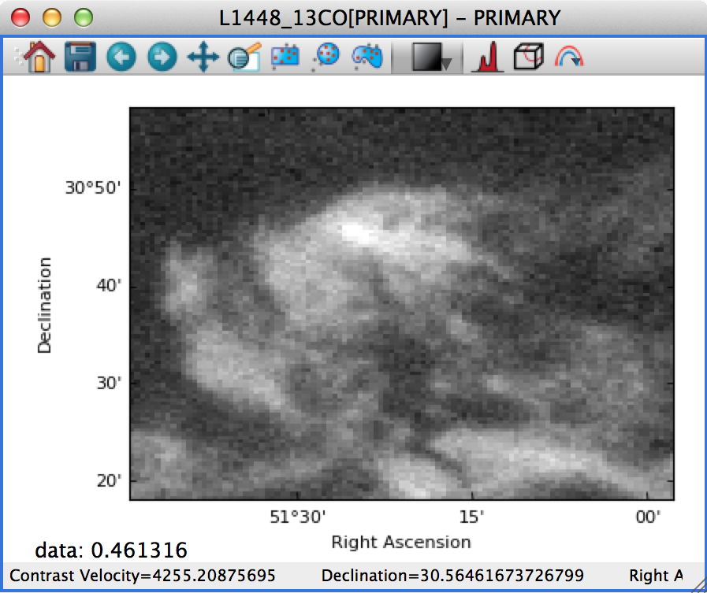
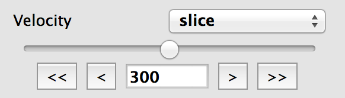

:orphan:

.. _whatsnew_06:

What's new in Glue v0.6?
========================

Below we list some of the main changes in Glue v0.6. As a reminder, you can easily update glue if you are using Anaconda/Miniconda, by doing::

    conda install glueviz

If instead you installed glue with pip, you can update with::

    pip install glueviz --upgrade

Improved file readers
---------------------

A significant amount of work has gone into improving the build-in readers for
various data formats. In particular:

- Glue now supports a wider range of ASCII table formats. Any format that can
  be read by the `Astropy <http://www.astropy.org>`_ package can now be read
  by Glue. If you run into ASCII tables that cannot be read, please let us
  know!

- The HDF5 file reader will now read in all datasets from a file, including
  both tabular and gridded data. The path to the HDF5 dataset is now
  reflected in the label for the dataset in Glue.

- The Excel file reader is now significantly more robust. In particular, it
  can now read in files with multiple sheets, and the sheet name is now
  included in the label for the data.

- The FITS file reader (a data format commonly used in Astronomy) will now
  read in all header-data units (HDUs) from FITS files rather than simply
  reading the first. In addition, FITS files with compressed HDUs will now be
  read correctly.

Plugin manager
--------------

In Glue v0.5, we introduced the ability to develop separate plugin packages
and have these be registered automatically with glue once installed. In some
cases it can be useful to disable/enable specific plugins, so the **Plugins**
menu now includes a plugin manager that can be used to enable/disable
plugins. This is then stored in a configuration file in the user's home
directory, and the configuration is preserved from one session to the next:

Improvements to image viewer
----------------------------

The image viewer now includes an **Aspect** setting that can be used to
control the aspect ratio of the pixels:

If this is set to **Square Pixels** (the default), the data is always shown
with square pixels, which may result in empty space around the data but is
more correct when the data is an actual image:

On the other hand, if this is set to **Automatic**, the data is distorted to
fill the axes:

For data cubes, the slider(s) used to move through slices along the extra
dimension(s) now includes the ability to manually specify the slice to move
to, as well as buttons to step through slices, and go to the first or last
slice:

Finally, when extracing a spectrum/profile from a data cube, the box used to
extract the spectrum can now be moved around by pressing the control key and
dragging the box around, resulting in the spectrum/profile being updated in
real time.

Data factories
--------------

For anyone developing custom data factories, the ``@data_factory`` decorator
can now accept a ``priority=`` argument that should be set to a positive
integer value (with the default being zero). This priority is then used in
case of multiple data factories being able to read a given file. For example,
if you are develop a data factory that reads FITS files in a special way, and
want it to take precedence on all other data factories, you can set the
priority to a large value.

Experimental support for PyQt5
------------------------------

Glue should now work with the
`PyQt5 <https://riverbankcomputing.com/software/pyqt/download5>`_ package, but
support is experimental for now. If you do try out PyQt5, please
`report any issues <https://github.com/glue-viz/glue/issues>`_ you encounter!

Python 2.6 support
------------------

This will be the last major release to support Python 2.6. Future releases
will support only Python 2.7 and 3.3 and above.

Other Improvements
------------------

In addition to the new features described above, we have made a number of
internal improvements to the code structure, and have fixed a number of
usability bugs reported by users.

Full list of Changes
--------------------

A full list of changes can be found in the
`CHANGES.md <https://github.com/glue-viz/glue/blob/master/CHANGES.md>`_ file
