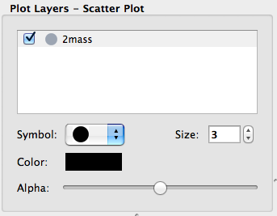

:orphan:

.. _whatsnew_07:

What's new in Glue v0.7?
========================

Below we list some of the main changes in Glue v0.7. As a reminder, you can
easily update glue if you are using Anaconda/Miniconda, by doing::

    conda install glueviz

If instead you installed glue with pip, you can update with::

    pip install glueviz --upgrade

Code and development reorganization
-----------------------------------

Since the v0.6.x releases, a lot of work has gone into reorganizing the Glue
code base to make it more modular and more accessible for new developers. The
documentation has also been completely reorganized and expanded, and now
includes a description of some aspects of the :ref:`Glue architecture
<architecture>` and information for anyone interested in getting
involved in :ref:`Glue development <devdocs>`.

We also have a new mailing list `glue-viz-dev
<https://groups.google.com/forum/#!forum/glue-viz-dev>`_ for anyone interested
in development, so if you are interested in getting involved, please join the
list and let us know!

As a result of the code reorganization, some imports may need to be updated if
you are using glue from scripts. Please see :doc:`this
<0.7_code_reorganization>` page for more details on what's changed!

Layer artist options
--------------------

When visualizing data in one of the data viewers, the list of layers is given
in the 'Plot Layers' list in the left sidebar. While it was possible to edit
the style of these layers via a contextual menu previously, we have now made
the options more visible below the list:

This is currently implemented for the scatter and histogram viewers, and will
be extended to other viewers in future.

Numpy reader
------------

Glue is now able to read in ``.npy`` and ``.npz`` files produced by Numpy.
Thanks to Adrian Price-Whelan for contributing this feature!

Bug fixes and usability improvements
------------------------------------

A number of usability issues have been fixed. Of particular note, in the v0.6.x
releases, lasso selection no longer worked in scatter plots with categorical
components on one or more of the axes, but this has now been fixed (thanks to
Will Dampier for refactoring the way selection of categorical components is
handled internally!).

Full list of Changes
--------------------

A full list of changes can be found in the
`CHANGES.md <https://github.com/glue-viz/glue/blob/master/CHANGES.md>`_ file
