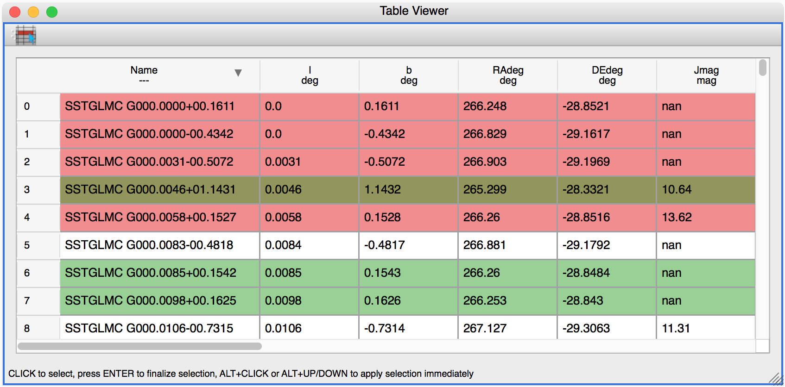
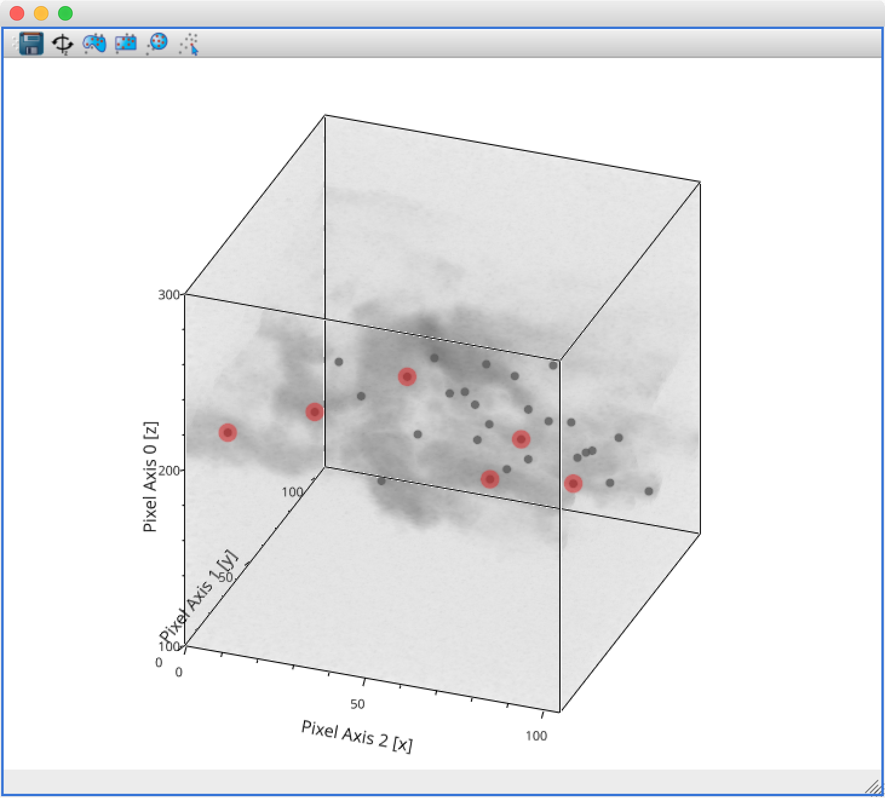
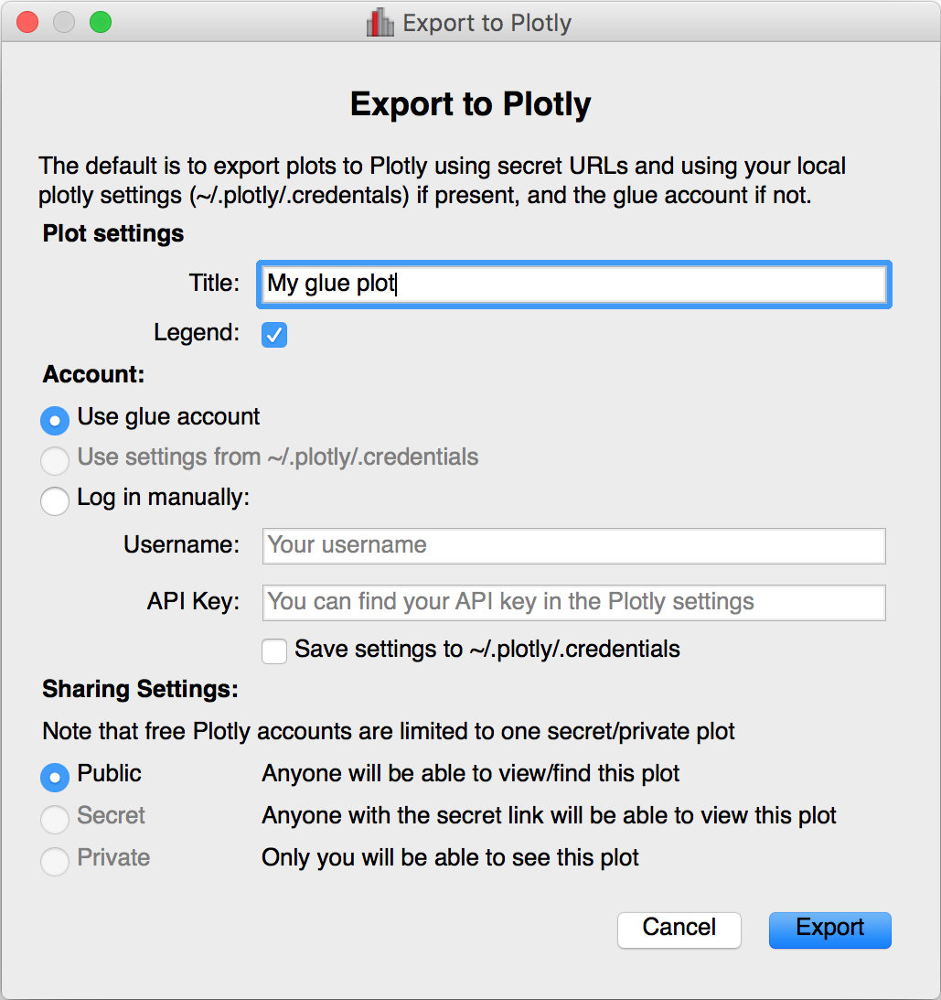
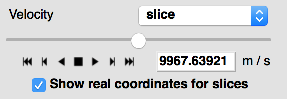
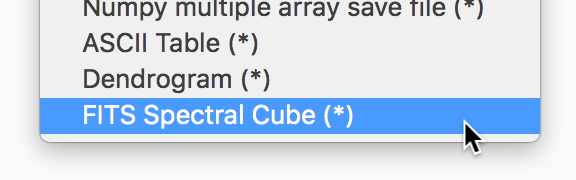

:orphan:

.. _whatsnew_09:

What's new in glue v0.9?
========================

Below we list some of the main changes in glue v0.9 and in the 3D viewers in
glue-vispy-viewers v0.5. As a reminder, you can easily update glue if you are
using Anaconda/Miniconda, by doing::

    conda install -c conda-forge glueviz

If instead you installed glue with pip, you can update with::

    pip install glueviz[all] --upgrade

Note that the 3D viewers (provided by the
`glue-vispy-viewers <https://github.com/glue-viz/glue-vispy-viewers>`_
plugin package) are now automatically installed when installing glue as above.

New table viewer
----------------

Glue now includes a table viewer for data with 1-dimensional components (such as
tables). The table viewer highlights selections made in other viewers, and
also allows selections to be made in the viewer:

To make a selection in the table, either select an existing subset in the **Data
Collection** panel in the top left if you want to modify a subset, or make sure
no subset is selected to make a new subset (as in other viewers), then
click the button on the left in the table viewer toolbar, select rows you want
to include in the subset, and press enter to validate the selection. You can
also combine this with the ususal logical selections ('and', 'or', etc.) from
glue to modify existing subsets by adding/removing rows.

Improvements to 3D viewers
--------------------------

There have been a number of improvements to the 3D viewers provided by the
`glue-vispy-viewers`_ package (now automatically installed with glue).

The main changes are:

* The axes now include ticks, tick labels, and axis labels. For volume
  renderings, the values are the pixel coordinates for now, but in future we
  will allow the world coordinates to be shown.

* Catalogs/tables can now be overplotted on top of volume renderings, as for the
  2-d image viewer. To use this, you will first need to make sure that you link
  three components of the catalog/table to the three **world** coordinates of
  the cube shown in the volume rendering, then drag the catalog/table dataset
  onto the volume rendering. By selecting the layer corresponding to the
  catalog, you can then change the appearance of the markers.

* There is now an option in the bottom left options panel to remove data that
  falls outside the coordinate axes box. This can be used for both the scatter
  viewer and volume rendering viewer.

* There is also now an option to show the data in its original aspect ratio,
  assuming that the voxels are cubes. By default, the 3D viewers stretch the
  data so that it fills a cube.

* It is now possible to visualize datasets of any dimensionality in the scatter
  plot viewer - however, note that this viewer currently becomes slow above
  a million points.

Improved plot.ly exporter
-------------------------

Glue has included the ability to export plots to the `plot.ly <https://plot.ly>`_
service for a few versions now, but there was no way to control the privacy
level of the resulting plots. When exporting to plotly, you will now be
presented with a window that allows much finer control over the export:

World coordinates in slices
---------------------------

When viewing 3+ dimensional data in the image viewer, if the data has a
world coordinate system defined, the coordinates can now be shown in the
image slicers:

If the world coordinate system is not linearly related to the pixel slices,
a warning will be shown to indicate that the world coordinates are measured
along a line that goes down the center of the cube.

Improvements to Astronomy-specific functionality
------------------------------------------------

If you have the `spectral-cube <http://spectral-cube.readthedocs.io>`__ package
installed, glue can now use this to read in spectral cubes in FITS format. To
use this, you will need to go through the **Open Data Set** menu item and
explicitly select **FITS Spectral Cube** from the list:

We haven't enable this by default at this time because this modifies the order
of the axes, and splits the Stokes components into glue data components, which
may not always be desirable.

In addition, units are now properly read from FITS and VO tables, and are
shown in the table viewer. In future, we will also show the units in the
different viewers.

Finally, a new linking function is now available to link celestial Galactic
coordinates to 3D Galactocentric coordinates.

Improvements to ``join_on_key`` [advanced]
------------------------------------------

The :meth:`~glue.core.data.Data.join_on_key` method can be used for advanced
linking scenarios - for instance linking datasets by e.g. an ID in two different
datasets. In this version, we have added some advanced possibilities, for
example linking by combinations of keys, as well as allowing one-to-many and
many-to-one linking. For more information, see the documentation for
:meth:`~glue.core.data.Data.join_on_key`.

This functionality is still experimental, and we will provide in future a window
in the graphical user interface to explain and make it easy for users to set up
these kinds of links.

Data updating [advanced]
------------------------

A new method, :meth:`~glue.core.data.Data.update_values_from_data` has been
added to allow values in datasets to be updated based on another dataset. This
allows users to open a dataset, create different viewers, make selections,
and then load a more recent version of the dataset and update the values,
keeping all the viewers open.

Infrastructure changes [advanced]
---------------------------------

The code to handle toolbars in viewers has now been completely refactored, and
it is much easier for people developing their own viewers to define toolbars
and tools for their viewers. A new page, :ref:`Custom tools for viewers and
custom toolbars <custom-toolbars>`, has been added to the documentation to show
how to use this functionality.

We have now also switched from using the ``glue.external.qt`` module to the
`QtPy <https://pypi.python.org/pypi/QtPy>`__ package for supporting different
Python Qt wrappers (PyQt4 and 5, as well as PySide). See :ref:`qtpy` for more
information.

Full list of Changes
--------------------

In addition to the above features, a number of bugs has been fixed since the
last release, and a few other small features have been added. A full list of
changes can be found in the
`CHANGES.md <https://github.com/glue-viz/glue/blob/master/CHANGES.md>`_ file
