:orphan:

.. _whatsnew:

*******************
What's new in glue?
*******************

On this page you will find information about significant changes in each
release. Many smaller improvements and bug fixes are not mentioned here but can be
found in the full list of `CHANGES.md
<https://github.com/glue-viz/glue/blob/master/CHANGES.md>`_ file if you are
interested.

Before we get started, here's a reminder on how to install/update glue. You can
easily update glue if you are using Anaconda/Miniconda by doing::

    conda install -c glueviz glueviz=1.2

If instead you installed glue with pip, you can update with::

    pip install glueviz[all] --upgrade

If you have any questions about any of the functionality described below or
about glue in general, you can find information :ref:`here
<help>` about contacting us and/or
reporting issues.

.. _whatsnew_120:

What's new in glue v1.2.0?
==========================

Glue v1.2.0 is a maintenance release that provides performance improvements and
incremental improvements in the programmatic API.

.. _whatsnew_110:

What's new in glue v1.1.0?
==========================

Glue v1.1.0 is a maintenance release that fixes support with recent versions of
dependencies and drops support for Python 3.6. Python 3.7 or later is now required
to run glue.

.. _whatsnew_100:

What's new in glue v1.0.x?
==========================

Semantic versioning
-------------------

Glue has been developed since 2011, and in the last few years we have focused on
keeping the application as stable as possible for existing users while adding
new functionality. The use of version numbers such as **0.15.6** is therefore no
longer appropriate since the **0** major version is typically used for early
development when many things can still change significantly.

To better reflect the current development stage, and because the programmatic
interface for glue is used by a number of other packages and user scripts, we
therefore have chosen to call the present release **1.0.0**. We are adopting `semantic
versioning <https://semver.org/>`_ (with version numbers of the form
major.minor.bugfix) to better distinguish between releases that break the
programmatic interface or have significant changes to the user interface (for
which we would increase the major number), releases that add new functionality
without changing existing functionality (for which we would increase the minor
number), and releases that just fix bugs (for which we would increase the bugfix
number).

To put it another way, the 1.0.0 version number does not mean that there will no
longer be significant enhancements or updates to glue, but rather that the
version numbers will now give a better indication of the scope of changes
between versions in future.

Updated minimum Python requirement
----------------------------------

With this release, we are focusing development on supporting Python 3.6 and
above, and glue will no longer work for Python 2.7 and 3.5. If you are using
these Python versions and are unable to upgrade, you will need to continue using
the 0.15.x releases of glue.

Legends
-------

Legends can now be displayed for the built-in Matplotlib viewers:

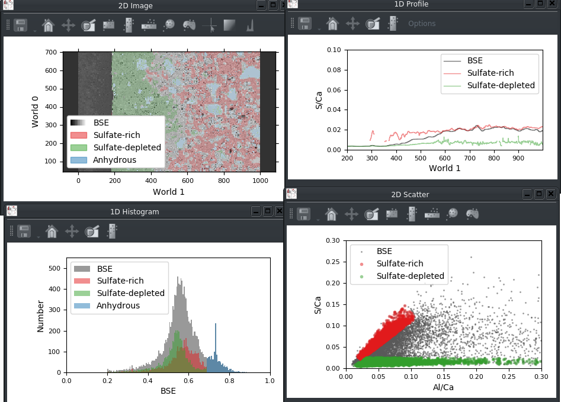

The legend in a viewer can be customized using a new tab in the plot options widget:

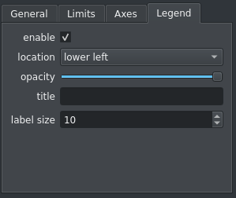

The export scripts for the default Matplotlib viewers have also been updated to
draw the legend if it is activated in the user interface. Otherwise, it is
commented out so the user can easily activate the legend if needed.

Support for polar and other non-rectilinear projections in 2D Scatter Viewer
----------------------------------------------------------------------------

The 2-d scatter plot now includes experimental support for non-rectilinear
projections, such as polar plots or Aitoff projections. The following shows
the 2D scattter plot in polar plot mode:

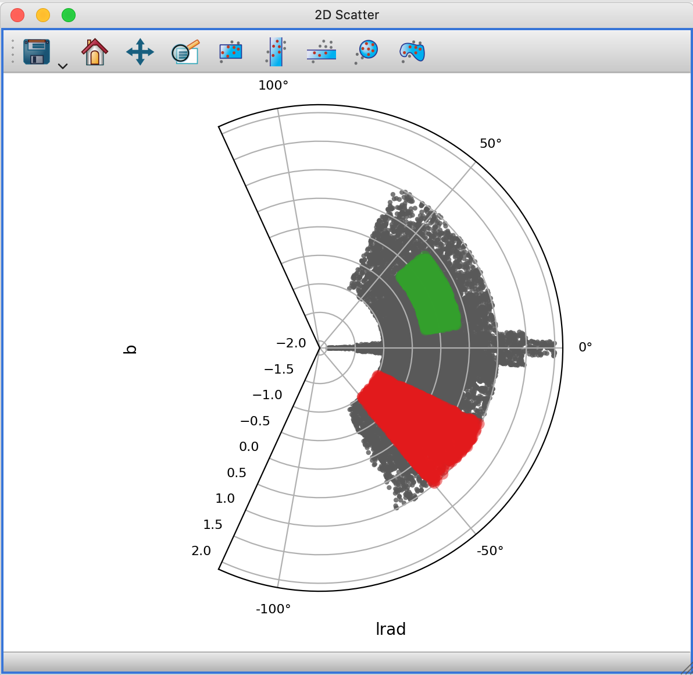

Replace mode when creating a subset
-----------------------------------

When creating a new subset, the selection mode is now automatically changed back
to 'replace' if it was changed previously, since there is no reason for the mode
to be one of the logical combinations when creating a new subset from scratch.

Export Python scripts (1D Profile viewer)
-----------------------------------------

The 1D Profile viewer now allows exporting of Python scripts, in line with the other
built-in Matplotlib viewers

Performance improvements
------------------------

The performance of the image viewer has been impoved in the case where some of the
coordinate axes are uncorrelated. In addition, the 1-d profile viewer should now
also be signficantly faster when showing the collapsed profiles for selections made in
the image viewer.

Changes to coordinate classes [advanced]
----------------------------------------

The infrastructure to handle world coordinates has been refactored - while this
should make no difference for users using exclusively the user interface, if you
have written custom code that makes use of ``Data.coords`` you may need to
update your code. The biggest change is that the ``pixel2world`` and
``world2pixel`` methods have now been renamed to ``pixel_to_world_values`` and
``world_to_pixel_values``. The latest changes were to bring the glue API in line
with the recommended API for world coordinate systems described in `A shared
Python interface for World Coordinate Systems
<https://github.com/astropy/astropy-APEs/blob/master/APE14.rst>`_. Any object
conforming to that API can now be used directly as a ``Data.coords`` object.

Initial support for dask arrays [advanced]
------------------------------------------

When adding `dask arrays <https://dask.org/>`_ to glue
:class:`~glue.core.data.Data` objects, glue will no longer cause the whole dask
array to be loaded into memory. The image viewer in particular will now only
access the required and relevant parts of the data.

.. _whatsnew_015:

What's new in glue v0.15?
=========================

New and improved link editor
----------------------------

The bottom panel of the link editor has now been re-written to make it easier to
edit existing links, and significantly improves the interface for links more
complex than identity links.

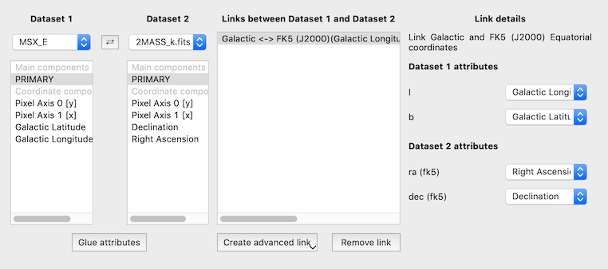

Reprojection of raster data in 3-d volume viewer
------------------------------------------------

The 3-d volume viewer now supports on-the-fly reprojection of raster data in
the same way as the 2-d image viewer. This means that if two 3-d datasets are
linked, they can be shown at the same time in the 3-d volume viewer even if they
are not defined on the same pixel grid.

No more merging suggestions
---------------------------

Glue will no longer prompt you to merge multiple datasets into a single one
automatically - instead this is something that you should now do manually by
selecting the datasets to merge, then right-clicking (or control-clicking) and
selecting **Merge datasets**. We decided to not suggest this by default anymore
since links are the preferred way of using multiple datasets together.

Improvements to Table viewer
----------------------------

When using the table viewer, you can now choose to show only one or more
subsets of the data in the viewer without having to show the full table. You
can control this by using the checkboxes in the layer list as for other
viewers.

Improvements when showing multiple images in the image viewer
-------------------------------------------------------------

When showing multiple datasets in the image viewer, the images are now no
longer downsampled to the resolution of the reference data and clipped to its
field of view. The reference data is still used to define the coordinate system
in which to show the data, but all datasets are now resampled to the resolution
of the screen.

New coordinate class for affine transformations
-----------------------------------------------

We have now written a page on :ref:`coordinates` and have added a new class
to deal with common affine transformations::

  >>> import numpy as np
  >>> from glue.core import Data
  >>> from glue.core.coordinates import AffineCoordinates
  >>> matrix = np.array([[2, 0, 0], [0, 2, 0], [0, 0, 1]])
  >>> affine_coords = AffineCoordinates(matrix, units=['m', 'm'], labels=['xw', 'yw'])
  >>> data = Data(x=[1, 2, 3], coords=affine_coords)

You can read more about this in :ref:`affine-coordinates`.

New auto-linking functionality
------------------------------

We have now set up an infrastructure to make it possible to define plugins that
can automatically suggest links, and have included such a plugin for linking
astronomical images and higher dimensional datasets (note that this
functionality requires astropy 3.1 or later). To write such a plugin, you will
need to define a Python function that takes a data collection and then returns a
list of links, e.g.::

    from glue.config import autolinker

    @autolinker('Auto-linker name')
    def my_autolinker(data_collection):
        ...
        return links

When adding datasets, glue will then automatically check whether links can be
added between datasets and show a dialog to ask whether to apply the
suggestions:

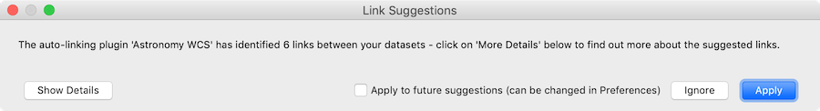

with the option to see the details:

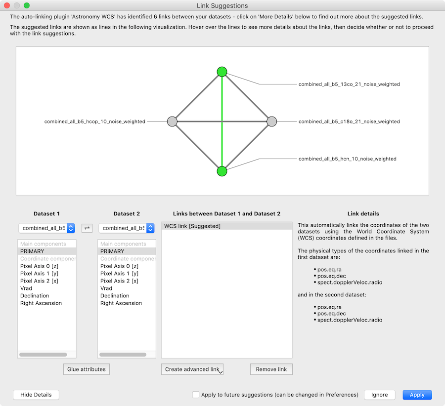

For more information, see :ref:`custom-auto-link`.

.. _whatsnew_014:

What's new in glue v0.14?
=========================

Active subset in menu bar
-------------------------

The active subset, which is the subset that would be modified during the next
selection, is now shown in the toolbar:

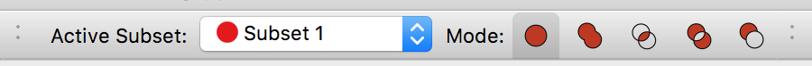

Prior to this, the only way to set the active subset was to select a subset
in the data collection list on the left, or deselect all subsets to create a new
one. The drop-down menu in the toolbar should make the process of choosing the
subset to modify (or choosing to create a new subset) more straightforward.

Documentation about plugins
---------------------------

We have now added a page to the documentation which provides a :ref:`list of
available plugins <available_plugins>`, as well a page describing how to
:ref:`write your own plugin package <writing_plugin>`

Changes in behavior
-------------------

There are a couple of changes in behavior in glue that we want to mention here:

* The first is that when saving session files, the default has now changed to
  be to include relative paths to the data files (as opposed to absolute paths).

* The second is that when accessing string components in datasets, you will
  now get back a specialized Numpy array class that behaves like an array of
  strings, but also has a ``.codes`` attribute to get the numerical category for
  each value, as well as a ``.categories`` attribute to get the unique
  categories::

    >>> from glue.core import Data
    >>> d = Data(x=['a', 'b', 'c', 'a', 'a'])
    >>> d['x']
    categorical_ndarray(['a', 'b', 'c', 'a', 'a'], dtype='<U1')
    >>> d['x'].codes
    array([0., 1., 2., 0., 0.])
    >>> d['x'].categories
    array(['a', 'b', 'c'], dtype=object)

  In previous versions, ``d['x']`` returns the numerical ``.codes`` directly
  but it was not easy to access the original labels.

Performance
-----------

This release includes a number of significant performance enhancements (both
in terms of speed and memory usage). In particular, the histogram and profile
viewers have been updated to be able to compute histograms and profiles in the
background without causing the rest of the application to hang - in this case
the viewers will look like this while they are updated:

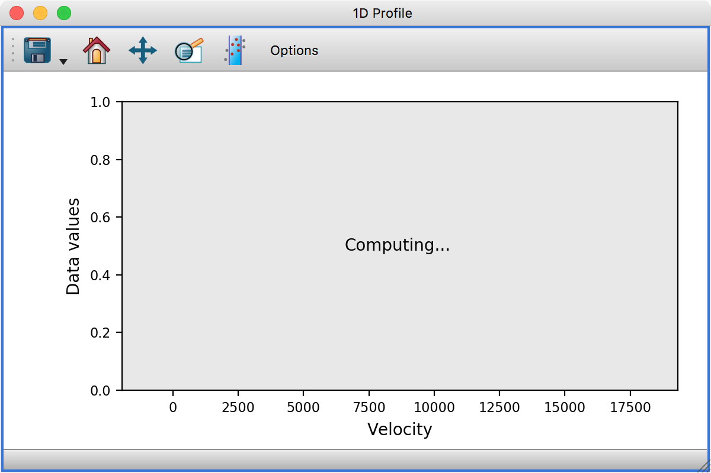

Documentation about creating custom viewers [advanced]
------------------------------------------------------

We have now written extensive documentation on writing fully customized
viewers for glue. The new pages available are:

* :ref:`state-viewer`
* :ref:`state-qt-viewer`
* :ref:`matplotlib-qt-viewer`

This is intended for developers working on plugin packages that define new
viewers. If you are a user and want to make Matplotlib-based custom viewers,
we recommend that you start off with the existing :ref:`simple-custom-viewer`
page.

Abstract data classes [advanced]
--------------------------------

By default, data objects in glue are instances of the Data class, and this class
assumes that the data are stored in one or more local n-dimensional arrays.
However, glue now includes a way of defining a wider variety of data objects,
which may rely for example on large remote datasets, or datasets that are not
inherently stored as regular n-dimensional arrays. We have written up
documentation on :ref:`basedata`.

Better isolation of Qt code [advanced]
--------------------------------------

The code related to the data viewers has been significantly re-organized to
split out as much as possible of the code to make it non-Qt-specific. This will
enable other interfaces, such as Jupyter widgets, to re-use as much of the code
as possible.

.. _whatsnew_013:

What's new in glue v0.13?
=========================

Scatter density maps
--------------------

The 2D scatter viewer can now show data using a density map rather than individual
markers - this makes it possible to now plot tens to hundreds of millions of
points efficiently.

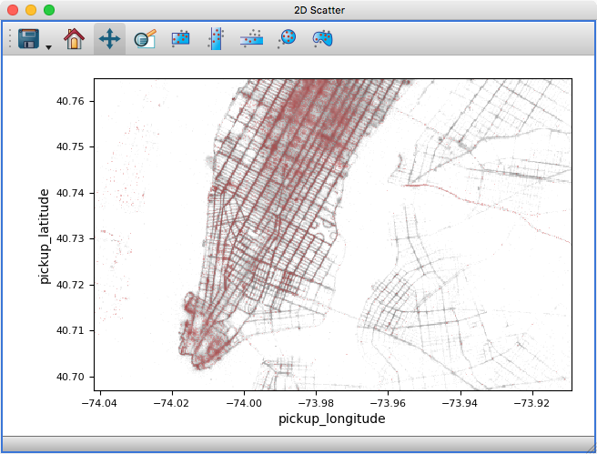

Whether data is shown as a density map or markers can be controlled for each
layer, and by default glue will automatically decide which one to use depending
on the size of the data. It is also possible to color-code points by a third
variable as for markers:

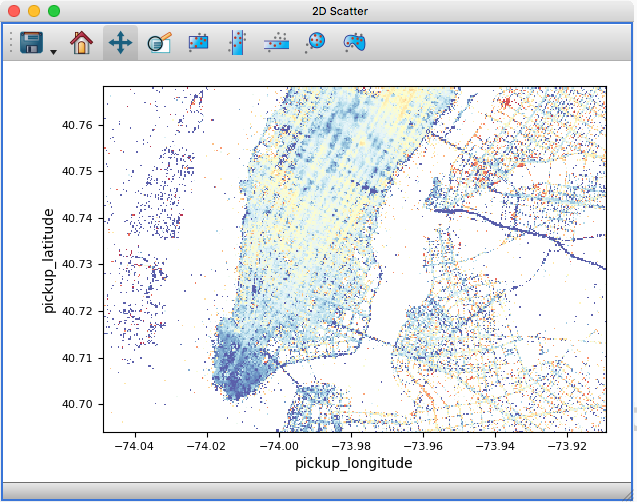

On-the-fly reprojection
-----------------------

Previously, the 2D image viewer only allowed multiple datasets to be shown at
the same time if all pixel coordinates were linked between the different
datasets. The image viewer will now automatically overlay data even if it is
linked by world coordinates instead of pixel coordinates:

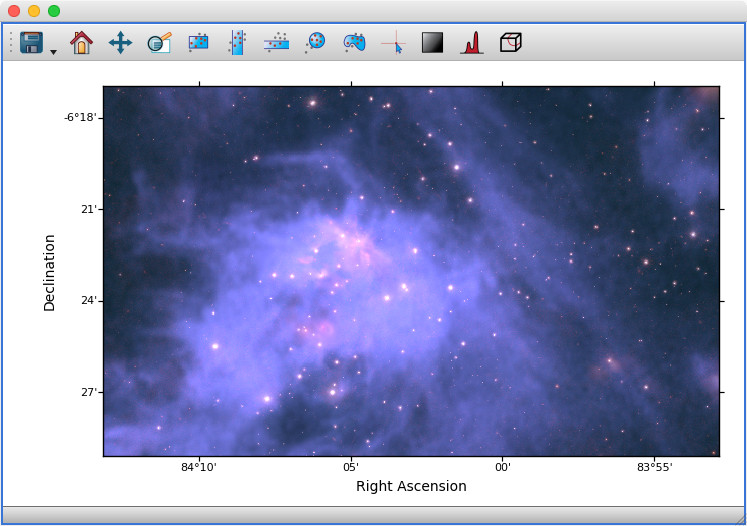

For astronomers: this means being able to overplot images and cubes with
different WCS transformations, provided that you have set up links between the
world coordinates - and this includes being able to show 2D images and 3D
spectral cubes at the same time (if you do this, note that the reference data
needs to be the dataset you want to slice over, i.e. the cube, not the 2D image).

Arithmetic attribute editor
---------------------------

Glue has long had the ability to define so-called 'arithmetic'
attributes/components, which are data attributes that depend on other data
attributes via an arithmetic expression. However, editing or removing existing
arithmetic attributes was not possible. We have now re-written the dialog for
arithmetic attributes to make it possible to go back and edit existing
expressions or remove unneeded arithmetic attributes:

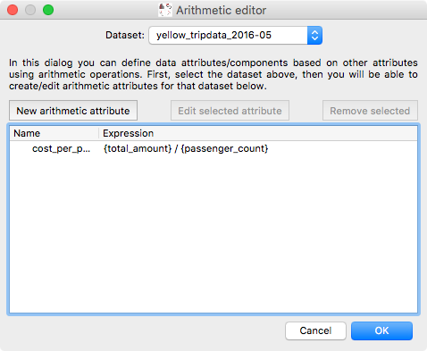

and the equation editor itself has also been improved:

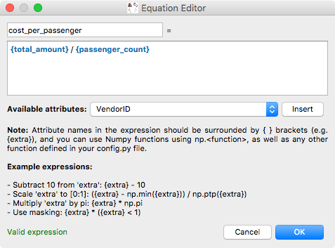

The arithmetic attribute editor is accessible via a new toolbar button:

Organize data attributes
------------------------

We have also added a new dialog that can be used to rename or reorder existing
attributes in the data. In future, this dialog will be used to also change the
types of attributes (for example to indicate that an attribute should be
interpreted as a time):

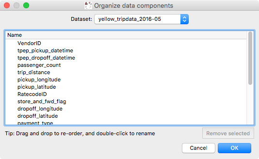

This dialog can be found in the **Data Manager** menu as **Reorder/rename data
attributes**.

Export data/subset dialog
-------------------------

While exporting datasets and subsets has been possible in the past by
control-clicking on datasets/subsets in the data collection view in the top left
of the glue window, we have now added a new **Export Data/Subsets** dialog which
provides a more intuitive interface for exporting data and subsets:

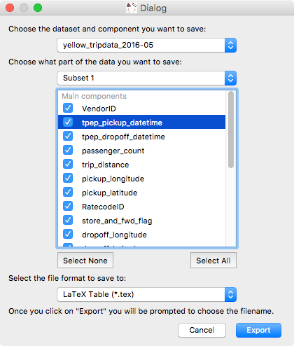

This dialog is accessible via the **Export Data/Subsets** button in the toolbar:

Metadata explorer
-----------------

Data objects have a ``.meta`` attribute that can be used to store arbitrary
metadata. For example for FITS files (in astronomy), this contains the header of
the file. We have now added the ability to visualize this metadata:

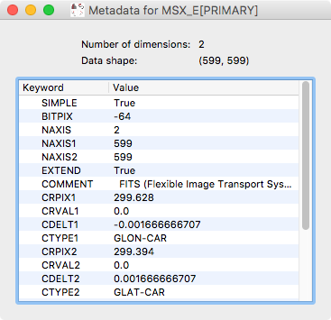

To view the metadata for a given dataset, control-click on the dataset in the
top left data collection view and select **View metadata/header**.

New link editor
---------------

The ability to link datasets is one of the core pieces of functionality in glue.
However, when dealing with more than a few datasets, the list of existing links
was previously difficult to conceptualize. We have now improved the link editor
to include a visualization all links between datasets, and to make it so that
links are only listed for the currently selected datasets. To set up one or more
links between two datasets, you can select both datasets in the graph then add
links below. You can also edit existing links between two datasets by clicking
on the line connecting them:

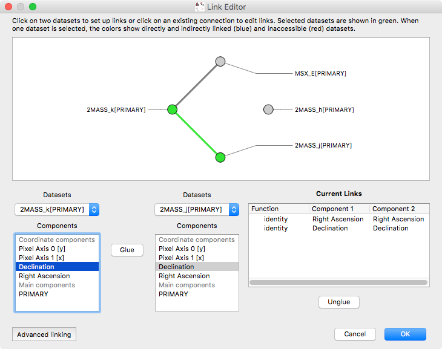

Profile viewer
--------------

Glue now features a new profile viewer that can be used to show data collapsed
along all but one dimension using a variety of functions (mean, median, maximum,
minimum, and so on). This new viewer replaces the previous 'spectrum' tool
(which was restricted to 3 dimensions and mostly designed to work with
astronomical data) and includes the same functionality to fit models to profiles
or collapse data in an image viewer based on an interval selected in the profile
viewer. The new profile viewer makes it possible to visualize the profile for
subsets as well as for the whole dataset.

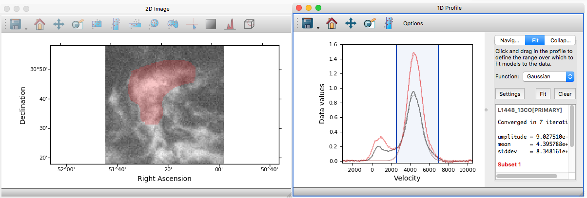

To create a profile viewer, either click on the profile icon (|profile_icon|) in
an image viewer, or drag a dataset onto the main canvas and select **1D
Profile**.

Single-pixel extraction tool
----------------------------

We have also added a new subset selection mode in the image viewer which is to
select a single pixel in the image plane. When used in conjunction with the
profile viewer, this makes it possible to hover over an image and see the
profile (e.g. spectrum) at the current mouse position:

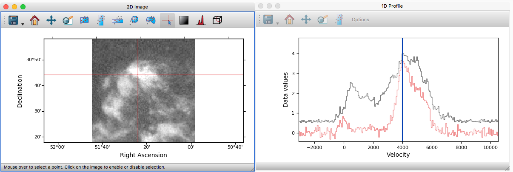

Export Python scripts
---------------------

While it has been possible for a while to export plots to e.g. PNG, PDF, or EPS
files from different image viewers it is now possible to export a Python script
that can be used to reproduce the plot for some of the core viewers (including
the 2D scatter and image viewers and the histogram viewer). To use this
functionality, click on the **Save** icon and select **Save Python script to
reproduce plot**. This functionality is still experimental, and will be extended
to more data viewers in future.

Datetime64 support
------------------

Datasets that include attributes with a Numpy ``datetime64`` dtype will now
be recognized by the scatter and histogram viewers, which will correctly format
the axis labels using dates/times. In future we will make it possible to use
this functionality to format dates/times read from files.

Relative paths in session files
-------------------------------

When exporting a session file from glue, it is now possible to select to refer
to the data files using relative paths rather than absolute paths. The relative
paths are determine relative to the location of the session file. This makes it
easier to send small session files to other users who have the same data already
on disk.

Mouse interaction with subsets in the image viewer
--------------------------------------------------

It is now possible to select and manipulate subsets in the image viewer using
the mouse. Previously, only newly created subsets could be resized and
relocated. Now it is possible to relocate any subset simply by left-clicking on
it and dragging it to a new location. Right-clicking on an existing subset opens
a context menu with an option for deleting that subset. Note that for now this
only works with the image viewer but in future we will generalize this to other
viewers.

Performance
-----------

This release includes a number of significant performance enhancements (both
in terms of speed and memory usage). The linking infrastructure has been
refactored to be much more efficient (previously, linking more than a dozen
datasets together could lead to significant performance issues), and the
propagation of selections across datasets in the presence of linking functions
has also been improved. Reading HDF5 files will now use memory mapping when
possible to avoid loading all the data into memory, and 3D selections are
represented in a much more memory-efficient way.

PySide2
-------

Glue 0.13 is now compatible with the `PySide2
<https://wiki.qt.io/Qt_for_Python>`_ library (the Python bindings for Qt5
developed by the Qt company). Since PySide2 was still in pre-release at the time
of writing, we recommend using Glue with PyQt5 for now. In parallel with this,
support for PyQt4 and PySide has now been removed from glue.

.. _whatsnew_012:

What's new in glue v0.12?
=========================

Improved 2D scatter viewer
--------------------------

It is now possible to show arrows/vectors in the **2D Scatter** viewer:

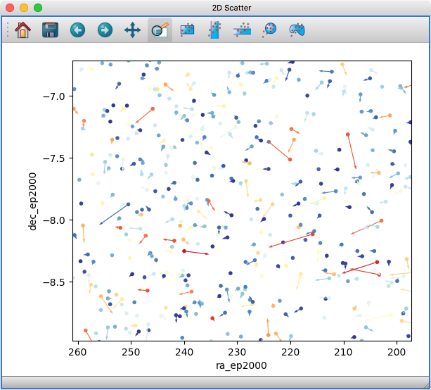

To use this, see the new **Vectors** tab below the layer list when using the 2D
Scatter viewer. In addition, we have made a number of improvements to the user
interface of this viewer to make it easier to enable/disable different
visualizations (markers, lines, errorbars, and vectors).

User interface improvements
---------------------------

We have made a number of improvements to the user interface and general
usability. In particular, selecting disabled layers in a viewer will now give a
clear explanation that the layer is disabled and will give possible causes,
rather than relying solely on visual cues (such as graying out a layer).

Custom startup actions
----------------------

It is now possible to define custom startup actions to execute when glue starts
up by writing simple Python functions in a config.py file or in plugin packages.
Startup actions are executed once glue is open and any data provided on the
command-line (if any) has been opened. Find out more about :ref:`writing custom
startup actions <custom_startup>`.

Custom data/subset actions
--------------------------

It is now possible to specify custom actions that can be accessed by
right/control-clicking  on a dataset or subset, using :ref:`the new
@layer_action <custom-actions>` decorator. The following screenshot shows
an example of a custom action added by a user to smooth data in a particular
way:

.. image:: images/v0.12/smooth.png
   :align: center
   :width: 400

Experimental SAMP plugin
------------------------

A number of Astronomy applications including `TOPCAT
<http://www.star.bris.ac.uk/~mbt/topcat/>`_, `Aladin
<https://aladin.u-strasbg.fr>`_, `DS9 <http://ds9.si.edu/site/Home.html>`_,
`WorldWideTelescope <http://worldwidetelescope.org/webclient>`_ and more support a
message-passing system that allows data and subsets to be exchanged between
applications. We have now developed a plugin that adds SAMP capabilities to
glue. To try this out, you will need to install the `glue-samp
<https://github.com/glue-viz/glue-samp>`_ package, using::

    conda install -c glueviz glue-samp

if you use conda, or::

    pip install glue-samp

otherwise. To use this, once inside glue, go to the **Plugins** menu, then
select **Open SAMP plugin**. The window that open will provide information on
using this plugin. Note however that this plugin is experimental and is still
missing a number of features. In addition, SAMP implementation in other
applications is sometimes buggy, so you may encounter issues unrelated to glue.

Improved performance in 3D viewers
----------------------------------

The **3D Volume Rendering** is now significantly faster for large datasets. In
particular, the resolution of the rendering is now reduced when rotating or
zooming, and we have made it so that the viewer is now much more efficient in
terms of memory.

Experimental fixed layout/dashboards [advanced]
-----------------------------------------------

By default, glue uses a free-form canvas to contain viewers, which gives you the
ability to arrange the data viewers in any way you like. However, for certain
applications, it can be helpful to defined tabs that contain data viewers in a
predefined layout. :ref:`This is now possible <custom_fixed_layout>`, although note
that this is still an experimental feature and requires some knowledge of how to
set up Qt widgets. In future, we will make it possible to define layouts in a
more intuitive way.

Full list of Changes
--------------------

In addition to the above features, a number of bugs has been fixed since the
last release, and a few other small features have been added. A full list of
changes can be found in the
`CHANGES.md <https://github.com/glue-viz/glue/blob/master/CHANGES.md>`_ file

What's new in glue v0.11?
=========================

The v0.11 release of glue includes a number of exciting new features and
improvements, so let's take a look at what's new!

New Slack community
-------------------

We have now set up Slack for any glue help/discussions, and we encourage you to
sign up! You will need to first get an account `here
<https://join.slack.com/t/glueviz/shared_invite/zt-1p5amn7ee-wTZCJJNlgxCTRup3SrSh3g>`_ after which you will be able to
sign in to https://glueviz.slack.com.

Improved interface
------------------

The main interface of the application has been improved, and now features a
toolbar at the top with quick access to common functionality, as well as a
clearer link to the error console (which replaces the square in the bottom right
of the interface).

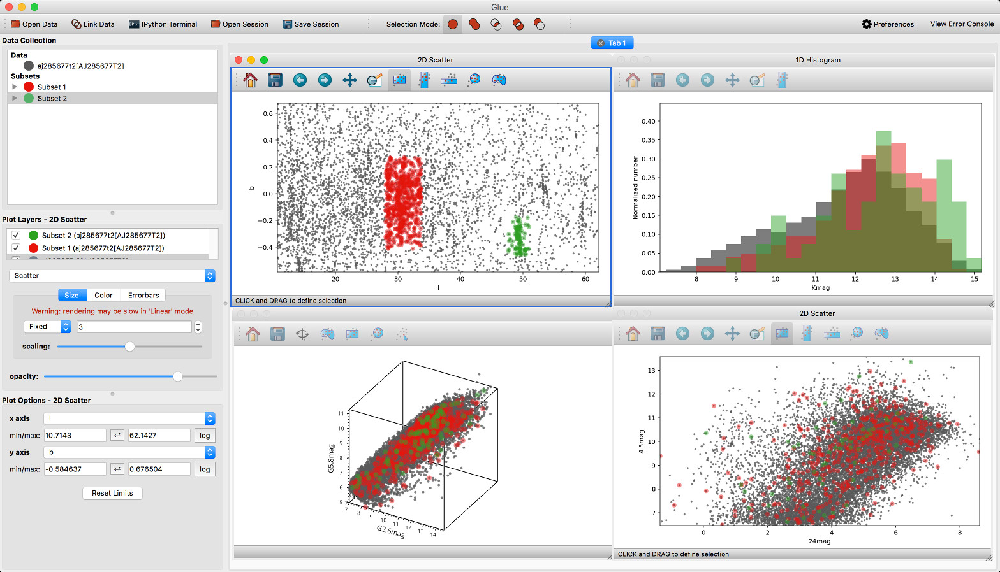

We've also done a lot of work to improve the layout of many of the option
widgets, fixing font sizes, and so on. We hope you like the updated interface!

New built-in viewers
--------------------

The built-in histogram, scatter, and image viewers have now been completely
re-written and now include new functionality. For example, the scatter viewer
now includes the ability to color-code or resize points based on another
attribute (this was previously possible in the 3D scatter viewer only):

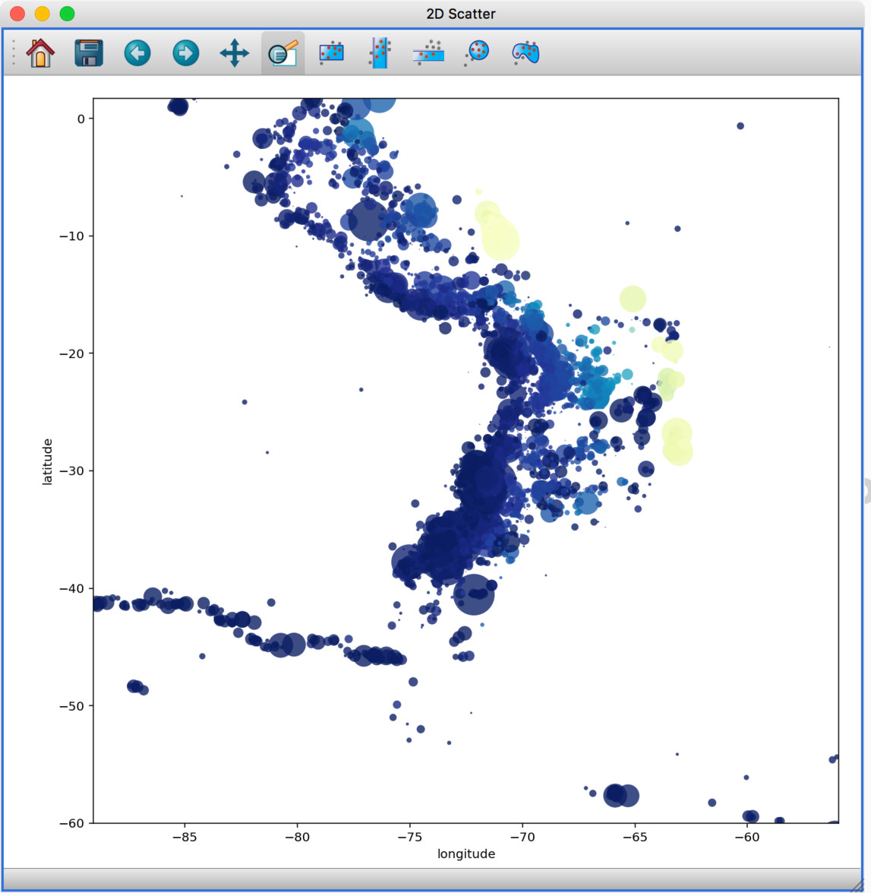

The scatter viewer now also includes the ability to show symmetric error bars in
the x and/or y direction.

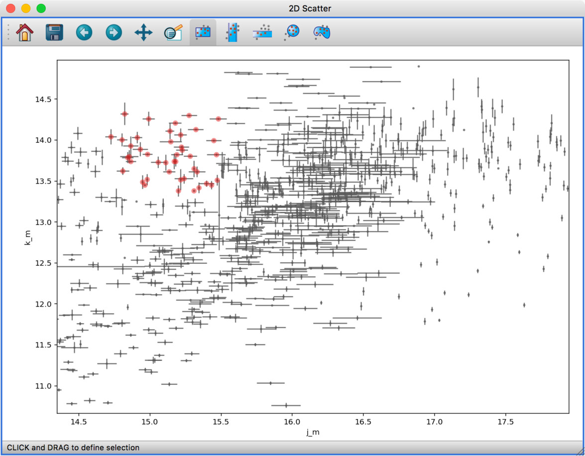

Finally, this viewer also allows you to plot the data using a continuous line
rather than individual points.

The image viewer has also seen an overhaul - the main change in user experience
is that multi-color images are now made via layers instead of using a special
RGB mode, and any number of images can be combined using an arbitrary number of
colormaps or colors, rather than being restricted to RGB colors:

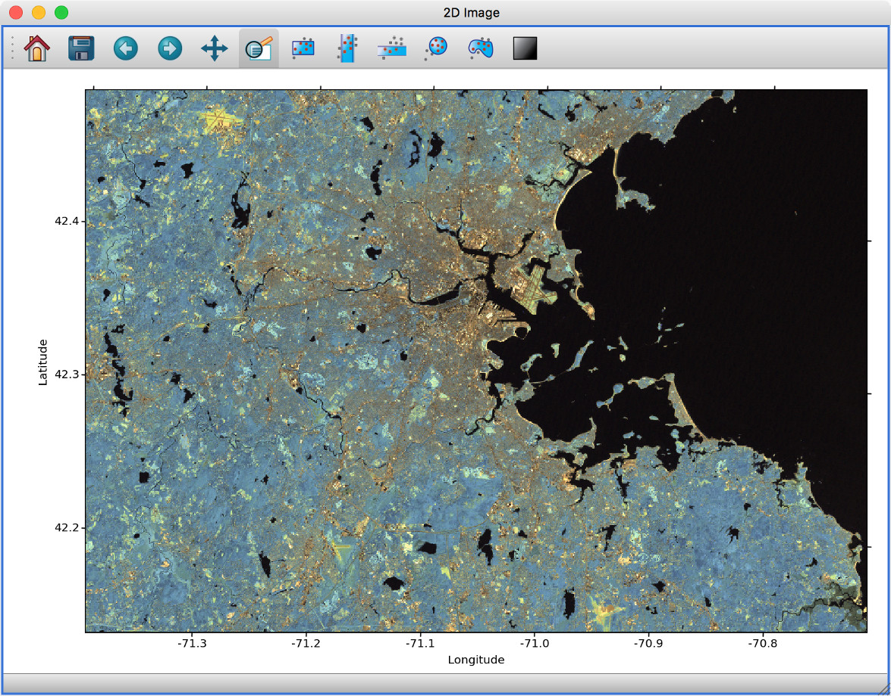

Subset mask importers and exporters
-----------------------------------

While it was already possible to export data subsets as actual subsets of the
data, it is now possible to import and export the boolean masks for subsets.
At the moment, there is only built-in support for importing/exporting from
FITS files, but defining new importers/exporters can easily be done, as
described in :ref:`custom_subset_mask_importer` and
:ref:`custom_subset_mask_exporter`. In future, we will add built-in support
for a wider range of file formats.

Performance improvements
------------------------

This release includes a number of significant performance improvements. For
example, there should now no longer be any delays when setting up links, and
selections should propagate between viewers more efficiently.

Experimental WorldWide Telescope plugin
---------------------------------------

We have developed a plugin that provides a `WorldWide Telescope (WWT)
<http://worldwidetelescope.org/webclient/>`_ viewer inside glue:

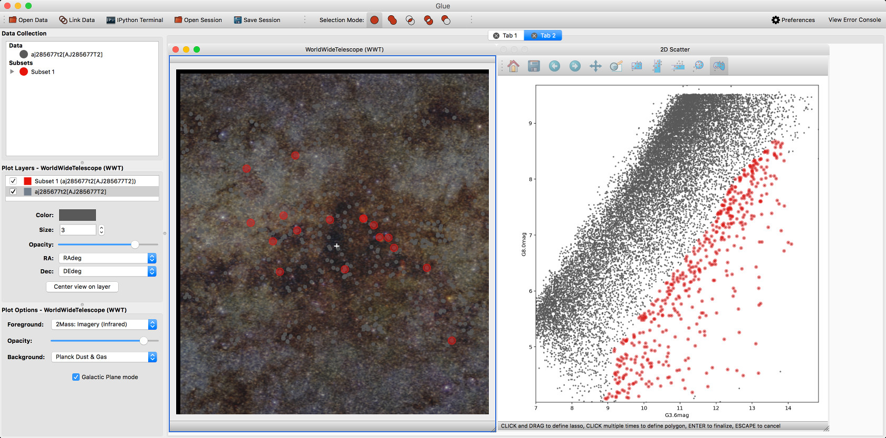

To use this viewer, you
will need to install the `glue-wwt <https://github.com/glue-viz/glue-wwt>`_
plugin, using::

    conda install -c glueviz glue-wwt

if you use conda, or::

    pip install glue-wwt

otherwise. This viewer is experimental and is still missing a number of
features. For example, it can only be used to show datasets that have RA/Dec
columns (not other types of coordinates). Please report any issues or feature
requests `here <https://github.com/glue-viz/glue-wwt/issues>`__. If you would be
interested in contributing to or help maintaining this plugin, we would also
love to hear from you! (see :ref:`here <help>` for different ways of getting in
touch).

Experimental geospatial plugin
------------------------------

We have started to develop a plugin which aims to collect functionality relevant
to the analysis of geospatial data. For now, the plugin provides a data factory
that uses the `rasterio <https://github.com/mapbox/rasterio>`_ package to read
geospatial raster data. This includes reading in the coordinate system and
showing longitude/latitude lines in image viewers, and also allows
longitude/latitude scatter data to be overplotted:

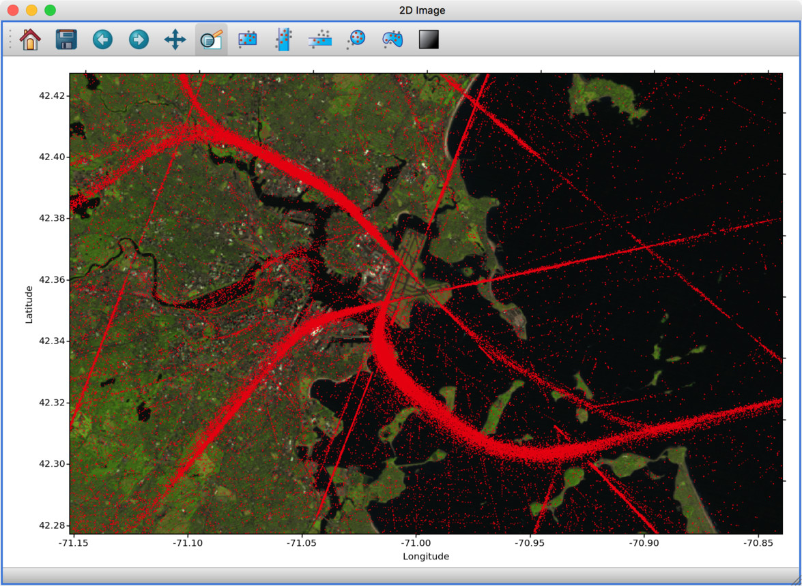

To use this, you will need to install the `glue-geospatial
<https://github.com/glue-viz/glue-geospatial>`_ plugin, using::

    conda install -c glueviz glue-geospatial

if you use conda, or::

    pip install glue-geospatial

otherwise.

This plugin is experimental, and if you run into any issues or would like to see
new features, please open an issue `here
<https://github.com/glue-viz/glue-geospatial>`__. If you would be interested in
contributing to or help maintaining this plugin, we would also love to hear from
you! (see :ref:`here <help>` for different ways of getting in touch).

Backward-incompatible changes
-----------------------------

If you programmatically create viewers from Python scripts, if you currently set
attributes on viewers, you will need to update this code if using the built-in
histogram, scatter, or image viewers.

The main change is that the viewer classes have been renamed as follows:

* ``ScatterWidget`` is now ``ScatterViewer``
* ``ImageWidget`` is now ``ImageViewer``
* ``HistogramWidget`` is now ``HistogramViewer``
* ``TableWidget`` is now ``TableViewer``

In addition, attributes related to the visualization are no longer set directly
on the viewer object but instead using a ``state`` attribute on the viewers. For
example to set the ``x`` attribute on the scatter plot viewer, you should set::

    >>> viewer.state.x_att = ...

instead of::

    >>> viewer.xatt = ...

The motivation for this change is that the ``state`` object is a new object that
represents the state of the viewer in a GUI-framework-independent way, and is a
cleaner way to encapsulate all the information needed to control the
visualization. See the :ref:`programmatic` section for more details.

New conda glueviz channel
-------------------------

We now provide our own conda channel called ``glueviz`` (rather than using
conda-forge), which should help alleviate installation issues some users have
reported in the past. This channel contains the stable versions of glue and
various plugin packages.

Note that it is also possible to install the latest developer version from the
``glueviz/label/dev`` channel, though be aware that while you will get the
latest cutting-edge features, you may also be more prone to bugs/breakage.

Full list of Changes
--------------------

In addition to the above features, a number of bugs has been fixed since the
last release, and a few other small features have been added. A full list of
changes can be found in the
`CHANGES.md <https://github.com/glue-viz/glue/blob/master/CHANGES.md>`_ file

.. _whatsnew_010:

What's new in glue v0.10?
=========================

Improved linking dialog
-----------------------

The data linking dialog has been redesigned and improved:

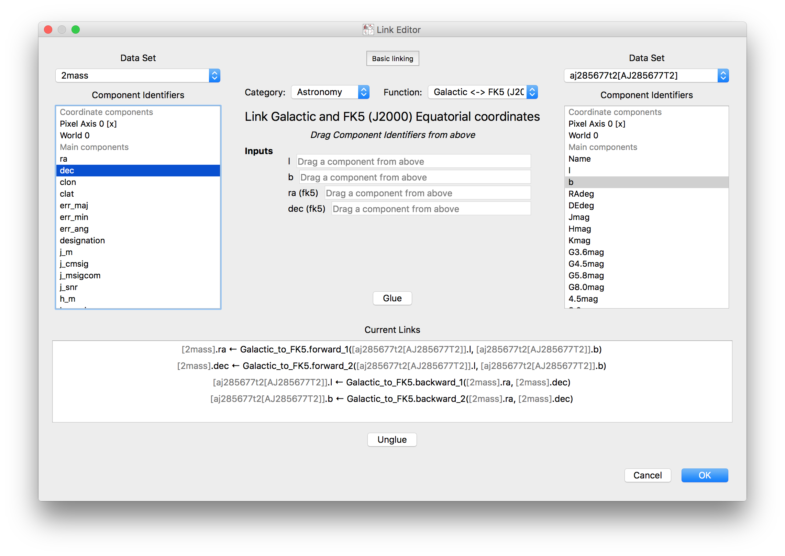

In particular, it is now clear in the list of links which components correspond
to which datasets. This also fixes previous undesirable behaviors such as
components changing names when using the identity link, and such as components
being shown alphabetically instead of in their original native order (which has
now been fixed). Linking functions can also be grouped by categories.

New data/subset exporters
-------------------------

It is now possible to easily export datasets and subsets by right-clicking (or
control-clicking) on them and selecting **Export Data** or **Export Subsets**.

.. image:: ../customizing_guide/images/export_data.png
   :align: center
   :width: 450

Custom data/subset exporters can be easily be defined by users - see
:ref:`custom_data_exporter` for more details. Currently only a small number of
formats are supported by default but this will be expanded in future.

Performance improvements
------------------------

Performance has been significantly improved (in some cases by factors of 10-100)
for cases where 2D datasets were linked with 3D or higher-dimensional datasets,
and selections were made in 2D.

Ginga plugin now moved to a separate package
--------------------------------------------

The plugin that allows `ginga <https://ejeschke.github.io/ginga/>`_ viewers to
be used inside glue has been moved to a new package,
`glue-ginga <https://pypi.org/project/glue-ginga/0.1>`_. To install
this plugin, simply do::

    pip install glue-ginga

Compatibility with PyQt5 and Matplotlib 2.x
-------------------------------------------

Glue and the 3D viewers are now fully compatible with PyQt5 and Matplotlib 2.x,
which together provide sharper plots on high DPI (e.g. retina) displays.

Creating subset states for categorical components [advanced]
------------------------------------------------------------

For users who like to create subsets programmatically or in the built-in
IPython console, it is now possible to create subset states for categorical
components using e.g.::

    d.id['source'] == 'name'

Subsets now share more attributes with parent Data objects [advanced]
---------------------------------------------------------------------

:class:`~glue.core.subset.Subset` objects now have properties such as
``components``, ``visible_components``, ``ndim``, ``shape``, and more which are
inherited from parent datasets.

Full list of Changes
--------------------

In addition to the above features, a number of bugs has been fixed since the
last release, and a few other small features have been added. A full list of
changes can be found in the
`CHANGES.md <https://github.com/glue-viz/glue/blob/master/CHANGES.md>`_ file

.. _whatsnew_09:

What's new in glue v0.9?
========================

New table viewer
----------------

Glue now includes a table viewer for data with 1-dimensional components (such as
tables). The table viewer highlights selections made in other viewers, and
also allows selections to be made in the viewer:

.. image:: images/v0.9/table_viewer.png
   :align: center
   :width: 847

To make a selection in the table, either select an existing subset in the **Data
Collection** panel in the top left if you want to modify a subset, or make sure
no subset is selected to make a new subset (as in other viewers), then
click the button on the left in the table viewer toolbar, select rows you want
to include in the subset, and press enter to validate the selection. You can
also combine this with the usual logical selections ('and', 'or', etc.) from
glue to modify existing subsets by adding/removing rows.

Improvements to 3D viewers
--------------------------

There have been a number of improvements to the 3D viewers provided by the
`glue-vispy-viewers <https://pypi.org/project/glue-vispy-viewers/>`_ package
(now automatically installed with glue).

.. image:: images/v0.9/3d_viewers.png
   :align: center
   :width: 731

The main changes are:

* The axes now include ticks, tick labels, and axis labels. For volume
  renderings, the values are the pixel coordinates for now, but in future we
  will allow the world coordinates to be shown.

* Catalogs/tables can now be overplotted on top of volume renderings, as for the
  2-d image viewer. To use this, you will first need to make sure that you link
  three components of the catalog/table to the three **world** coordinates of
  the cube shown in the volume rendering, then drag the catalog/table dataset
  onto the volume rendering. By selecting the layer corresponding to the
  catalog, you can then change the appearance of the markers.

* There is now an option in the bottom left options panel to remove data that
  falls outside the coordinate axes box. This can be used for both the scatter
  viewer and volume rendering viewer.

* There is also now an option to show the data in its original aspect ratio,
  assuming that the voxels are cubes. By default, the 3D viewers stretch the
  data so that it fills a cube.

* It is now possible to visualize datasets of any dimensionality in the scatter
  plot viewer - however, note that this viewer currently becomes slow above
  a million points.

Improved plot.ly exporter
-------------------------

Glue has included the ability to export plots to the `plot.ly <https://plot.ly>`_
service for a few versions now, but there was no way to control the privacy
level of the resulting plots. When exporting to plotly, you will now be
presented with a window that allows much finer control over the export:

.. image:: images/v0.9/plotly_exporter.png
   :align: center
   :width: 514

World coordinates in slices
---------------------------

When viewing 3+ dimensional data in the image viewer, if the data has a
world coordinate system defined, the coordinates can now be shown in the
image slicers:

.. image:: images/v0.9/world_slicing.png
   :align: center
   :width: 288

If the world coordinate system is not linearly related to the pixel slices,
a warning will be shown to indicate that the world coordinates are measured
along a line that goes down the center of the cube.

Improvements to Astronomy-specific functionality
------------------------------------------------

If you have the `spectral-cube <https://spectral-cube.readthedocs.io>`__ package
installed, glue can now use this to read in spectral cubes in FITS format. To
use this, you will need to go through the **Open Data Set** menu item and
explicitly select **FITS Spectral Cube** from the list:

.. image:: images/v0.9/spectral_cube_import.png
   :align: center
   :width: 288

We haven't enable this by default at this time because this modifies the order
of the axes, and splits the Stokes components into glue data components, which
may not always be desirable.

In addition, units are now properly read from FITS and VO tables, and are
shown in the table viewer. In future, we will also show the units in the
different viewers.

Finally, a new linking function is now available to link celestial Galactic
coordinates to 3D Galactocentric coordinates.

Improvements to ``join_on_key`` [advanced]
------------------------------------------

The :meth:`~glue.core.data.Data.join_on_key` method can be used for advanced
linking scenarios - for instance linking datasets by e.g. an ID in two different
datasets. In this version, we have added some advanced possibilities, for
example linking by combinations of keys, as well as allowing one-to-many and
many-to-one linking. For more information, see the documentation for
:meth:`~glue.core.data.Data.join_on_key`.

This functionality is still experimental, and we will provide in future a window
in the graphical user interface to explain and make it easy for users to set up
these kinds of links.

Data updating [advanced]
------------------------

A new method, :meth:`~glue.core.data.Data.update_values_from_data` has been
added to allow values in datasets to be updated based on another dataset. This
allows users to open a dataset, create different viewers, make selections,
and then load a more recent version of the dataset and update the values,
keeping all the viewers open.

Infrastructure changes [advanced]
---------------------------------

The code to handle toolbars in viewers has now been completely refactored, and
it is much easier for people developing their own viewers to define toolbars
and tools for their viewers. A new page, :ref:`Custom tools for viewers and
custom toolbars <custom-toolbars>`, has been added to the documentation to show
how to use this functionality.

We have now also switched from using the ``glue.external.qt`` module to the
`QtPy <https://pypi.org/project/QtPy>`__ package for supporting different
Python Qt wrappers (PyQt4 and 5, as well as PySide). See :ref:`qtpy` for more
information.

Full list of Changes
--------------------

In addition to the above features, a number of bugs has been fixed since the
last release, and a few other small features have been added. A full list of
changes can be found in the
`CHANGES.md <https://github.com/glue-viz/glue/blob/master/CHANGES.md>`_ file

.. _whatsnew_08:

What's new in Glue v0.8?
========================

Playback controls for image slicing
-----------------------------------

When using the image viewer to view datasets with more than two dimensions, the
sliders snow include playback controls that you can use to animate the slicing.

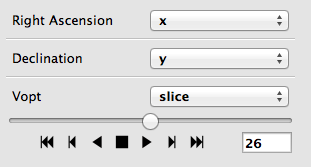

By clicking multiple times on the play forward or play back button (the buttons
on either side of the stop button), you can speed up the animation.

Improved new component window
-----------------------------

The *Define New Component* window has now been significantly improved. The
syntax of the expression for the new component is now validated on-the-fly, and
the component cannot be created until the expression validates:

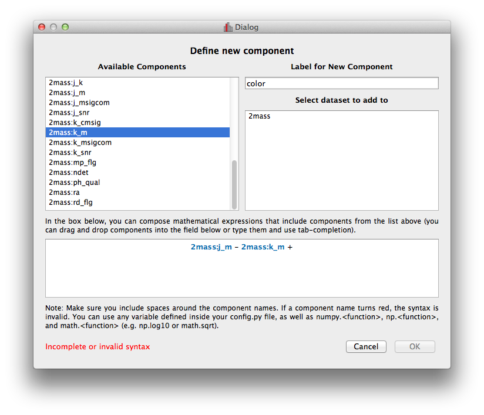

Adding data to glue from Python
-------------------------------

If you make use of the :func:`~glue.qglue` function to launch glue from IPython
or the Jupyter notebook, you can now easily continue to add data to glue from
that Python session, by doing e.g.::

    >>> app = qglue(data1=array1)
    >>> app.add_data(data2=array2)

More details can be found :ref:`here <add_data_qglue>`.

New preferences dialog
----------------------

A new dialog for preferences is now available via **File -> Edit Preferences**,
and allows you to change the settings for the foreground/background color of
viewers, as well as the default data color and transparency:

.. image :: preferences.png
   :align: center

Improved feedback window
------------------------

The *Send Feedback* functionality available through the Help menu and the window
to send crash reports to the developers now also provide the option to specify
an email address in case you want to be contacted about the feedback/bug report:

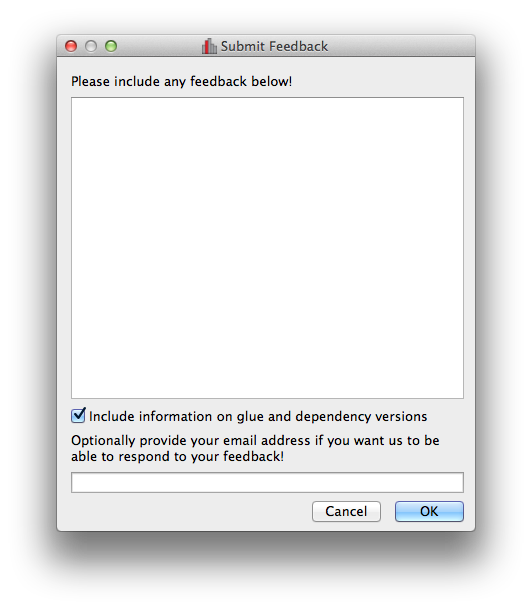

Circular and polygonal profile extraction
------------------------------------------

The spectrum/profile extraction tool for the image viewer now supports
extraction using circular and polygonal regions.

Full list of Changes
--------------------

In addition to the above features, a number of bugs has been fixed since the
last release. A full list of changes can be found in the
`CHANGES.md <https://github.com/glue-viz/glue/blob/master/CHANGES.md>`_ file

.. _whatsnew_07:

What's new in Glue v0.7?
========================

Code and development reorganization
-----------------------------------

Since the v0.6.x releases, a lot of work has gone into reorganizing the Glue
code base to make it more modular and more accessible for new developers. The
documentation has also been completely reorganized and expanded, and now
includes a description of some aspects of the :ref:`Glue architecture
<architecture>` and information for anyone interested in getting
involved in :ref:`Glue development <devdocs>`.

We also have a new mailing list `glue-viz-dev
<https://groups.google.com/forum/#!forum/glue-viz-dev>`_ for anyone interested
in development, so if you are interested in getting involved, please join the
list and let us know!

As a result of the code reorganization, some imports may need to be updated if
you are using glue from scripts. Please see :doc:`this
<0.7_code_reorganization>` page for more details on what's changed!

Layer artist options
--------------------

When visualizing data in one of the data viewers, the list of layers is given
in the 'Plot Layers' list in the left sidebar. While it was possible to edit
the style of these layers via a contextual menu previously, we have now made
the options more visible below the list:

.. image:: layer_options.png
   :width: 300px
   :align: center

This is currently implemented for the scatter and histogram viewers, and will
be extended to other viewers in future.

Numpy reader
------------

Glue is now able to read in ``.npy`` and ``.npz`` files produced by Numpy.
Thanks to Adrian Price-Whelan for contributing this feature!

Bug fixes and usability improvements
------------------------------------

A number of usability issues have been fixed. Of particular note, in the v0.6.x
releases, lasso selection no longer worked in scatter plots with categorical
components on one or more of the axes, but this has now been fixed (thanks to
Will Dampier for refactoring the way selection of categorical components is
handled internally!).

Full list of Changes
--------------------

A full list of changes can be found in the
`CHANGES.md <https://github.com/glue-viz/glue/blob/master/CHANGES.md>`_ file

.. _whatsnew_06:

What's new in Glue v0.6?
========================

Improved file readers
---------------------

A significant amount of work has gone into improving the build-in readers for
various data formats. In particular:

- Glue now supports a wider range of ASCII table formats. Any format that can
  be read by the `Astropy <https://www.astropy.org>`_ package can now be read
  by Glue. If you run into ASCII tables that cannot be read, please let us
  know!

- The HDF5 file reader will now read in all datasets from a file, including
  both tabular and gridded data. The path to the HDF5 dataset is now
  reflected in the label for the dataset in Glue.

- The Excel file reader is now significantly more robust. In particular, it
  can now read in files with multiple sheets, and the sheet name is now
  included in the label for the data.

- The FITS file reader (a data format commonly used in Astronomy) will now
  read in all header-data units (HDUs) from FITS files rather than simply
  reading the first. In addition, FITS files with compressed HDUs will now be
  read correctly.

Plugin manager
--------------

In Glue v0.5, we introduced the ability to develop separate plugin packages
and have these be registered automatically with glue once installed. In some
cases it can be useful to disable/enable specific plugins, so the **Plugins**
menu now includes a plugin manager that can be used to enable/disable
plugins. This is then stored in a configuration file in the user's home
directory, and the configuration is preserved from one session to the next:

.. image:: plugin_manager.png
   :width: 50%
   :align: center

Improvements to image viewer
----------------------------

The image viewer now includes an **Aspect** setting that can be used to
control the aspect ratio of the pixels:

.. image:: aspect_combo.png
   :width: 50%
   :align: center

If this is set to **Square Pixels** (the default), the data is always shown
with square pixels, which may result in empty space around the data but is
more correct when the data is an actual image:

.. image:: aspect_square.png
   :width: 50%
   :align: center

On the other hand, if this is set to **Automatic**, the data is distorted to
fill the axes:

.. image:: aspect_auto.png
   :width: 50%
   :align: center

For data cubes, the slider(s) used to move through slices along the extra
dimension(s) now includes the ability to manually specify the slice to move
to, as well as buttons to step through slices, and go to the first or last
slice:

.. image:: cube_slider.png
   :width: 50%
   :align: center

Finally, when extracting a spectrum/profile from a data cube, the box used to
extract the spectrum can now be moved around by pressing the control key and
dragging the box around, resulting in the spectrum/profile being updated in
real time.

Data factories
--------------

For anyone developing custom data factories, the ``@data_factory`` decorator
can now accept a ``priority=`` argument that should be set to a positive
integer value (with the default being zero). This priority is then used in
case of multiple data factories being able to read a given file. For example,
if you are develop a data factory that reads FITS files in a special way, and
want it to take precedence on all other data factories, you can set the
priority to a large value.

Experimental support for PyQt5
------------------------------

Glue should now work with the
`PyQt5 <https://riverbankcomputing.com/software/pyqt/download5>`_ package, but
support is experimental for now. If you do try out PyQt5, please
`report any issues <https://github.com/glue-viz/glue/issues>`_ you encounter!

Python 2.6 support
------------------

This will be the last major release to support Python 2.6. Future releases
will support only Python 2.7 and 3.3 and above.

Other Improvements
------------------

In addition to the new features described above, we have made a number of
internal improvements to the code structure, and have fixed a number of
usability bugs reported by users.

Full list of Changes
--------------------

A full list of changes can be found in the
`CHANGES.md <https://github.com/glue-viz/glue/blob/master/CHANGES.md>`_ file

.. _whatsnew_05:

What's new in Glue v0.5?
========================

Python 3 compatibility
----------------------

Glue v0.5 is now fully compatible with Python 2.6, 2.7, and 3.3 and later.

Installation with conda
-----------------------

If you make use of Anaconda or Miniconda, Glue can now be installed very easily
by doing::

    conda install glueviz

This will install glue itself as well as all of the required and many optional
dependencies.

New features
------------

Glue v0.5 includes a number of new features, in particular:

* The ability to :ref:`include a copy of all datasets <saving_session>` in
  ``.glu`` session files, to make it easier to exchange session files with
  other users. When saving a session file, choose the option to include all
  data from the drop-down menu:

.. figure:: ../getting_started/images/save_with_data.png
   :align: center
   :width: 400px

* The ability to write and register
  :ref:`custom data importers <custom_importers>`, as well as
  :ref:`custom menubar tools <custom_menubar_tools>`.

* An improved interface for :ref:`creating new components <new_components>`,
  including tab-completion and color highlighting of component names.

* The ability to pass ``HDUList`` objects when using ``qglue``.

* The ability to define floating-point and text parameter boxes when defining
  custom viewers.

* Support for more coordinate frames for the Astronomy coordinate system
  transformations.

* The ability to drag existing selection regions by pressing 'control',
  selecting a selection, and moving it around.

Improvements
------------

In addition to the new features described above, we have made a number of
internal improvements to the code structure, and have fixed a number of
usability bugs reported by users.

Full list of Changes
--------------------

A full list of changes can be found in the
`CHANGES.md <https://github.com/glue-viz/glue/blob/master/CHANGES.md>`_ file
