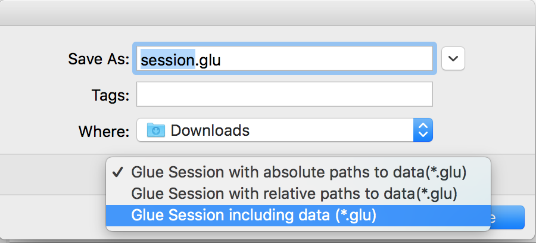
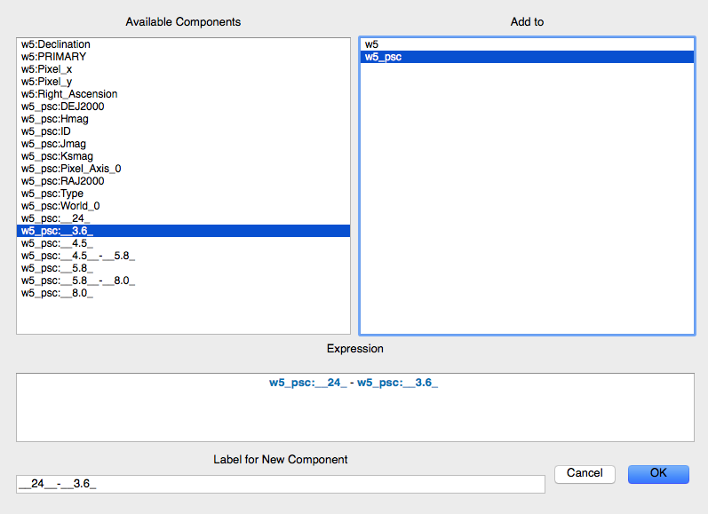

:orphan:

.. _whatsnew:

*******************
What's new in glue?
*******************

On this page you will find information about significant changes in each
release. Many smaller improvements and bug fixes are not mentioned here but can be
found in the full list of `CHANGES.md
<https://github.com/glue-viz/glue/blob/master/CHANGES.md>`_ file if you are
interested.

Before we get started, here's a reminder on how to install/update glue. You can
easily update glue if you are using Anaconda/Miniconda by doing::

    conda install -c glueviz glueviz

If instead you installed glue with pip, you can update with::

    pip install glueviz[all] --upgrade

.. _whatsnew_011:

What's new in glue v0.11?
=========================

The v0.11 release of glue includes a number of exciting new features and
improvements, so let's take a look at what's new!

New Slack community
-------------------

We have now set up Slack for any glue help/discussions, and we encourage you to
sign up! You will need to first get an account `here
<https://glueviz-slack-invite.herokuapp.com>`_ after which you will be able to
sign in to http://glueviz.slack.com.

Improved interface
------------------

The main interface of the application has been improved, and now features a
toolbar at the top with quick access to common functionality, as well as a
clearer link to the error console (which replaces the square in the bottom right
of the interface).

.. image:: images/v0.11/application_ui.jpg
   :align: center
   :width: 900

We've also done a lot of work to improve the layout of many of the option
widgets, fixing font sizes, and so on. We hope you like the updated interface!

New built-in viewers
--------------------

The built-in histogram, scatter, and image viewers have now been completely
re-written and now include new functionality. For example, the scatter viewer
now includes the ability to color-code or resize points based on another
attribute (this was previously possible in the 3D scatter viewer only):

.. image:: images/v0.11/scatter_color_size.jpg
   :align: center
   :width: 700

The scatter viewer now also includes the ability to show symmetric error bars in
the x and/or y direction.

.. image:: images/v0.11/scatter_error.jpg
   :align: center
   :width: 700

Finally, this viewer also allows you to plot the data using a continuous line
rather than individual points.

The image viewer has also seen an overhaul - the main change in user experience
is that multi-color images are now made via layers instead of using a special
RGB mode, and any number of images can be combined using an arbitrary number of
colormaps or colors, rather than being restricted to RGB colors:

.. image:: images/v0.11/image_rgb.jpg
   :align: center
   :width: 700

Subset mask importers and exporters
-----------------------------------

While it was already possible to export data subsets as actual subsets of the
data, it is now possible to import and export the boolean masks for subsets.
At the moment, there is only built-in support for importing/exporting from
FITS files, but defining new importers/exporters can easily be done, as
described in :ref:`custom_subset_mask_importer` and
:ref:`custom_subset_mask_exporter`. In future, we will add built-in support
for a wider range of file formats.

Performance improvements
------------------------

This release includes a number of significant performance improvements. For
example, there should now no longer be any delays when setting up links, and
selections should propagate between viewers more efficiently.

Experimental WorldWide Telescope plugin
---------------------------------------

We have developed a plugin that provides a `WorldWide Telescope (WWT)
<http://worldwidetelescope.org/webclient/>`_ viewer inside glue:

.. image:: images/v0.11/plugin_wwt.jpg
   :align: center
   :width: 900

To use this viewer, you
will need to install the `glue-wwt <https://github.com/glue-viz/glue-wwt>`_
plugin, using::

    conda install -c glueviz glue-wwt

if you use conda, or::

    pip install glue-wwt

otherwise. This viewer is experimental and is still missing a number of
features. For example, it can only be used to show datasets that have RA/Dec
columns (not other types of coordinates). Please report any issues or feature
requests `here <https://github.com/glue-viz/glue-wwt/issues>`__. If you would be
interested in contributing to or help maintaining this plugin, we would also
love to hear from you! (see :ref:`here <help>` for different ways of getting in
touch).

Experimental geospatial plugin
------------------------------

We have started to develop a plugin which aims to collect functionality relevant
to the analysis of geospatial data. For now, the plugin provides a data factory
that uses the `rasterio <https://github.com/mapbox/rasterio>`_ package to read
geospatial raster data. This includes reading in the coordinate system and
showing longitude/latitude lines in image viewers, and also allows
longitude/latitude scatter data to be overplotted:

.. image:: images/v0.11/plugin_geospatial.jpg
   :align: center
   :width: 700

To use this, you will need to install the `glue-geospatial
<https://github.com/glue-viz/glue-geospatial>`_ plugin, using::

    conda install -c glueviz glue-geospatial

if you use conda, or::

    pip install glue-geospatial

otherwise.

This plugin is experimental, and if you run into any issues or would like to see
new features, please open an issue `here
<https://github.com/glue-viz/glue-geospatial>`__. If you would be interested in
contributing to or help maintaining this plugin, we would also love to hear from
you! (see :ref:`here <help>` for different ways of getting in touch).

Backward-incompatible changes
-----------------------------

If you programmatically create viewers from Python scripts, if you currently set
attributes on viewers, you will need to update this code if using the built-in
histogram, scatter, or image viewers.

The main change is that the viewer classes have been renamed as follows:

* ``ScatterWidget`` is now ``ScatterViewer``
* ``ImageWidget`` is now ``ImageViewer``
* ``HistogramWidget`` is now ``HistogramViewer``
* ``TableWidget`` is now ``TableViewer``

In addition, attributes related to the visualization are no longer set directly
on the viewer object but instead using a ``state`` attribute on the viewers. For
example to set the ``x`` attribute on the scatter plot viewer, you should set::

    >>> viewer.state.x_att = ...

instead of::

    >>> viewer.xatt = ...

The motivation for this change is that the ``state`` object is a new object that
represents the state of the viewer in a GUI-framework-independent way, and is a
cleaner way to encapsulate all the information needed to control the
visualization. See the :ref:`programmatic` section for more details.

New conda glueviz channel
-------------------------

We now provide our own conda channel called ``glueviz`` (rather than using
conda-forge), which should help alleviate installation issues some users have
reported in the past. This channel contains the stable versions of glue and
various plugin packages.

Note that it is also possible to install the latest developer version from the
``glueviz/label/dev`` channel, though be aware that while you will get the
latest cutting-edge features, you may also be more prone to bugs/breakage.

Full list of Changes
--------------------

In addition to the above features, a number of bugs has been fixed since the
last release, and a few other small features have been added. A full list of
changes can be found in the
`CHANGES.md <https://github.com/glue-viz/glue/blob/master/CHANGES.md>`_ file

.. _whatsnew_010:

What's new in glue v0.10?
=========================

Improved linking dialog
-----------------------

The data linking dialog has been redesigned and improved:

.. image:: images/v0.10/link_window.png
   :align: center
   :width: 900

In particular, it is now clear in the list of links which components correspond
to which datasets. This also fixes previous undesirable behaviors such as
components changing names when using the identity link, and such as components
being shown alphabetically instead of in their original native order (which has
now been fixed). Linking functions can also be grouped by categories.

New data/subset exporters
-------------------------

It is now possible to easily export datasets and subsets by right-clicking (or
control-clicking) on them and selecting **Export Data** or **Export Subsets**.

.. image:: ../customizing_guide/images/export_data.png
   :align: center
   :width: 450

Custom data/subset exporters can be easily be defined by users - see
:ref:`custom_data_exporter` for more details. Currently only a small number of
formats are supported by default but this will be expanded in future.

Performance improvements
------------------------

Performance has been significantly improved (in some cases by factors of 10-100)
for cases where 2D datasets were linked with 3D or higher-dimensional datasets,
and selections were made in 2D.

Ginga plugin now moved to a separate package
--------------------------------------------

The plugin that allows `ginga <https://ejeschke.github.io/ginga/>`_ viewers to
be used inside glue has been moved to a new package,
`glue-ginga <https://pypi.python.org/pypi/glue-ginga/0.1>`_. To install
this plugin, simply do::

    pip install glue-ginga

Compatibility with PyQt5 and Matplotlib 2.x
-------------------------------------------

Glue and the 3D viewers are now fully compatible with PyQt5 and Matplotlib 2.x,
which together provide sharper plots on high DPI (e.g. retina) displays.

Creating subset states for categorical components [advanced]
------------------------------------------------------------

For users who like to create subsets programmatically or in the built-in
IPython console, it is now possible to create subset states for categorical
components using e.g.::

    d.id['source'] == 'name'

Subsets now share more attributes with parent Data objects [advanced]
---------------------------------------------------------------------

:class:`~glue.core.subset.Subset` objects now have properties such as
``components``, ``visible_components``, ``ndim``, ``shape``, and more which are
inherited from parent datasets.

Full list of Changes
--------------------

In addition to the above features, a number of bugs has been fixed since the
last release, and a few other small features have been added. A full list of
changes can be found in the
`CHANGES.md <https://github.com/glue-viz/glue/blob/master/CHANGES.md>`_ file

.. _whatsnew_09:

What's new in glue v0.9?
========================

New table viewer
----------------

Glue now includes a table viewer for data with 1-dimensional components (such as
tables). The table viewer highlights selections made in other viewers, and
also allows selections to be made in the viewer:

.. image:: images/v0.9/table_viewer.png
   :align: center
   :width: 847

To make a selection in the table, either select an existing subset in the **Data
Collection** panel in the top left if you want to modify a subset, or make sure
no subset is selected to make a new subset (as in other viewers), then
click the button on the left in the table viewer toolbar, select rows you want
to include in the subset, and press enter to validate the selection. You can
also combine this with the ususal logical selections ('and', 'or', etc.) from
glue to modify existing subsets by adding/removing rows.

Improvements to 3D viewers
--------------------------

There have been a number of improvements to the 3D viewers provided by the
`glue-vispy-viewers <https://pypi.org/project/glue-vispy-viewers/>`_ package
(now automatically installed with glue).

.. image:: images/v0.9/3d_viewers.png
   :align: center
   :width: 731

The main changes are:

* The axes now include ticks, tick labels, and axis labels. For volume
  renderings, the values are the pixel coordinates for now, but in future we
  will allow the world coordinates to be shown.

* Catalogs/tables can now be overplotted on top of volume renderings, as for the
  2-d image viewer. To use this, you will first need to make sure that you link
  three components of the catalog/table to the three **world** coordinates of
  the cube shown in the volume rendering, then drag the catalog/table dataset
  onto the volume rendering. By selecting the layer corresponding to the
  catalog, you can then change the appearance of the markers.

* There is now an option in the bottom left options panel to remove data that
  falls outside the coordinate axes box. This can be used for both the scatter
  viewer and volume rendering viewer.

* There is also now an option to show the data in its original aspect ratio,
  assuming that the voxels are cubes. By default, the 3D viewers stretch the
  data so that it fills a cube.

* It is now possible to visualize datasets of any dimensionality in the scatter
  plot viewer - however, note that this viewer currently becomes slow above
  a million points.

Improved plot.ly exporter
-------------------------

Glue has included the ability to export plots to the `plot.ly <https://plot.ly>`_
service for a few versions now, but there was no way to control the privacy
level of the resulting plots. When exporting to plotly, you will now be
presented with a window that allows much finer control over the export:

.. image:: images/v0.9/plotly_exporter.png
   :align: center
   :width: 514

World coordinates in slices
---------------------------

When viewing 3+ dimensional data in the image viewer, if the data has a
world coordinate system defined, the coordinates can now be shown in the
image slicers:

.. image:: images/v0.9/world_slicing.png
   :align: center
   :width: 288

If the world coordinate system is not linearly related to the pixel slices,
a warning will be shown to indicate that the world coordinates are measured
along a line that goes down the center of the cube.

Improvements to Astronomy-specific functionality
------------------------------------------------

If you have the `spectral-cube <http://spectral-cube.readthedocs.io>`__ package
installed, glue can now use this to read in spectral cubes in FITS format. To
use this, you will need to go through the **Open Data Set** menu item and
explicitly select **FITS Spectral Cube** from the list:

.. image:: images/v0.9/spectral_cube_import.png
   :align: center
   :width: 288

We haven't enable this by default at this time because this modifies the order
of the axes, and splits the Stokes components into glue data components, which
may not always be desirable.

In addition, units are now properly read from FITS and VO tables, and are
shown in the table viewer. In future, we will also show the units in the
different viewers.

Finally, a new linking function is now available to link celestial Galactic
coordinates to 3D Galactocentric coordinates.

Improvements to ``join_on_key`` [advanced]
------------------------------------------

The :meth:`~glue.core.data.Data.join_on_key` method can be used for advanced
linking scenarios - for instance linking datasets by e.g. an ID in two different
datasets. In this version, we have added some advanced possibilities, for
example linking by combinations of keys, as well as allowing one-to-many and
many-to-one linking. For more information, see the documentation for
:meth:`~glue.core.data.Data.join_on_key`.

This functionality is still experimental, and we will provide in future a window
in the graphical user interface to explain and make it easy for users to set up
these kinds of links.

Data updating [advanced]
------------------------

A new method, :meth:`~glue.core.data.Data.update_values_from_data` has been
added to allow values in datasets to be updated based on another dataset. This
allows users to open a dataset, create different viewers, make selections,
and then load a more recent version of the dataset and update the values,
keeping all the viewers open.

Infrastructure changes [advanced]
---------------------------------

The code to handle toolbars in viewers has now been completely refactored, and
it is much easier for people developing their own viewers to define toolbars
and tools for their viewers. A new page, :ref:`Custom tools for viewers and
custom toolbars <custom-toolbars>`, has been added to the documentation to show
how to use this functionality.

We have now also switched from using the ``glue.external.qt`` module to the
`QtPy <https://pypi.python.org/pypi/QtPy>`__ package for supporting different
Python Qt wrappers (PyQt4 and 5, as well as PySide). See :ref:`qtpy` for more
information.

Full list of Changes
--------------------

In addition to the above features, a number of bugs has been fixed since the
last release, and a few other small features have been added. A full list of
changes can be found in the
`CHANGES.md <https://github.com/glue-viz/glue/blob/master/CHANGES.md>`_ file

.. _whatsnew_08:

What's new in Glue v0.8?
========================

Playback controls for image slicing
-----------------------------------

When using the image viewer to view datasets with more than two dimensions, the
sliders snow include playback controls that you can use to animate the slicing.

.. image:: cube_playback_controls.png
   :align: center

By clicking multiple times on the play forward or play back button (the buttons
on either side of the stop button), you can speed up the animation.

Improved new component window
-----------------------------

The *Define New Component* window has now been significantly improved. The
syntax of the expression for the new component is now validated on-the-fly, and
the component cannot be created until the expression validates:

.. image:: new_component.png
   :align: center

Adding data to glue from Python
-------------------------------

If you make use of the :func:`~glue.qglue` function to launch glue from IPython
or the Jupyter notebook, you can now easily continue to add data to glue from
that Python session, by doing e.g.::

    >>> app = qglue(data1=array1)
    >>> app.add_data(data2=array2)

More details can be found :ref:`here <add_data_qglue>`.

New preferences dialog
----------------------

A new dialog for preferences is now available via **File -> Edit Preferences**,
and allows you to change the settings for the foreground/background color of
viewers, as well as the default data color and transparency:

.. image :: preferences.png
   :align: center

Improved feedback window
------------------------

The *Send Feedback* functionality available through the Help menu and the window
to send crash reports to the developers now also provide the option to specify
an email address in case you want to be contacted about the feedback/bug report:

.. image:: feedback.png
   :align: center

Circular and polygonal profile extraction
------------------------------------------

The spectrum/profile extraction tool for the image viewer now supports
extraction using circular and polygonal regions.

Full list of Changes
--------------------

In addition to the above features, a number of bugs has been fixed since the
last release. A full list of changes can be found in the
`CHANGES.md <https://github.com/glue-viz/glue/blob/master/CHANGES.md>`_ file

.. _whatsnew_07:

What's new in Glue v0.7?
========================

Code and development reorganization
-----------------------------------

Since the v0.6.x releases, a lot of work has gone into reorganizing the Glue
code base to make it more modular and more accessible for new developers. The
documentation has also been completely reorganized and expanded, and now
includes a description of some aspects of the :ref:`Glue architecture
<architecture>` and information for anyone interested in getting
involved in :ref:`Glue development <devdocs>`.

We also have a new mailing list `glue-viz-dev
<https://groups.google.com/forum/#!forum/glue-viz-dev>`_ for anyone interested
in development, so if you are interested in getting involved, please join the
list and let us know!

As a result of the code reorganization, some imports may need to be updated if
you are using glue from scripts. Please see :doc:`this
<0.7_code_reorganization>` page for more details on what's changed!

Layer artist options
--------------------

When visualizing data in one of the data viewers, the list of layers is given
in the 'Plot Layers' list in the left sidebar. While it was possible to edit
the style of these layers via a contextual menu previously, we have now made
the options more visible below the list:

.. image:: layer_options.png
   :width: 300px
   :align: center

This is currently implemented for the scatter and histogram viewers, and will
be extended to other viewers in future.

Numpy reader
------------

Glue is now able to read in ``.npy`` and ``.npz`` files produced by Numpy.
Thanks to Adrian Price-Whelan for contributing this feature!

Bug fixes and usability improvements
------------------------------------

A number of usability issues have been fixed. Of particular note, in the v0.6.x
releases, lasso selection no longer worked in scatter plots with categorical
components on one or more of the axes, but this has now been fixed (thanks to
Will Dampier for refactoring the way selection of categorical components is
handled internally!).

Full list of Changes
--------------------

A full list of changes can be found in the
`CHANGES.md <https://github.com/glue-viz/glue/blob/master/CHANGES.md>`_ file

.. _whatsnew_06:

What's new in Glue v0.6?
========================

Improved file readers
---------------------

A significant amount of work has gone into improving the build-in readers for
various data formats. In particular:

- Glue now supports a wider range of ASCII table formats. Any format that can
  be read by the `Astropy <http://www.astropy.org>`_ package can now be read
  by Glue. If you run into ASCII tables that cannot be read, please let us
  know!

- The HDF5 file reader will now read in all datasets from a file, including
  both tabular and gridded data. The path to the HDF5 dataset is now
  reflected in the label for the dataset in Glue.

- The Excel file reader is now significantly more robust. In particular, it
  can now read in files with multiple sheets, and the sheet name is now
  included in the label for the data.

- The FITS file reader (a data format commonly used in Astronomy) will now
  read in all header-data units (HDUs) from FITS files rather than simply
  reading the first. In addition, FITS files with compressed HDUs will now be
  read correctly.

Plugin manager
--------------

In Glue v0.5, we introduced the ability to develop separate plugin packages
and have these be registered automatically with glue once installed. In some
cases it can be useful to disable/enable specific plugins, so the **Plugins**
menu now includes a plugin manager that can be used to enable/disable
plugins. This is then stored in a configuration file in the user's home
directory, and the configuration is preserved from one session to the next:

.. image:: plugin_manager.png
   :width: 50%
   :align: center

Improvements to image viewer
----------------------------

The image viewer now includes an **Aspect** setting that can be used to
control the aspect ratio of the pixels:

.. image:: aspect_combo.png
   :width: 50%
   :align: center

If this is set to **Square Pixels** (the default), the data is always shown
with square pixels, which may result in empty space around the data but is
more correct when the data is an actual image:

.. image:: aspect_square.png
   :width: 50%
   :align: center

On the other hand, if this is set to **Automatic**, the data is distorted to
fill the axes:

.. image:: aspect_auto.png
   :width: 50%
   :align: center

For data cubes, the slider(s) used to move through slices along the extra
dimension(s) now includes the ability to manually specify the slice to move
to, as well as buttons to step through slices, and go to the first or last
slice:

.. image:: cube_slider.png
   :width: 50%
   :align: center

Finally, when extracing a spectrum/profile from a data cube, the box used to
extract the spectrum can now be moved around by pressing the control key and
dragging the box around, resulting in the spectrum/profile being updated in
real time.

Data factories
--------------

For anyone developing custom data factories, the ``@data_factory`` decorator
can now accept a ``priority=`` argument that should be set to a positive
integer value (with the default being zero). This priority is then used in
case of multiple data factories being able to read a given file. For example,
if you are develop a data factory that reads FITS files in a special way, and
want it to take precedence on all other data factories, you can set the
priority to a large value.

Experimental support for PyQt5
------------------------------

Glue should now work with the
`PyQt5 <https://riverbankcomputing.com/software/pyqt/download5>`_ package, but
support is experimental for now. If you do try out PyQt5, please
`report any issues <https://github.com/glue-viz/glue/issues>`_ you encounter!

Python 2.6 support
------------------

This will be the last major release to support Python 2.6. Future releases
will support only Python 2.7 and 3.3 and above.

Other Improvements
------------------

In addition to the new features described above, we have made a number of
internal improvements to the code structure, and have fixed a number of
usability bugs reported by users.

Full list of Changes
--------------------

A full list of changes can be found in the
`CHANGES.md <https://github.com/glue-viz/glue/blob/master/CHANGES.md>`_ file

.. _whatsnew_05:

What's new in Glue v0.5?
========================

Python 3 compatibility
----------------------

Glue v0.5 is now fully compatible with Python 2.6, 2.7, and 3.3 and later.

Installation with conda
-----------------------

If you make use of Anaconda or Miniconda, Glue can now be installed very easily
by doing::

    conda install glueviz

This will install glue itself as well as all of the required and many optional
dependencies.

New features
------------

Glue v0.5 includes a number of new features, in particular:

* The ability to :ref:`include a copy of all datasets <saving_session>` in
  ``.glu`` session files, to make it easier to exchange session files with
  other users. When saving a session file, choose the option to include all
  data from the drop-down menu:

* The ability to write and register
  :ref:`custom data importers <custom_importers>`, as well as
  :ref:`custom menubar tools <custom_menubar_tools>`.

* An improved interface for :ref:`creating new components <new_components>`,
  including tab-completion and color highlighting of component names.

* The ability to pass ``HDUList`` objects when using ``qglue``.

* The ability to define floating-point and text parameter boxes when defining
  custom viewers.

* Support for more coordinate frames for the Astronomy coordinate system
  transformations.

* The ability to drag existing selection regions by pressing 'control',
  selecting a selection, and moving it around.

Improvements
------------

In addition to the new features described above, we have made a number of
internal improvements to the code structure, and have fixed a number of
usability bugs reported by users.

Full list of Changes
--------------------

A full list of changes can be found in the
`CHANGES.md <https://github.com/glue-viz/glue/blob/master/CHANGES.md>`_ file
